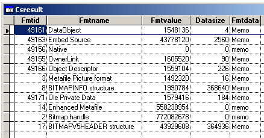

<link rel="stylesheet" type="text/css" href="../css/win32api.css">  
<link rel="stylesheet" href="https://cdnjs.cloudflare.com/ajax/libs/font-awesome/4.7.0/css/font-awesome.min.css">

# Enumerating data formats currently available on the clipboard

## Before you begin:
Run this code several times, each time placing new data on the Clipboard from different applications: IE, Word, Excel etc. Sometimes you get *dozens of various formats* for just a small cell range copied from an Excel spreadsheet.  
  

A value obtained with GetClipboardData function can be either handle  -- like bitmap handle -- or a global memory address, where a bigger portion of data is stored. Use API functions GlobalSize, CopyMemory, and possibly GlobalLock and GlobalUnlock, to retrieve this data.  

See also:

* [How to disable the Windows Clipboard](sample_488.md)  
* [Monitoring clipboard content changes](sample_601.md)  
  
***  


## Code:
```foxpro  
DO decl
= OpenClipboard(0)  && 0 means active window

CREATE CURSOR csResult (fmtid I, fmtname C(35),;
		fmtvalue N(16), datasize N(16), fmtdata M)

nIndex = 0  && enumeration starts from zero
DO WHILE .T.
	nIndex = EnumClipboardFormats(nIndex)
	IF nIndex = 0
		EXIT
	ELSE
		cName = GetStdName(nIndex)
		hData = GetClipboardData(nIndex)
		nSize = GlobalSize(hData)
		
		SELECT csResult
		APPEND BLANK
		REPLACE fmtid WITH nIndex, fmtname WITH cName,;
			fmtvalue WITH hData, datasize WITH nSize

		IF nSize <> 0
			cBuffer = Repli(Chr(0), nSize)
			= CopyMemory(@cBuffer, hData, nSize)
			REPLACE fmtdata WITH cBuffer
		ENDIF
	ENDIF
ENDDO

= CloseClipboard()  && important
GO TOP
BROWSE NORMAL NOWAIT
* end of main

FUNCTION  GetStdName (nIndex)
#DEFINE CF_BITMAP            2
#DEFINE CF_DIB               8
#DEFINE CF_DIBV5            17
#DEFINE CF_DIF               5
#DEFINE CF_DSPBITMAP       130
#DEFINE CF_DSPENHMETAFILE  142
#DEFINE CF_DSPMETAFILEPICT 131
#DEFINE CF_DSPTEXT         129
#DEFINE CF_ENHMETAFILE      14
#DEFINE CF_GDIOBJFIRST     768
#DEFINE CF_GDIOBJLAST     1023
#DEFINE CF_HDROP            15
#DEFINE CF_LOCALE           16
#DEFINE CF_METAFILEPICT      3
#DEFINE CF_OEMTEXT           7
#DEFINE CF_OWNERDISPLAY    128
#DEFINE CF_PALETTE           9
#DEFINE CF_PENDATA          10
#DEFINE CF_PRIVATEFIRST    512
#DEFINE CF_PRIVATELAST     767
#DEFINE CF_RIFF             11
#DEFINE CF_SYLK              4
#DEFINE CF_TEXT              1
#DEFINE CF_WAVE             12
#DEFINE CF_TIFF              6
#DEFINE CF_UNICODETEXT      13

	DO CASE
	CASE nIndex = CF_BITMAP
		RETURN "Bitmap handle"
	CASE nIndex = CF_DIB
		RETURN "BITMAPINFO structure"
	CASE nIndex = CF_DIBV5
		RETURN "BITMAPV5HEADER structure"
	CASE nIndex = CF_DIF
		RETURN "Data Interchange Format"
	CASE nIndex = CF_DSPBITMAP
		RETURN "Private Bimtap format"
	CASE nIndex = CF_DSPENHMETAFILE
		RETURN "Private Enhanced Metafile format"
	CASE nIndex = CF_DSPMETAFILEPICT
		RETURN "Private Metafile format"
	CASE nIndex = CF_DSPTEXT
		RETURN "Private Text format"
	CASE nIndex = CF_ENHMETAFILE
		RETURN "Enhanced Metafile"
	CASE nIndex = CF_GDIOBJFIRST
		RETURN "GDI object format first"
	CASE nIndex = CF_GDIOBJLAST
		RETURN "GDI object format last"
	CASE nIndex = CF_HDROP
		RETURN "List of files"
	CASE nIndex = CF_LOCALE
		RETURN "Locale Identifier handle"
	CASE nIndex = CF_METAFILEPICT
		RETURN "Metafile Picture format"
	CASE nIndex = CF_OEMTEXT
		RETURN "Text format with OEM charset"
	CASE nIndex = CF_OWNERDISPLAY
		RETURN "Owner-display format"
	CASE nIndex = CF_PALETTE
		RETURN "Color Palette handle"
	CASE nIndex = CF_PENDATA
		RETURN "Pen Computing format"
	CASE nIndex = CF_PRIVATEFIRST
		RETURN "Private format first"
	CASE nIndex = CF_PRIVATELAST
		RETURN "Private format last"
	CASE nIndex = CF_RIFF
		RETURN "Audio data format"
	CASE nIndex = CF_SYLK
		RETURN "Microsoft Symbolic Link format"
	CASE nIndex = CF_TEXT
		RETURN "Text format"
	CASE nIndex = CF_WAVE
		RETURN "Standard Wave format"
	CASE nIndex = CF_TIFF
		RETURN "Tagged-image format"
	CASE nIndex = CF_UNICODETEXT
		RETURN "Unicode Text"
	OTHER
		RETURN GetRegName(nIndex)
	ENDCASE

FUNCTION  GetRegName(nIndex)
#DEFINE cmBufsize  250
	LOCAL cBuffer, nResult
	cBuffer = Repli(Chr(0), cmBufsize)
	nResult = GetClipboardFormatName(nIndex, @cBuffer, cmBufsize)
RETURN Iif(nResult=0, "", Left(cBuffer, nResult))

PROCEDURE  decl
	DECLARE INTEGER EnumClipboardFormats IN user32 INTEGER wFormat
	DECLARE INTEGER OpenClipboard IN user32 INTEGER hwnd
	DECLARE INTEGER CloseClipboard IN user32
	DECLARE INTEGER GetClipboardData IN user32 INTEGER uFormat
	DECLARE INTEGER GlobalSize IN kernel32 INTEGER hMem

	DECLARE INTEGER GetClipboardFormatName IN user32;
		INTEGER fmt, STRING @lpszFmtName, INTEGER cchMaxCount

	DECLARE RtlMoveMemory IN kernel32 As CopyMemory;
		STRING @Dst, INTEGER Src, INTEGER nLen  
```  
***  


## Listed functions:
[CloseClipboard](../libraries/user32/CloseClipboard.md)  
[EnumClipboardFormats](../libraries/user32/EnumClipboardFormats.md)  
[GetClipboardData](../libraries/user32/GetClipboardData.md)  
[GetClipboardFormatName](../libraries/user32/GetClipboardFormatName.md)  
[GlobalSize](../libraries/kernel32/GlobalSize.md)  
[OpenClipboard](../libraries/user32/OpenClipboard.md)  

## Comment:
This function enumerates formats in the order that they were placed on the clipboard.  
Registered clipboard formats are identified by values in the range 0xC000 through 0xFFFF.   
  
Now you can see that _CLIPTEXT is just a small tip of an iceberg, which is the Clipboard.  
  
* * *  
A screen shot of the C# example:  
  
  
  
***  

