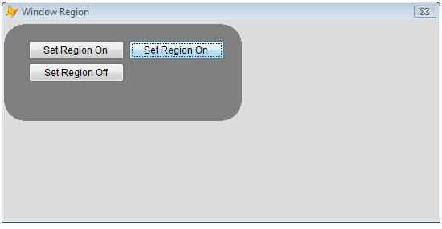

<link rel="stylesheet" type="text/css" href="../css/win32api.css">  
<link rel="stylesheet" href="https://cdnjs.cloudflare.com/ajax/libs/font-awesome/4.7.0/css/font-awesome.min.css">

# Setting the Window Region for a form

## Before you begin:
  
The external (in lighter gray color) part of the form and the caption disappears when the region is set on.  

See also:

* [Round FoxPro form](sample_143.md)  
* [How to draw a custom Window Caption on FoxPro form](sample_499.md)  
* [A way to make a transparent area in a form -- a hole in the form](sample_126.md)  
* [Semi-transparent form](sample_453.md)  
  
***  


## Code:
```foxpro  
LOCAL frm
frm = CreateObject("Tform")
frm.Show(1)
* end of main

DEFINE CLASS Tform As Form
PROTECTED hRegion
	Caption="Window Region"
	Width=600
	Height=350
	BorderStyle=2
	Backcolor=RGB(128,128,128)
	AutoCenter=.T.
	MaxButton=.F.
	MinButton=.F.
	hRegion=0
	
	ADD OBJECT cmdOn As CommandButton WITH;
		Left=30, Top=25, Width=120, Height=25,;
		Caption="Set Region On"

	ADD OBJECT cmdOn1 As CommandButton WITH;
		Left=155, Top=25, Width=120, Height=25,;
		Caption="Set Region On"

	ADD OBJECT cmdOff As CommandButton WITH;
		Left=30, Top=53, Width=120, Height=25,;
		Caption="Set Region Off", Enabled=.F.

PROCEDURE Init
	THIS.declare
	
PROCEDURE Destroy
	THIS.RegionOff

PROCEDURE cmdOn.Click
	ThisForm.RegionOn(0)

PROCEDURE cmdOn1.Click
	ThisForm.RegionOn(1)

PROCEDURE cmdOff.Click
	ThisForm.RegionOff

PROCEDURE RegionOn(nMode)
	THIS.RegionOff
	
	LOCAL nX, nY, nWidth, nHeight
	nX = SYSMETRIC(10)+2
	nY = SYSMETRIC(4) + SYSMETRIC(9)
	nWidth=300
	nHeight=150

	IF nMode=0
		THIS.hRegion = CreateRectRgn(nX, nY, nWidth, nHeight)
	ELSE
		THIS.hRegion = CreateRoundRectRgn(nX, nY,;
			nWidth, nHeight, 50, 50)
	ENDIF

	IF THIS.hRegion = 0
		ACTIVATE SCREEN
		? "Failed to create region:", GetLastError()
	ELSE
		IF SetWindowRgn(THIS.HWnd, THIS.hRegion, 1) <> 0
			THIS.cmdOff.Enabled=.T.
		ENDIF
	ENDIF

PROCEDURE RegionOff
* the system owns the region and deletes the handle
* when it is no longer needed
	IF THIS.hRegion <> 0
		IF SetWindowRgn(THIS.HWnd, 0, 1) <> 0
			THIS.hRegion=0
			THIS.cmdOff.Enabled=.F.
		ENDIF
	ENDIF

PROCEDURE declare
	DECLARE INTEGER GetLastError IN kernel32
	DECLARE INTEGER GetFocus IN user32

	DECLARE INTEGER CreateRectRgn IN gdi32;
		INTEGER nLeftRect, INTEGER nTopRect,;
		INTEGER nRightRect, INTEGER nBottomRect

	DECLARE INTEGER CreateRoundRectRgn IN gdi32;
		INTEGER nLeftRect, INTEGER nTopRect,;
		INTEGER nRightRect, INTEGER nBottomRect,;
		INTEGER nWidthEllipse, INTEGER nHeightEllipse

	DECLARE INTEGER SetWindowRgn IN user32;
		INTEGER hWnd, INTEGER hRgn, SHORT bRedraw

ENDDEFINE  
```  
***  


## Listed functions:
[CreateRectRgn](../libraries/gdi32/CreateRectRgn.md)  
[CreateRoundRectRgn](../libraries/gdi32/CreateRoundRectRgn.md)  
[GetFocus](../libraries/user32/GetFocus.md)  
[GetLastError](../libraries/kernel32/GetLastError.md)  
[SetWindowRgn](../libraries/user32/SetWindowRgn.md)  

## Comment:
The window region determines the area within the window where the system permits drawing. The system does not display any portion of a window that lies outside of the window region.  
  
The system owns the region and deletes the handle when it is no longer needed  
  
When testing this code sample in VFP6, replace ThisForm.hWnd with GetFocus() calls.  
  
***  

