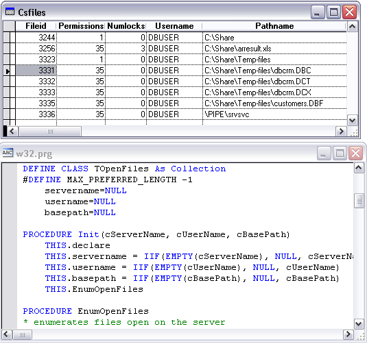

[ Home ](https://github.com/VFPX/Win32API)  

# Enumerating files opened on the network

## Before you begin:
Usage:  
```foxpro
LOCAL oFiles As TOpenFiles, oFile As TOpenFile  
oFiles = CREATEOBJECT("TOpenFiles", "SOME_SERVER")  

CREATE CURSOR csFiles (fileid I, permissions I, numlocks I,;  
	username C(32), pathname C(250))  

FOR EACH oFile IN oFiles  
	WITH oFile  
		INSERT INTO csFiles (fileid, permissions, numlocks,;  
			username, pathname);  
		VALUES (.fileid, .permissions, .numlocks,;  
			FromUnicode(.username),;  
			FromUnicode(.pathname))  
	ENDWITH  
NEXT  

SELECT csFiles  
GO TOP  
BROWSE NORMAL NOWAIT
```
See also:

<!-- Anatoliy * [FileSystemWatcher ActiveX Control for Visual FoxPro](?solution=8)  --> 
* [Monitoring changes in a directory](sample_117.md)  
* [Enumerating global and local group accounts on a server](sample_411.md)  
* [Obtaining names of local and global groups for current user](sample_431.md)  
* [How to enumerate, add and delete shares on the local computer](sample_351.md)  
* [Enumerating sessions established on a server](sample_505.md)  

  
***  


## Code:
```foxpro  
DEFINE CLASS TOpenFiles As Collection
#DEFINE MAX_PREFERRED_LENGTH -1
	servername=NULL
	username=NULL
	basepath=NULL

PROCEDURE Init(cServerName, cUserName, cBasePath)
	THIS.declare
	THIS.servername = IIF(EMPTY(cServerName), NULL, cServerName)
	THIS.username = IIF(EMPTY(cUserName), NULL, cUserName)
	THIS.basepath = IIF(EMPTY(cBasePath), NULL, cBasePath)
	THIS.EnumOpenFiles

PROCEDURE EnumOpenFiles
* enumerates files open on the server
	DO WHILE THIS.Count > 0
		THIS.Remove(1)
	ENDDO
	
	LOCAL nResult, hBuffer, nReadCnt, nTotalCnt,;
		nResume, nIndex, cBuffer, nBufsize

	STORE 0 TO hBuffer, nReadCnt, nTotalCnt, nResume

	* 5 = ERROR_ACCESS_DENIED
	* 53 = ERROR_BAD_NETPATH
	* 123 = ERROR_INVALID_NAME
	* 1113 = ERROR_NO_UNICODE_TRANSLATION

	nResult = NetFileEnum(ToUnicode(THIS.servername),;
		ToUnicode(THIS.basepath), ToUnicode(THIS.username),;
		3, @hBuffer, MAX_PREFERRED_LENGTH,;
		@nReadCnt, @nTotalCnt, @nResume)

	IF m.hBuffer = 0 OR m.nReadCnt=0
		RETURN
	ENDIF

	nBufsize = GlobalSize(hBuffer)
	cBuffer = REPLICATE(CHR(0), nBufsize)
	= MemToStr(@cBuffer, hBuffer, nBufsize)

	FOR nIndex=1 TO m.nReadCnt
		LOCAL oFile As TOpenFile, hPath, hUser
		oFile = CREATEOBJECT("TOpenFile")
		WITH oFile
			.fileid = buf2dword(SUBSTR(cBuffer, (nIndex-1)*20 + 1, 4))
			.permissions = buf2dword(SUBSTR(cBuffer, (nIndex-1)*20 + 5, 4))
			.numlocks = buf2dword(SUBSTR(cBuffer, (nIndex-1)*20 + 9, 4))

			hPath = buf2dword(SUBSTR(cBuffer, (nIndex-1)*20 + 13, 4))
			.pathname = GetStrFromMem(@cBuffer, hPath-hBuffer+1)

			hUser = buf2dword(SUBSTR(cBuffer, (nIndex-1)*20 + 17, 4))
			.username = GetStrFromMem(@cBuffer, hUser-hBuffer+1)
		ENDWITH
		THIS.Add(oFile)
		oFile=NULL
	NEXT

	= NetApiBufferFree(hBuffer)

PROCEDURE declare
	DECLARE INTEGER NetApiBufferFree IN netapi32 INTEGER buf
	DECLARE INTEGER GlobalSize IN kernel32 INTEGER hMem

	DECLARE RtlMoveMemory IN kernel32 As MemToStr;
		STRING @dst, INTEGER src, INTEGER nLength

	DECLARE INTEGER NetFileEnum IN netapi32;
		STRING servername, STRING basepath, STRING username,;
		INTEGER lvl, INTEGER @bufptr, INTEGER prefmaxlen,;
		INTEGER @entriesread, INTEGER @totalentries,;
		INTEGER @resume

ENDDEFINE

DEFINE CLASS TOpenFile As Relation
	fileid=0
	permissions=0
	numlocks=0
	pathname=NULL
	username=NULL
ENDDEFINE

FUNCTION GetStrFromMem(cBuffer, nOffset)
	LOCAL cResult, ch
	cResult=""
	DO WHILE nOffset < LEN(cBuffer)
		ch = SUBSTR(m.cBuffer, m.nOffset, 2)
		IF m.ch = CHR(0) + CHR(0)
			EXIT
		ENDIF
		cResult = m.cResult + m.ch
		nOffset = m.nOffset + 2
	ENDDO
RETURN m.cResult

FUNCTION ToUnicode(cStr As String) As String
RETURN STRCONV(NVL(m.cStr,"")+CHR(0),5)

FUNCTION FromUnicode(cStr As String) As String
RETURN STRCONV(m.cStr,6)

FUNCTION buf2dword(lcBuffer)
RETURN Asc(SUBSTR(lcBuffer, 1,1)) + ;
	BitLShift(Asc(SUBSTR(lcBuffer, 2,1)),  8) +;
	BitLShift(Asc(SUBSTR(lcBuffer, 3,1)), 16) +;
	BitLShift(Asc(SUBSTR(lcBuffer, 4,1)), 24)  
```  
***  


## Listed functions:
[GlobalSize](../libraries/kernel32/GlobalSize.md)  
[NetApiBufferFree](../libraries/netapi32/NetApiBufferFree.md)  
[NetFileEnum](../libraries/netapi32/NetFileEnum.md)  

## Comment:
May.24, 2007: rewritten from scratch  
  
Only members of the Administrators or Server Operators local group can successfully execute the NetFileEnum function.  
  
Here is an example of data this code sample returns: 



The number of file locks in FILE_INFO_3 structure does not relate to whether a VFP table or database open in exclusive or shared mode. This structure member shows zero.  
  
For RPC communication, the Server service opens a named pipe SRVSVC.  
  
* * *  
Read <a href="http://fox.wikis.com/wc.dll?Wiki~RLOCK">RLOCK topic on VFP Wiki</a> for explanation of how VFP locks table records.  
  
***  

