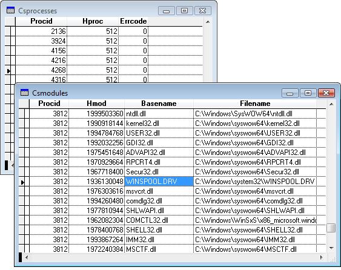

# Enumerating Processes -- WinNT

## Before you begin:
This code sample enumerates running processes on Windows XP and Vista computers.   

  

See also:

* [Obtaining memory performance information for the system](sample_567.md)  
* [Memory usage info for current VFP session](sample_172.md)  
* [Terminating all running applications from a VFP program](sample_243.md)  
* [Enumerating Processes -- Win9*](sample_164.md)  

  
***  


## Code:
```foxpro  
#DEFINE PROCESS_VM_READ 16
#DEFINE PROCESS_QUERY_INFORMATION 1024
#DEFINE DWORD 4
DO declare
	
LOCAL lcProcBuf, lnBufSize, lnProcessBufRet, lnProcNo, lnProcId,;
	hProcess, lcModBuf, lnModBufRet, lnModNo, lcFilename, lcBasename

lnBufSize = 4096  && should be large enough
lcProcBuf = REPLICATE(Chr(0), lnBufSize)
lnProcessBufRet = 0

IF EnumProcesses(@lcProcBuf, lnBufSize, @lnProcessBufRet) = 0
	? "Error code:", GetLastError()
	RETURN
ENDIF
	
SELECT 0
CREATE CURSOR csProcesses (procId N(16), hProc N(16), errcode N(6))

SELECT 0
CREATE CURSOR csModules (procId N(16), hMod N(16),;
	basename C(30), filename C(250))

FOR lnProcNo=1 TO lnProcessBufRet/DWORD
	lnProcId = buf2dword(SUBSTR(lcProcBuf, (lnProcNo-1)*DWORD+1, DWORD))

	hProcess = OpenProcess(PROCESS_QUERY_INFORMATION +;
		PROCESS_VM_READ, 0, lnProcId)

	IF hProcess <> 0
		INSERT INTO csProcesses VALUES (lnProcId, hProcess, 0)

		* get handles to the modules participating in the process
		lnBufSize = 4096  && should be large enough
		lcModBuf = REPLICATE(Chr(0), lnBufSize)
		lnModBufRet = 0

		IF EnumProcessModules(hProcess, @lcModBuf,;
			lnBufSize, @lnModBufRet) <> 0

			FOR lnModNo=1 TO lnModBufRet/DWORD
				hModule = buf2dword(SUBSTR(lcModBuf,;
					(lnModNo-1)*DWORD+1, DWORD))

				lcFilename = SPACE(250)
				lnBufSize = GetModuleFileNameEx(hProcess, hModule,;
					@lcFilename, Len(lcFilename))
				lcFilename = Left(lcFilename, lnBufSize)
					
				lcBasename = SPACE(250)
				lnBufSize = GetModuleBaseName(hProcess, hModule,;
					@lcBasename, Len(lcBasename))
				lcBasename = Left(lcBasename, lnBufSize)

				INSERT INTO csModules VALUES (;
					lnProcId, hModule, lcBasename, lcFilename)
			ENDFOR  && lnModNo
		ENDIF
		* release the handle - it does not mean closing the process
		= CloseHandle(hProcess)
	ELSE
		* 5 = Access is denied
		* 87 = The parameter is incorrect
		INSERT INTO csProcesses VALUES (;
			lnProcId, hProcess, GetLastError())
	ENDIF
ENDFOR  && lnProcNo

FUNCTION buf2dword(cBuffer)
RETURN Asc(SUBSTR(cBuffer, 1,1)) + ;
	BitLShift(Asc(SUBSTR(cBuffer, 2,1)), 8) +;
	BitLShift(Asc(SUBSTR(cBuffer, 3,1)), 16) +;
	BitLShift(Asc(SUBSTR(cBuffer, 4,1)), 24)

PROCEDURE declare
	DECLARE INTEGER GetLastError IN kernel32

	DECLARE INTEGER CloseHandle IN kernel32 INTEGER Handle

	DECLARE INTEGER OpenProcess IN kernel32;
		INTEGER dwDesiredAccessas, INTEGER bInheritHandle,;
		INTEGER dwProcId

	DECLARE INTEGER EnumProcesses IN psapi;
		STRING @lpidProcess, INTEGER cb, INTEGER @cbNeeded

	DECLARE INTEGER GetModuleFileNameEx IN psapi;
		INTEGER hProcess, INTEGER hModule,;
		STRING ModuleName, INTEGER nSize

	DECLARE INTEGER GetModuleBaseName IN psapi;
		INTEGER hProcess, INTEGER hModule,;
		STRING @lpBaseName, INTEGER nSize

	DECLARE INTEGER EnumProcessModules IN psapi;
		INTEGER hProcess, STRING @lphModule,;
		INTEGER cb, INTEGER @cbNeeded  
```  
***  


## Listed functions:
[CloseHandle](../libraries/kernel32/CloseHandle.md)  
[EnumProcessModules](../libraries/psapi/EnumProcessModules.md)  
[EnumProcesses](../libraries/psapi/EnumProcesses.md)  
[GetLastError](../libraries/kernel32/GetLastError.md)  
[GetModuleBaseName](../libraries/psapi/GetModuleBaseName.md)  
[GetModuleFileNameEx](../libraries/psapi/GetModuleFileNameEx.md)  
[OpenProcess](../libraries/kernel32/OpenProcess.md)  

## Comment:
Microsoft Knowledge Base: <a href="http://support.microsoft.com/support/kb/articles/q175/0/30.asp">HOWTO: Enumerate Applications in Win32</A>  
  
***  

