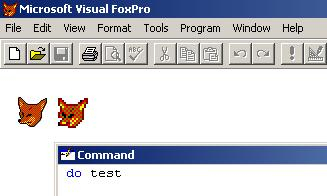

<link rel="stylesheet" type="text/css" href="../css/win32api.css">  
<link rel="stylesheet" href="https://cdnjs.cloudflare.com/ajax/libs/font-awesome/4.7.0/css/font-awesome.min.css">

# Drawing icons associated with the VFP main window

## Before you begin:
  

See also:

* [How to view icons stored in executable files](sample_019.md)  
* [Adding icon to the systray (requires VFP9)](sample_235.md)  
* [Converting image file to .ICO file](sample_503.md)  
  
***  


## Code:
```foxpro  
DO declare

LOCAL hWindow, hDC, lcClassName, hInstance, lcWndClassX,;
	hIcon, hIconSm, hCursor

hWindow = _vfp.HWnd && GetActiveWindow()
hDC = GetWindowDC(hWindow)

lcClassName = GetClsName(hWindow)
hInstance = GetModuleHandle(0)

*| typedef struct _WNDCLASSEX {
*|     UINT       cbSize;         0:4
*|     UINT       style;          4:4
*|     WNDPROC    lpfnWndProc;    8:4
*|     int        cbClsExtra;    12:4
*|     int        cbWndExtra;    16:4
*|     HINSTANCE  hInstance;     20:4
*|     HICON      hIcon;         24:4
*|     HCURSOR    hCursor;       28:4
*|     HBRUSH     hbrBackground; 32:4
*|     LPCTSTR    lpszMenuName;  36:4
*|     LPCTSTR    lpszClassName; 40:4
*|     HICON      hIconSm;       44:4
*| } WNDCLASSEX
#DEFINE WNDCLASSX_SIZE 48

* the first dword contains the size of the structure
lcWndClassX = PADR(CHR(WNDCLASSX_SIZE),;
	WNDCLASSX_SIZE, CHR(0))

= GetClassInfoEx(hInstance, lcClassName, @lcWndClassX)

* handles returned in the WNDCLASSEX structure
hIcon = buf2dword(SUBSTR(lcWndClassX, 25,4))
hIconSm = buf2dword(SUBSTR(lcWndClassX, 45,4))
hCursor = buf2dword(SUBSTR(lcWndClassX, 29,4))

* drawing the icons and the cursor (if any)
* on the main VFP window

IF hIcon <> 0  && class icon
	= DrawIcon(hDC, 20,100, hIcon)
ENDIF

IF hIconSm <> 0  && class small icon
	= DrawIcon(hDC, 60,100, hIconSm)
ENDIF

IF hCursor <> 0  && class cursor
	= DrawIcon(hDC, 100,100, hCursor)
ENDIF

= ReleaseDC(hWindow, hDC)
* end of main

FUNCTION GetClsName(hWindow)
	LOCAL lnBufsize, lcClassName
	lnBufsize = 250
	lcClassName = SPACE(lnBufsize)
	lnBufsize = GetClassName(hWindow, @lcClassName, lnBufsize)
RETURN SUBSTR(lcClassName, 1, lnBufsize)

FUNCTION buf2dword(lcBuffer)
RETURN Asc(SUBSTR(lcBuffer, 1,1)) + ;
	Asc(SUBSTR(lcBuffer, 2,1)) * 256 +;
	Asc(SUBSTR(lcBuffer, 3,1)) * 65536 +;
	Asc(SUBSTR(lcBuffer, 4,1)) * 16777216

PROCEDURE declare
	DECLARE INTEGER GetActiveWindow IN user32
	DECLARE INTEGER GetWindowDC IN user32 INTEGER hWindow

	DECLARE INTEGER GetModuleHandle IN kernel32;
		STRING lpModuleName

	DECLARE INTEGER ReleaseDC IN user32;
		INTEGER hWindow, INTEGER hdc

	DECLARE INTEGER GetClassName IN user32;
		INTEGER hWindow, STRING lpClassName, INTEGER nMaxCount

	DECLARE INTEGER GetClassInfoEx IN user32;
		INTEGER hinst, STRING lpszClass, STRING @lpwcx

	DECLARE SHORT DrawIcon IN user32;
		INTEGER hDC, INTEGER X, INTEGER Y, INTEGER hIcon  
```  
***  


## Listed functions:
[DrawIcon](../libraries/user32/DrawIcon.md)  
[GetActiveWindow](../libraries/user32/GetActiveWindow.md)  
[GetClassInfoEx](../libraries/user32/GetClassInfoEx.md)  
[GetClassName](../libraries/user32/GetClassName.md)  
[GetModuleHandle](../libraries/kernel32/GetModuleHandle.md)  
[GetWindowDC](../libraries/user32/GetWindowDC.md)  
[ReleaseDC](../libraries/user32/ReleaseDC.md)  
