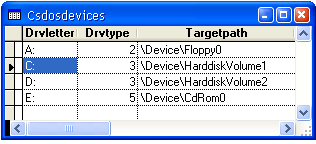

# Retrieving information about MS-DOS device names using QueryDosDevice (WinNT only)

## Before you begin:
According to the MSDN the QueryDosDevice function works under Windows 98/Me. But to what I saw, it does not.  

  
  
***  


## Code:
```foxpro  
#DEFINE MAX_PATH 260
DO declare

CREATE CURSOR csDosDevices (drvletter C(2), drvtype I,;
	targetpath C(250))

LOCAL cDrives, nBufsize, cDrvLetter, ch, cTargetPath
cDrives = REPLICATE(CHR(0), 250)
nBufsize = GetLogicalDriveStrings(LEN(cDrives), @cDrives)
cDrives = PADR(cDrives, nBufsize)

cDrvLetter=""
FOR nBufsize=1 TO LEN(cDrives)
	ch = SUBSTR(cDrives, nBufsize,1)
	IF ch = Chr(0)
		cDrvLetter=PADR(cDrvLetter,2)
		cTargetPath = REPLICATE(CHR(0), MAX_PATH)

		= QueryDosDevice(cDrvLetter, @cTargetPath,;
			LEN(cTargetPath))

		cTargetPath = STRTRAN(cTargetPath, CHR(0), "")

		INSERT INTO csDosDevices VALUES (;
			cDrvLetter, GetDriveType(cDrvLetter),;
			cTargetPath)

		cDrvLetter = ""
	ELSE
		cDrvLetter = cDrvLetter + m.ch
	ENDIF
NEXT

GO TOP
BROWSE NORMAL NOWAIT

PROCEDURE declare
	DECLARE INTEGER GetDriveType IN kernel32 STRING nDrive

	DECLARE INTEGER GetLogicalDriveStrings IN kernel32;
		INTEGER nBufferLength, STRING @lpBuffer

	DECLARE INTEGER QueryDosDevice IN kernel32;
		STRING lpDeviceName, STRING @lpTargetPath, INTEGER ucchMax  
```  
***  


## Listed functions:
[GetDriveType](../libraries/kernel32/GetDriveType.md)  
[GetLogicalDriveStrings](../libraries/kernel32/GetLogicalDriveStrings.md)  
[QueryDosDevice](../libraries/kernel32/QueryDosDevice.md)  

## Comment:
The QueryDosDevice returns names like \Device\HarddiskVolume1.  
  
***  

