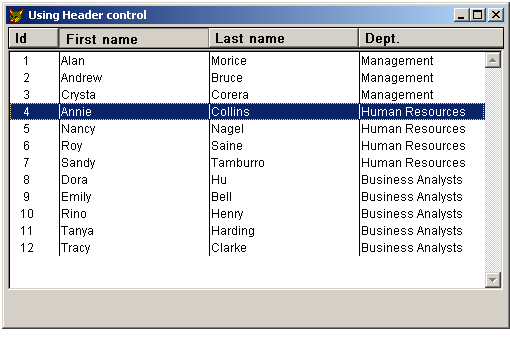

<link rel="stylesheet" type="text/css" href="../css/win32api.css">  
<link rel="stylesheet" href="https://cdnjs.cloudflare.com/ajax/libs/font-awesome/4.7.0/css/font-awesome.min.css">

# Using Common Controls: the Header Control

## Before you begin:
This following code creates a header (ListView style) and places it above a ListBox control. There is no particualr functionality connected to this header. As soon as you find a way to intercept and respond to window messages sent to its window (HHT_ONHEADER, HHT_ONDIVIDER) you can use it.  

  
  
***  


## Code:
```foxpro  
PUBLIC obj
obj = CreateObject("Tform")
obj.Visible = .T.
* end of main

#DEFINE WM_PARENTNOTIFY 0x0210
#DEFINE WM_LBUTTONDOWN 0x201
#DEFINE WM_RBUTTONDOWN 0x204
#DEFINE WM_DESTROY 2
#DEFINE GWL_WNDPROC -4

DEFINE CLASS Tform As Form
PROTECTED hWindow, hOrigProc, SortOrder
	hWindow=0
	hOrigProc=0
	SortOrder=1

	Width=500
	Height=300
	Autocenter=.T.
	Caption=" Using Header control"
	
	ADD OBJECT hdr As Theader WITH;
	hdrLeft=2, hdrTop=2, hdrWidth=495, hdrHeight=21
	
	ADD OBJECT lst As listBox WITH;
	Left=2, Top=25, Width=495, Height=240

PROCEDURE Init
	THIS.declare
	
PROTECTED PROCEDURE declare
	DECLARE INTEGER GetFocus IN user32
	DECLARE INTEGER InitCommonControlsEx IN comctl32 STRING @lpInitCtrls
	DECLARE INTEGER GetWindowLong IN user32 INTEGER hWnd, INTEGER nIndex
	DECLARE INTEGER DeleteObject IN gdi32 INTEGER hObject
	DECLARE INTEGER DestroyWindow IN user32 INTEGER hWnd
	DECLARE INTEGER StrDup IN shlwapi STRING @lpsz
	DECLARE INTEGER LocalFree IN kernel32 INTEGER hMem

	DECLARE INTEGER SetWindowPos IN user32;
		INTEGER hwnd, INTEGER hWndInsertAfter,;
		INTEGER x, INTEGER y, INTEGER cx, INTEGER cy,;
		INTEGER wFlags

	DECLARE INTEGER CreateWindowEx IN user32 AS CreateWindow;
		INTEGER dwExStyle, STRING lpClassName, STRING lpWndName,;
		INTEGER dwStyle, INTEGER x, INTEGER y, INTEGER nWidth, INTEGER nHeight,;
		INTEGER hWndParent, INTEGER hMenu, INTEGER hInst, INTEGER lpParam

	DECLARE INTEGER CreateFont IN gdi32;
		INTEGER nHeight, INTEGER nWidth, INTEGER nEscapement,;
		INTEGER nOrientation, INTEGER fnWeight, INTEGER fdwItalic,;
		INTEGER fdwUnderline, INTEGER fdwStrikeOut,;
		INTEGER fdwCharSet, INTEGER fdwOutputPrecision,;
		INTEGER fdwClipPrecision, INTEGER fdwQuality,;
		INTEGER fdwPitchAndFamily, STRING lpszFace

PROCEDURE Activate
	IF THIS.hdr.hWindow = 0
		THIS.CreateHeader
	ENDIF

	IF THIS.hWindow = 0
		THIS.hWindow = GetFocus()
		THIS.hOrigProc = GetWindowLong(THIS.hWindow, GWL_WNDPROC)

		* link WM_PARENTNOTIFY window message to a method
		IF VERSION(5) >= 900
			= BINDEVENT(THIS.hWindow, WM_PARENTNOTIFY,;
				THIS, "WindowProc")
		ENDIF
	ENDIF

PROTECTED PROCEDURE WindowProc(hWindow as Integer,;
	nMsgID as Integer, wParam as Integer, lParam as Integer)
* requires VFP9, otherwise ignored

	LOCAL nReturn
	nReturn=0
	
	DO CASE
	CASE nMsgID=WM_PARENTNOTIFY
		ACTIVATE SCREEN
		? wParam, lParam
		
	OTHERWISE
	* pass control to the original window procedure
		nReturn = CallWindowProc(THIS.hOrigProc, THIS.hWindow,;
			m.nMsgID, m.wParam, m.lParam)
	ENDCASE
RETURN nReturn

PROCEDURE CreateHeader
	THIS.hdr.CreateHeader
	THIS.hdr.AddItem ("Id", 50, 0)
	THIS.hdr.AddItem ("First name", 150, 1)
	THIS.hdr.AddItem ("Last name", 150, 2)
	THIS.hdr.AddItem ("Dept.", 150, 3)
	THIS.ShowList

PROCEDURE ShowList
	CREATE CURSOR csList (personid N(5),;
		firstname C(20), lastname C(30), dept C(50))

	INSERT INTO csList VALUES ( 1, "Alan","Morice","Management")
	INSERT INTO csList VALUES ( 2, "Andrew","Bruce","Management")
	INSERT INTO csList VALUES ( 3, "Crysta","Corera","Management")
	INSERT INTO csList VALUES ( 4, "Annie","Collins","Human Resources")
	INSERT INTO csList VALUES ( 5, "Nancy","Nagel","Human Resources")
	INSERT INTO csList VALUES ( 6, "Roy","Saine","Human Resources")
	INSERT INTO csList VALUES ( 7, "Sandy","Tamburro","Human Resources")
	INSERT INTO csList VALUES ( 8, "Dora","Hu","Business Analysts")
	INSERT INTO csList VALUES ( 9, "Emily","Bell","Business Analysts")
	INSERT INTO csList VALUES (10, "Rino","Henry","Business Analysts")
	INSERT INTO csList VALUES (11, "Tanya","Harding","Business Analysts")
	INSERT INTO csList VALUES (12, "Tracy","Clarke","Business Analysts")

	LOCAL cSql

	cSql = "SELECT * FROM csList " +;
		"ORDER BY " + LTRIM(STR(THIS.SortOrder)) +;
		" INTO CURSOR csList"
	&cSql

	WITH THIS.lst
		.RowsourceType=2
		.RowSource="csList"
		.ColumnCount=4
		.ColumnWidths="47,147,147,147"
		.ListIndex = 1
	ENDWITH
ENDDEFINE

DEFINE CLASS Theader As Custom
	hParent=0
	hWindow=0
	hFont=0
	hdrLeft=0
	hdrTop=0
	hdrWidth=0
	hdrHeight=0
	ItemsCount=0

PROCEDURE Destroy
	THIS.ReleaseHeader

PROCEDURE CreateHeader
#DEFINE WS_CHILD  0x40000000
#DEFINE WS_BORDER 0x00800000
#DEFINE HDS_BUTTONS         2
#DEFINE GWL_HINSTANCE      -6
#DEFINE HWND_BOTTOM         1
#DEFINE SWP_SHOWWINDOW      64
#DEFINE ANSI_CHARSET        0
#DEFINE OUT_OUTLINE_PRECIS  8
#DEFINE CLIP_STROKE_PRECIS  2
#DEFINE PROOF_QUALITY       2
#DEFINE DEFAULT_PITCH       0
#DEFINE WM_SETFONT          48

	THIS.ReleaseHeader

	THIS.hParent = GetFocus()

	* initializing access to Common Controls
	= InitCommonControlsEx (PADR(Chr(8), 4,Chr(0)) + PADR(Chr(255), 4,Chr(0)))

	LOCAL lcWindowName, lnStyle, lnStyleX, lnId, hApp
	lnStyle = WS_CHILD + WS_BORDER + HDS_BUTTONS
	lnStyleX = 0
	lnId = Val(SYS(3))
	lcWindowName = "hdr" + SYS(3)
	hApp = GetWindowLong (THIS.hWindow, GWL_HINSTANCE)

	THIS.hWindow = CreateWindow(lnStyleX, "SysHeader32",;
		lcWindowName, lnStyle, 0,0,0,0,;
		THIS.hParent, lnId, hApp, 0)

	* changing font to Arial, semi-bold, 16 pixels height
	THIS.hFont = CreateFont (16, 0, 0, 0, 600, 0,0,0,;
		ANSI_CHARSET, OUT_OUTLINE_PRECIS, CLIP_STROKE_PRECIS,;
		PROOF_QUALITY, DEFAULT_PITCH, "Arial")

	DECLARE INTEGER SendMessage IN user32;
		INTEGER hWnd, INTEGER Msg, INTEGER wParam, INTEGER lParam
	= SendMessage (THIS.hWindow, WM_SETFONT, THIS.hFont, 0)

	* positioning
	= SetWindowPos(THIS.hWindow, HWND_BOTTOM,;
		THIS.hdrLeft, THIS.hdrTop,;
		THIS.hdrLeft+THIS.hdrWidth-1, THIS.hdrTop+THIS.hdrHeight-1,;
		SWP_SHOWWINDOW)

PROCEDURE ReleaseHeader
	IF THIS.hWindow <> 0
		THIS.RemoveItems
		= DeleteObject(THIS.hFont)
		= DestroyWindow(THIS.hWindow)
		THIS.hWindow = 0
	ENDIF

PROCEDURE SendItemMsg (lnMessage, lcItem, lnWidth, lnOrder)
#DEFINE HDI_WIDTH       1
#DEFINE HDI_TEXT        2
#DEFINE HDI_ORDER       128
#DEFINE HDF_LEFT        0
#DEFINE HDM_INSERTITEM  4609

	LOCAL lnItemPtr, lcBuffer
	lcItem = STRTRAN(lcItem, Chr(0),"") + Chr(0)
	lnItemPtr = StrDup(@lcItem)

	lcBuffer = num2dword(HDI_TEXT+HDI_WIDTH+HDI_ORDER) +;
		num2dword(lnWidth) + num2dword(lnItemPtr) +;
		num2dword(0) + num2dword(Len(lcItem)) +;
		num2dword(0) + num2dword(0) + num2dword(0) +;
		num2dword(lnOrder)

	DECLARE INTEGER SendMessage IN user32;
		INTEGER hWnd, INTEGER Msg, INTEGER wParam, STRING @lParam

	= SendMessage (THIS.hWindow, lnMessage, 0, @lcBuffer)
	= LocalFree(lnItemPtr)

PROCEDURE RemoveItems (lcItem)
#DEFINE HDM_DELETEITEM  4610
	LOCAL lnIndex
	FOR lnIndex=1 TO THIS.ItemsCount
		THIS.SendItemMsg (HDM_DELETEITEM, "", 0, 0)
	ENDFOR

PROCEDURE AddItem (lcItem, lnWidth, lnOrder)
#DEFINE HDM_INSERTITEM  4609
	THIS.ItemsCount = THIS.ItemsCount + 1
	THIS.SendItemMsg (HDM_INSERTITEM, lcItem, lnWidth, lnOrder)
ENDDEFINE

FUNCTION  num2dword (lnValue)
#DEFINE m0       256
#DEFINE m1     65536
#DEFINE m2  16777216
	LOCAL b0, b1, b2, b3
	b3 = Int(lnValue/m2)
	b2 = Int((lnValue - b3*m2)/m1)
	b1 = Int((lnValue - b3*m2 - b2*m1)/m0)
	b0 = Mod(lnValue, m0)
RETURN Chr(b0)+Chr(b1)+Chr(b2)+Chr(b3)  
```  
***  


## Listed functions:
[CreateFont](../libraries/gdi32/CreateFont.md)  
[CreateWindowEx](../libraries/user32/CreateWindowEx.md)  
[DeleteObject](../libraries/gdi32/DeleteObject.md)  
[DestroyWindow](../libraries/user32/DestroyWindow.md)  
[GetFocus](../libraries/user32/GetFocus.md)  
[GetWindowLong](../libraries/user32/GetWindowLong.md)  
[InitCommonControlsEx](../libraries/comctl32/InitCommonControlsEx.md)  
[LocalFree](../libraries/kernel32/LocalFree.md)  
[SendMessage](../libraries/user32/SendMessage.md)  
[SetWindowPos](../libraries/user32/SetWindowPos.md)  
[StrDup](../libraries/shlwapi/StrDup.md)  

## Comment:
To display bitmaps use HDI_BITMAP flag. Any item can be adjusted through HDM_GETITEM and HDM_SETITEM messages.  
  
* * *  
The WM_PARENTNOTIFY message is sent to the parent of a child window when the child window is created or destroyed, or when the user clicks a mouse button while the cursor is over the child window.  
  
In VFP9 new BINDEVENT() allows to intercept this message. So tecnically, left and right mouse clicks on a header control can be detected by its parent form and linked to a method.   
  
***  

