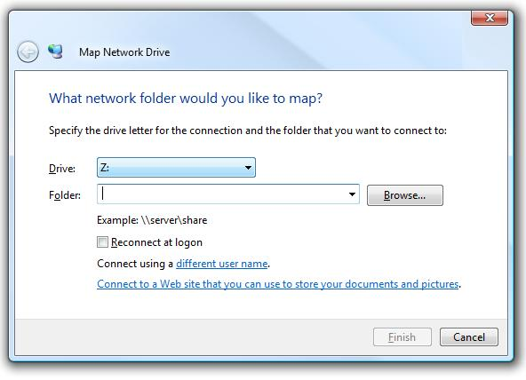

[ Home ](https://github.com/VFPX/Win32API)  

# Starting a dialog box for connecting to network resources (mapping network drive)

## Before you begin:
  

See also:

* [Starting a dialog box for connecting to network resources and passing input parameters](sample_551.md)  
* [Connecting a local device to a network resource](sample_318.md)  
* [Mapping and disconnecting network drives in FoxPro application](sample_387.md)  
  
***  


## Code:
```foxpro  
#DEFINE RESOURCETYPE_DISK   1
DO declare

LOCAL hWindow
hWindow = GetActiveWindow()

* Map Network Drive dialog box
= WNetConnectionDialog(hWindow, RESOURCETYPE_DISK)

* Disconnect Network Drives dialog box
* only RESOURCETYPE_DISK flag is allowed
= WNetDisconnectDialog(hWindow, RESOURCETYPE_DISK)

PROCEDURE declare
	DECLARE INTEGER GetActiveWindow IN user32

	DECLARE INTEGER WNetConnectionDialog IN mpr;
		INTEGER hwnd, INTEGER dwType

	DECLARE INTEGER WNetDisconnectDialog IN mpr;
		INTEGER hwnd, INTEGER dwType  
```  
***  


## Listed functions:
[GetActiveWindow](../libraries/user32/GetActiveWindow.md)  
[WNetConnectionDialog](../libraries/mpr/WNetConnectionDialog.md)  
[WNetDisconnectDialog](../libraries/mpr/WNetDisconnectDialog.md)  

## Comment:
Not much of options exists for this function: one can not specify a disk letter and network path through the input parameters.  
  
The *NET USE* command connects a computer to, or disconnects a computer from a shared resource; or displays information about computer connections. The command also controls persistent net connections.  
  
*Syntax:*<DIV style="color: #000080">  
net use [devicename | *] [\\computername\sharename[\volume]] [password | *]  
[/user:[domainname\]username] [[/delete] | [/persistent:{yes | no}]]  
  
net use devicename [/home [password | *]] [/delete: {yes | no}]  
  
net use [/persistent: {yes | no}]</DIV>  
  
***  

