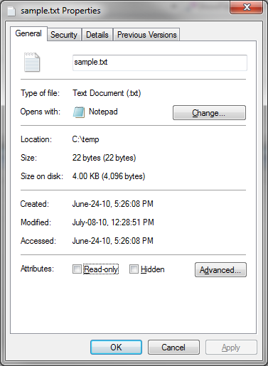

# How to display the Properties dialog box for a file (ShellExecuteEx)

## Before you begin:
  

See also:

* [Displaying icons and descriptions associated with files and folders](sample_530.md)  
  
***  


## Code:
```foxpro  
DO declare

#DEFINE SEE_MASK_CLASSNAME 0x000001
#DEFINE SEE_MASK_CLASSKEY 0x000003
#DEFINE SEE_MASK_IDLIST 0x000004
#DEFINE SEE_MASK_INVOKEIDLIST 0x00000c
#DEFINE SEE_MASK_ICON 0x000010
#DEFINE SEE_MASK_HOTKEY 0x000020
#DEFINE SEE_MASK_NOCLOSEPROCESS 0x000040
#DEFINE SEE_MASK_CONNECTNETDRV 0x000080
#DEFINE SEE_MASK_FLAG_DDEWAIT 0x000100
#DEFINE SEE_MASK_DOENVSUBST 0x000200
#DEFINE SEE_MASK_FLAG_NO_UI 0x000400
#DEFINE SEE_MASK_UNICODE 0x004000
#DEFINE SEE_MASK_NO_CONSOLE 0x008000
#DEFINE SEE_MASK_ASYNCOK 0x100000
#DEFINE SEE_MASK_HMONITOR 0x200000

*|typedef struct _SHELLEXECUTEINFO {
*|    DWORD  cbSize;           0:4
*|    ULONG  fMask;            4:4
*|    HWND  hwnd;              8:4
*|    LPCTSTR  lpVerb;        12:4
*|    LPCTSTR  lpFile;        16:4
*|    LPCTSTR  lpParameters;  20:4
*|    LPCTSTR  lpDirectory;   24:4
*|    int  nShow;             28:4
*|    HINSTANCE  hInstApp;    32:4
*|    LPVOID  lpIDList;       36:4
*|    LPCTSTR  lpClass;       40:4
*|    HKEY  hkeyClass;        44:4
*|    DWORD  dwHotKey;        48:4
*|    union {
*|        HANDLE  hIcon;      52:4
*|        HANDLE  hMonitor;
*|    } DUMMYUNIONNAME;
*|    HANDLE  hProcess;       56:4
*|} SHELLEXECUTEINFO, *LPSHELLEXECUTEINFO; total bytes = 60
#DEFINE INFO_SIZE  60

LOCAL lcBuffer, lnFlag, hWindow, loVerb, loFile
lnFlag = SEE_MASK_INVOKEIDLIST + SEE_MASK_NOCLOSEPROCESS + SEE_MASK_FLAG_NO_UI
hWindow = GetActiveWindow()
loVerb = CreateObject("PChar", "properties")
loFile = CreateObject("PChar", GetVfpExe())  && VFP executable

lcBuffer = num2dword(INFO_SIZE) +;
	num2dword(lnFlag) +;
	num2dword(hWindow) +;
	num2dword(loVerb.GetAddr()) +;
	num2dword(loFile.GetAddr()) +;
	Repli(Chr(0), 40)

IF ShellExecuteEx(@lcBuffer) = 0
* 2 -- ERROR_FILE_NOT_FOUND
	? "Error code:", GetLastError()
ENDIF

FUNCTION  num2dword (lnValue)
#DEFINE m0       256
#DEFINE m1     65536
#DEFINE m2  16777216
	LOCAL b0, b1, b2, b3
	b3 = Int(lnValue/m2)
	b2 = Int((lnValue - b3*m2)/m1)
	b1 = Int((lnValue - b3*m2 - b2*m1)/m0)
	b0 = Mod(lnValue, m0)
RETURN Chr(b0)+Chr(b1)+Chr(b2)+Chr(b3)

DEFINE CLASS PChar As Custom
	PROTECTED hMem

PROCEDURE  Init (lcString)
	THIS.hMem = 0
	THIS.setValue (lcString)

PROCEDURE  Destroy
	THIS.ReleaseString

FUNCTION getAddr  && returns a pointer to the string
RETURN THIS.hMem

FUNCTION getValue && returns string value
	LOCAL lnSize, lcBuffer
	lnSize = THIS.getAllocSize()
	lcBuffer = SPACE(lnSize)

	IF THIS.hMem <> 0
		DECLARE RtlMoveMemory IN kernel32 As Heap2Str;
			STRING @, INTEGER, INTEGER
		= Heap2Str (@lcBuffer, THIS.hMem, lnSize)
	ENDIF
RETURN lcBuffer

FUNCTION getAllocSize  && returns allocated memory size (string length)
	DECLARE INTEGER GlobalSize IN kernel32 INTEGER hMem
RETURN Iif(THIS.hMem=0, 0, GlobalSize(THIS.hMem))

PROCEDURE setValue (lcString) && assigns new string value
#DEFINE GMEM_FIXED   0
	THIS.ReleaseString

	DECLARE INTEGER GlobalAlloc IN kernel32 INTEGER, INTEGER
	DECLARE RtlMoveMemory IN kernel32 As Str2Heap;
		INTEGER, STRING @, INTEGER

	LOCAL lnSize
	lcString = lcString + Chr(0)
	lnSize = Len(lcString)
	THIS.hMem = GlobalAlloc (GMEM_FIXED, lnSize)
	IF THIS.hMem <> 0
		= Str2Heap (THIS.hMem, @lcString, lnSize)
	ENDIF

PROCEDURE ReleaseString  && releases allocated memory
	IF THIS.hMem <> 0
		DECLARE INTEGER GlobalFree IN kernel32 INTEGER
		= GlobalFree (THIS.hMem)
		THIS.hMem = 0
	ENDIF
ENDDEFINE

FUNCTION GetVfpExe
* returns VFP executable running
	DECLARE INTEGER GetModuleFileName IN kernel32;
		INTEGER hModule, STRING @lpFilename,INTEGER nSize

	LOCAL lcFilename, lnLen
	lcFilename = SPACE(250)
	lnLen = GetModuleFileName (0, @lcFilename, Len(lcFilename))
RETURN Left(lcFilename, lnLen)

PROCEDURE declare
	DECLARE INTEGER ShellExecuteEx IN Shell32 STRING @lpExecInfo
	DECLARE INTEGER GetActiveWindow IN user32
	DECLARE INTEGER GetLastError IN kernel32  
```  
***  


## Listed functions:
[GetActiveWindow](../libraries/user32/GetActiveWindow.md)  
[GetLastError](../libraries/kernel32/GetLastError.md)  
[GetModuleFileName](../libraries/kernel32/GetModuleFileName.md)  
[GlobalAlloc](../libraries/kernel32/GlobalAlloc.md)  
[GlobalFree](../libraries/kernel32/GlobalFree.md)  
[GlobalSize](../libraries/kernel32/GlobalSize.md)  
[ShellExecuteEx](../libraries/shell32/ShellExecuteEx.md)  

## Comment:
The SHELLEXECUTEINFO structure contains several pointers to strings implemented in PChar class that wraps calls to GlobalAlloc, CopyMemory and GlobalFree API functions.  
  
The actions that can be performed on an object are presented through available verbs.   
  
The following verbs are commonly used: *edit*, *explore*, *find*, *open*, *print* and *properties*. Otherwise, the "play" verb is valid for multimedia files.  
  
***  

