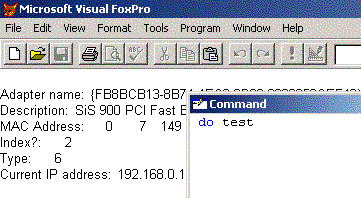

[ Home ](https://github.com/VFPX/Win32API)  

# How to retrieve adapter information for the local computer (including MAC address)

## Before you begin:
This sample code returns a good amount of network parameters for your computer: adapter name, MAC address, current IP address and more.  

  

See also:

* [SendARP function](../libraries/iphlpapi/SendARP.md)  
* [Obtaining addresses for the adapters on the local computer (Win XP/2003/Vista)](sample_506.md)  
* [Using NetWkstaTransportEnum to obtain MAC Address of remote server](sample_435.md)  
* [How to ping a remote site using IP Helper API calls](sample_382.md)  
* [How to ping a remote site using ICMP API calls](sample_486.md)  

  
***  


## Code:
```foxpro  
#DEFINE ERROR_SUCCESS           0
#DEFINE ERROR_NOT_SUPPORTED     50
#DEFINE ERROR_INVALID_PARAMETER 87
#DEFINE ERROR_BUFFER_OVERFLOW   111
#DEFINE ERROR_NO_DATA           232

DECLARE INTEGER GetAdaptersInfo IN iphlpapi;
	STRING @pAdapterInfo, LONG @pOutBufLen

LOCAL lcBuffer, lnBufsize
lnBufsize = 0
lcBuffer = ""

* this call usually returns the ERROR_BUFFER_OVERFLOW
* with lnBufsize set to the required amount of memory
= GetAdaptersInfo(@lcBuffer, @lnBufsize)

lcBuffer = Repli(Chr(0), lnBufsize)
IF GetAdaptersInfo(@lcBuffer, @lnBufsize) <> ERROR_SUCCESS
* still something is wrong
	RETURN
ENDIF

*|typedef struct _IP_ADAPTER_INFO {
*|  struct _IP_ADAPTER_INFO* Next;         0:4
*|  DWORD ComboIndex;                      4:4
*|  char AdapterName[MAX_ADAPTER_NAME_LENGTH + 4];          8:260
*|  char Description[MAX_ADAPTER_DESCRIPTION_LENGTH + 4]; 268:132
*|  UINT AddressLength;                       400:4
*|  BYTE Address[MAX_ADAPTER_ADDRESS_LENGTH]; 404:8
*|  DWORD Index;                              412:4
*|  UINT Type;                                416:4
*|  UINT DhcpEnabled;                         420:4
*|  PIP_ADDR_STRING CurrentIpAddress;         424:...
*|  IP_ADDR_STRING IpAddressList;
*|  IP_ADDR_STRING GatewayList;
*|  IP_ADDR_STRING DhcpServer;
*|  BOOL HaveWins;
*|  IP_ADDR_STRING PrimaryWinsServer;
*|  IP_ADDR_STRING SecondaryWinsServer;
*|  time_t LeaseObtained;
*|  time_t LeaseExpires;
*|} IP_ADAPTER_INFO, *PIP_ADAPTER_INFO;

#DEFINE MAX_ADAPTER_NAME_LENGTH        256
#DEFINE MAX_ADAPTER_DESCRIPTION_LENGTH 128
#DEFINE MAX_ADAPTER_ADDRESS_LENGTH     8

? "Adapter name:",;
	STRTRAN(SUBSTR(lcBuffer, 9, 260), Chr(0), "")
? "Description:",;
	STRTRAN(SUBSTR(lcBuffer, 269, 132), Chr(0), "")

LOCAL lnAddrlen, lcAddress, ii, ch
lnAddrlen = Asc(SUBSTR(lcBuffer, 401, 1))
lcAddress = SUBSTR(lcBuffer, 405, lnAddrlen)

? "MAC Address: "
FOR ii=1 TO lnAddrlen
	?? Asc(SUBSTR(lcAddress, ii,1)), " "
ENDFOR

? "Index?:", Asc(SUBSTR(lcBuffer, 413,1))
? "Type:", Asc(SUBSTR(lcBuffer, 417,1))
? "Current IP address:", STRTRAN(SUBSTR(lcBuffer, 433,15), Chr(0),"")

* storing the buffer to a cursor, so you can review each byte of it
CREATE CURSOR cs (asc I, ch C(1))
FOR ii=1 TO lnBufsize
	ch = SUBSTR(lcBuffer, ii,1)
	INSERT INTO cs VALUES (Asc(m.ch), m.ch)
ENDFOR  
```  
***  


## Listed functions:
[GetAdaptersInfo](../libraries/iphlpapi/GetAdaptersInfo.md)  

## Comment:
MAC address: short for *Media Access Control address*, a hardware address that uniquely identifies each node of a network (<a href="http://www.webopedia.com/TERM/M/MAC_address.html">Webopedia</a>).  
  
Windows <a href="http://www.microsoft.com/windows2000/techinfo/reskit/tools/existing/getmac-o.asp">GETMAC</a> tool (WinXP/2K) provides a quick method for obtaining the MAC (Ethernet) layer address and binding order for a computer running Windows 2000, locally or across a network.  
  
Windows Server 2003 and Windows XP: Use the GetAdaptersAddresses function instead of GetAdaptersInfo.  
  
Microsoft Knowledge Base Article - 118623: <a href="http://support.microsoft.com/default.aspx?scid=kb;en-us;118623">HOWTO: Get the MAC Address for an Ethernet Adapter</a>.  
  
Another code sample <a href="http://techsupt.windowware.com/TS/T000001013F7.html">How to Get Mac (Media Access Control) Address</a> on Wilson WindowWare Tech Support uses NetWkstaTransportEnum function to obtain MAC address of a server.  
  
  
***  

