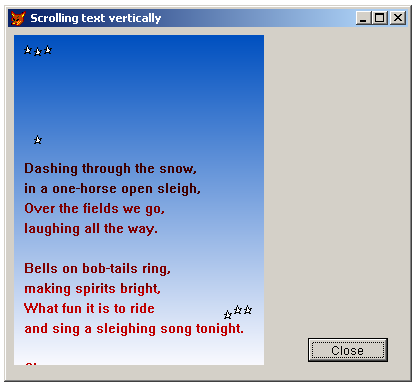

# How to put a vertical text scrolling on the form (a movie cast)

## Before you begin:
  

See also:

* [Scrolling text on the form horizontally (a newsreel)](sample_352.md)  
* [Shaking VFP form controls](sample_526.md)  
* [Playing AVI on _screen](sample_430.md)  
* [Displaying animated images](sample_355.md)  
* [Form Magnifier](sample_414.md)  

  
***  


## Code:
```foxpro  
PUBLIC oForm
oForm = CreateObject("Tform")
oForm.Visible = .T.

DEFINE CLASS Tform As Form
	Width=400
	Height=350
	Caption=" Scrolling text vertically"
	Autocenter=.T.
	
	DIMEN content[25]
	content[1] = "Dashing through the snow, "
	content[2] = "in a one-horse open sleigh, "
	content[3] = "Over the fields we go, "
	content[4] = "laughing all the way. "
	content[5] = ""
	content[6] = "Bells on bob-tails ring, "
	content[7] = "making spirits bright, "
	content[8] = "What fun it is to ride "
	content[9] = "and sing a sleighing song tonight."
	content[10] = ""
	content[11] = "Chorus"
	content[12] = "Jingle bells, jingle bells, "
	content[13] = "jingle all the way! "
	content[14] = "O what fun it is to ride "
	content[15] = "in a one-horse open sleigh."
	content[16] = ""
	content[17] = "A day or two ago, "
	content[18] = "the story I must tell "
	content[19] = "I went out on the snow, "
	content[20] = "and on my back I fell; "
	content[21] = "A gent was riding by, "
	content[22] = "in a one-horse open sleigh "
	content[23] = "He laughed as there I sprawling "
	content[24] = "lie but quickly drove away"
	content[25] = ""

	hWindow=0
	hDC=0
	
	DspWidth=250
	DspHeight=330
	BackHeight=900

	hDspDC=0
	hDspBmp=0
	hBackDC=0
	hBackBmp=0
	
	SrcOffs=0
	
	ADD OBJECT tm As Timer WITH interval=0
	ADD OBJECT cmd As CommandButton WITH;
	Left=300,Top=310, Height=24, Width=80,;
	Caption="Close"

PROCEDURE Init
	THIS.decl
	
PROCEDURE tm.Timer
	ThisForm.CopyToTarget

PROCEDURE cmd.Click
	ThisForm.Release

PROCEDURE Activate
	IF THIS.hDspDC = 0
		THIS.CreateSource
	ENDIF
	THIS.tm.Interval = 50

PROCEDURE Destroy
	THIS.ReleaseSource

PROCEDURE CreateSource
	DECLARE INTEGER GetDesktopWindow IN user32
	DECLARE INTEGER CreateCompatibleDC IN gdi32 INTEGER hdc
	DECLARE INTEGER CreateCompatibleBitmap IN gdi32;
		INTEGER hdc, INTEGER nWidth, INTEGER nHeight
		
	THIS.hWindow = GetFocus()
	THIS.hDC = GetWindowDC(THIS.hWindow)

	LOCAL hDsk, hDskDC, hBr, rect
	hDsk = GetDesktopWindow()
	hDskDC = GetWindowDC(hDsk)

	THIS.hDspDC = CreateCompatibleDC(hDskDC)
	THIS.hDspBmp = CreateCompatibleBitmap(hDskDC,;
		THIS.DspWidth, THIS.DspHeight)
	= DeleteObject(SelectObject(THIS.hDspDC, THIS.hDspBmp))

	THIS.hBackDC = CreateCompatibleDC(hDskDC)
	THIS.hBackBmp = CreateCompatibleBitmap(hDskDC,;
		THIS.DspWidth, THIS.BackHeight)
	= DeleteObject(SelectObject(THIS.hBackDC, THIS.hBackBmp))

	* setting background color
	hBr = CreateSolidBrush(Rgb(255,255,255))
	rect = num2dword(0) + num2dword(0) +;
		num2dword(THIS.DspWidth) + num2dword(THIS.BackHeight)
	= FillRect(THIS.hBackDC, @rect, hBr)
	= DeleteObject(hBr)

	* setting text parameters
	= SetBkMode(THIS.hBackDC, 1)  && transparent
	= SetTextColor(THIS.hBackDC, Rgb(192,0,0))

	* printing text on memory device context
	LOCAL ii
	FOR ii=1 TO 25
		= TextOut(THIS.hBackDC,;
			10,THIS.DspHeight+(ii-1)*20,;
			THIS.content[ii], Len(THIS.content[ii]))
	ENDFOR
	= ReleaseDC(hDsk, hDskDC)

PROCEDURE CopyToTarget
#DEFINE SRCCOPY  13369376
#DEFINE SRCAND   8913094

	LOCAL hBr, rect

	* setting background
	= DrawGradient(THIS.hDspDC, 0,0, THIS.DspWidth, THIS.DspHeight,;
		0,80,192, 250,250,255)

	THIS.DrawStar(10,10)
	THIS.DrawStar(20,12)
	THIS.DrawStar(30,10)
	THIS.DrawStar(20,100)
	THIS.DrawStar(230,270)
	THIS.DrawStar(210,275)
	THIS.DrawStar(220,270)

	* copying text to interim device context
	= BitBlt(THIS.hDspDC, 0,0, THIS.DspWidth, THIS.DspHeight,;
		THIS.hBackDC, 0, THIS.SrcOffs, SRCAND)

	THIS.SrcOffs = THIS.SrcOffs + 1
	IF THIS.SrcOffs > THIS.BackHeight
		THIS.SrcOffs = 0
	ENDIF

	* copying from the interim DC to DC of the form
	= BitBlt(THIS.hDC, 10,30, THIS.DspWidth, THIS.DspHeight,;
		THIS.hDspDC, 0, 0, SRCCOPY)

PROCEDURE DrawStar(x,y)
	LOCAL lcBuffer
	lcBuffer =;
		num2dword(x+0) + num2dword(y+4) +;
		num2dword(x+2) + num2dword(y+4) +;
		num2dword(x+3) + num2dword(y-0) +;
		num2dword(x+5) + num2dword(y+4) +;
		num2dword(x+7) + num2dword(y+3) +;
		num2dword(x+5) + num2dword(y+6) +;
		num2dword(x+6) + num2dword(y+8) +;
		num2dword(x+3) + num2dword(y+7) +;
		num2dword(x+0) + num2dword(y+8) +;
		num2dword(x+2) + num2dword(y+5) +;
		num2dword(x+0) + num2dword(y+4)
	= Polygon(THIS.hDspDC, @lcBuffer, 11)

PROCEDURE ReleaseSource
	= DeleteObject(THIS.hBackBmp)
	= DeleteDC(THIS.hBackDC)
	= DeleteObject(THIS.hDspBmp)
	= DeleteDC(THIS.hDspDC)
	= ReleaseDC(THIS.hWindow, THIS.hDC)

PROCEDURE decl
	DECLARE INTEGER GetFocus IN user32
	DECLARE INTEGER GetActiveWindow IN user32
	DECLARE INTEGER DeleteDC IN gdi32 INTEGER hdc
	DECLARE INTEGER DeleteObject IN gdi32 INTEGER hObj
	DECLARE INTEGER GetWindowDC IN user32 INTEGER hwnd
	DECLARE INTEGER CreateSolidBrush IN gdi32 LONG crColor
	DECLARE INTEGER ReleaseDC IN user32 INTEGER hwnd, INTEGER hdc
	DECLARE INTEGER SetBkColor IN gdi32 INTEGER hdc, LONG crColor
	DECLARE INTEGER SelectObject IN gdi32 INTEGER hdc, INTEGER hObj
	DECLARE INTEGER SetBkMode IN gdi32 INTEGER hdc, INTEGER iBkMode
	DECLARE INTEGER SetTextColor IN gdi32 INTEGER hdc, INTEGER crColor

	DECLARE INTEGER FillRect IN user32;
		INTEGER hDC, STRING @RECT, INTEGER hBrush

	DECLARE INTEGER TextOut IN gdi32;
		INTEGER hdc, INTEGER x, INTEGER y,;
		STRING lpString, INTEGER nCount

	DECLARE INTEGER BitBlt IN gdi32 INTEGER hDestDC,;
		INTEGER x, INTEGER y, INTEGER nWidth, INTEGER nHeight,;
		INTEGER hSrcDC, INTEGER xSrc, INTEGER ySrc, INTEGER dwRop

	DECLARE INTEGER GradientFill IN Msimg32;
		INTEGER hdc, STRING @pVertex, LONG dwNumVertex,;
		STRING @pMesh, LONG dwNumMesh, LONG dwMode

	DECLARE INTEGER Polygon IN gdi32;
		INTEGER hdc, STRING @lpPoints, INTEGER nCount

ENDDEFINE

PROCEDURE DrawGradient
LPARAMETERS hDC, x1,y1, x2,y2,;
	nRed1,nGreen1,nBlue1, nRed2,nGreen2,nBlue2

	LOCAL lcVertex, lcMesh
	lcMesh = num2dword(0) + num2dword(1)
	lcVertex = num2dword(x1) + num2dword(y1) +;
		num2word(nRed1*256) +;
		num2word(nGreen1*256) +;
		num2word(nBlue1*256) +;
		num2word(0) +;
		num2dword(x2) + num2dword(y2)  +;
		num2word(nRed2*256) +;
		num2word(nGreen2*256) +;
		num2word(nBlue2*256) +;
		num2word(0)

	= GradientFill(hDC, @lcVertex, 2, @lcMesh, 1, 1)
RETURN

FUNCTION  num2dword (lnValue)
#DEFINE m0       256
#DEFINE m1     65536
#DEFINE m2  16777216
	LOCAL b0, b1, b2, b3
	b3 = Int(lnValue/m2)
	b2 = Int((lnValue - b3*m2)/m1)
	b1 = Int((lnValue - b3*m2 - b2*m1)/m0)
	b0 = Mod(lnValue, m0)
RETURN Chr(b0)+Chr(b1)+Chr(b2)+Chr(b3)

FUNCTION num2word (lnValue)
RETURN Chr(MOD(m.lnValue,256)) + CHR(INT(m.lnValue/256))  
```  
***  


## Listed functions:
[BitBlt](../libraries/gdi32/BitBlt.md)  
[CreateCompatibleBitmap](../libraries/gdi32/CreateCompatibleBitmap.md)  
[CreateCompatibleDC](../libraries/gdi32/CreateCompatibleDC.md)  
[CreateSolidBrush](../libraries/gdi32/CreateSolidBrush.md)  
[DeleteDC](../libraries/gdi32/DeleteDC.md)  
[DeleteObject](../libraries/gdi32/DeleteObject.md)  
[FillRect](../libraries/gdi32/FillRect.md)  
[GetActiveWindow](../libraries/user32/GetActiveWindow.md)  
[GetDesktopWindow](../libraries/user32/GetDesktopWindow.md)  
[GetFocus](../libraries/user32/GetFocus.md)  
[GetWindowDC](../libraries/user32/GetWindowDC.md)  
[GradientFill](../libraries/msimg32/GradientFill.md)  
[Polygon](../libraries/gdi32/Polygon.md)  
[ReleaseDC](../libraries/user32/ReleaseDC.md)  
[SelectObject](../libraries/gdi32/SelectObject.md)  
[SetBkColor](../libraries/gdi32/SetBkColor.md)  
[SetBkMode](../libraries/gdi32/SetBkMode.md)  
[SetTextColor](../libraries/gdi32/SetTextColor.md)  
[TextOut](../libraries/gdi32/TextOut.md)  

## Comment:
This is a simple example of double buffered video output.   
  
The first buffer, which is the largest one, contains all lines of text printed as a long column.   
  
The second buffer is of size of the output frame. Triggered by each timer event, the program code:  
- draws a gradient background ( GradientFill )  
- puts some stars ( Polygon )  
- copies a rectangle part with text lines from the first buffer ( BitBlt )  
  
After this the second buffer is drawn completely, and it is copied to the output frame on the form with the BitBlt function.  
  
The timing is important for creating a smooth scrolling. Fortunately there are not too many FoxPro commands involved in this cycle, mostly Win32 functions do the job. So the performance is almost the same as it could be for a similar VB code.  
  
***  

