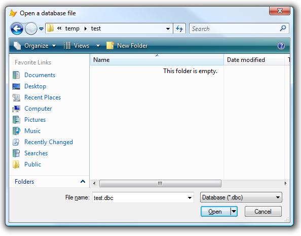

<link rel="stylesheet" type="text/css" href="../css/win32api.css">  
<link rel="stylesheet" href="https://cdnjs.cloudflare.com/ajax/libs/font-awesome/4.7.0/css/font-awesome.min.css">

# Creating the Open dialog box to specify the drive, directory, and name of a file to open

## Before you begin:
The GetFileNameFromBrowse Shell32 function (see <a href="?example=365">another example</a>) provides same functionality with shorter code.[another example](sample_365.md)  

  

See also:<UL><LI style="padding-bottom: 7px;"><a href="?example=482">How to position the GETPRINTER() dialog</a>

<LI style="padding-bottom: 7px;"><a href="?example=424">Using Extended MessageBox() Class</a>[Using Extended MessageBox() Class](sample_424.md)  
<LI style="padding-bottom: 7px;"><a href="?example=418">Extended MessageBox Class</a>[Extended MessageBox Class](sample_418.md)  
<LI style="padding-bottom: 7px;"><a href="?example=434">How to change font name and size in the MessageBox dialog</a>[How to change font name and size in the MessageBox dialog](sample_434.md)  
<LI style="padding-bottom: 7px;"><a href="?example=365">Creating an Open dialog box to specify the drive, directory, and name of a file to open (Shell32 version)</a>[Creating an Open dialog box to specify the drive, directory, and name of a file to open (Shell32 version)](sample_365.md)  
<LI style="padding-bottom: 7px;"><a href="?example=265">Creating the Save dialog box to specify the drive, directory, and name of a file to save</a>[Creating the Save dialog box to specify the drive, directory, and name of a file to save](sample_265.md)  
<LI style="padding-bottom: 7px;"><a href="?example=364">How to display a dialog box that enables the user to select a folder (an alternative to the GETDIR)</a>[How to display a dialog box that enables the user to select a folder (an alternative to the GETDIR)](sample_364.md)  
  
***  


## Code:
```foxpro  
DO declare

*| typedef struct tagOFN {
*|   DWORD         lStructSize;      0:4
*|   HWND          hwndOwner;        4:4
*|   HINSTANCE     hInstance;        8:4
*|   LPCTSTR       lpstrFilter;     12:4
*|   LPTSTR        lpstrCustFilt;   16:4
*|   DWORD         nMaxCustFilter;  20:4
*|   DWORD         nFilterIndex;    24:4
*|   LPTSTR        lpstrFile;       28:4
*|   DWORD         nMaxFile;        32:4
*|   LPTSTR        lpstrFileTitle;  36:4
*|   DWORD         nMaxFileTitle;   40:4
*|   LPCTSTR       lpstrInitialDir; 44:4
*|   LPCTSTR       lpstrTitle;      48:4
*|   DWORD         Flags;           52:4
*|   WORD          nFileOffset;     56:2
*|   WORD          nFileExtension;  58:2
*|   LPCTSTR       lpstrDefExt;     60:4
*|   LPARAM        lCustData;       64:4
*|   LPOFNHOOKPROC lpfnHook;        68:4
*|   LPCTSTR       lpTemplateName;  72:4 = 76 bytes
*| #if (_WIN32_WINNT >= 0x0500)
*|   void *        pvReserved;      76:4
*|   DWORD         dwReserved;      80:4
*|   DWORD         FlagsEx;         84:4
*| #endif // (_WIN32_WINNT >= 0x0500)
*| } OPENFILENAME, *LPOPENFILENAME; total = 88 bytes

#DEFINE OPENFILENAME_SIZE  76  && set to 88 for W2K

LOCAL lcBuffer, loFilter, loTitlebar, loFilename, loFilenameRet,;
	loDefExt, loStartDir, lnErrorCode

* dialog title
loTitlebar = CreateObject("PChar", "Open a database file")

* file types filter
loFilter = CreateObject("PChar",;
	"Database (*.dbc)" + Chr(0) + "*.dbc" + Chr(0) +;
	"All files" + Chr(0) + "*.*" + Chr(0)+Chr(0))

* default extension, in case if user type a name with no extension
loDefExt = CreateObject("PChar", "DBC")

* suggest a file name or put just an empty string
loFilename = CreateObject("PChar", Padr("test.dbc", 250,Chr(0)))

* a space for file name to be returned
loFilenameRet = CreateObject("PChar", Repli(Chr(0),250))

* initial directory displayed in the dialog
loStartDir = CreateObject("PChar", SYS(5)+SYS(2003))

* configuration flags
#DEFINE OFN_HIDEREADONLY 4
#DEFINE OFN_NOCHANGEDIR 8  && ineffective for GetOpenFileName
#DEFINE OFN_EXTENSIONDIFFERENT 0x400
#DEFINE OFN_PATHMUSTEXIST 0x800
#DEFINE OFN_CREATEPROMPT 0x2000
#DEFINE OFN_EXPLORER 0x80000
#DEFINE OFN_DONTADDTORECENT 0x2000000

lnFlags = OFN_PATHMUSTEXIST + OFN_EXTENSIONDIFFERENT +;
	OFN_CREATEPROMPT + OFN_HIDEREADONLY + OFN_NOCHANGEDIR

* assembling the OPENFILENAME structure
lcBuffer = num2dword(OPENFILENAME_SIZE) +;
	num2dword(GetActiveWindow()) +;
	num2dword(0) +;
	num2dword(loFilter.GetAddr()) +;
	num2dword(0) + num2dword(0) + num2dword(1) +;
	num2dword(loFilename.GetAddr()) +;
	num2dword(loFilename.GetAllocSize()) +;
	num2dword(loFilenameRet.GetAddr()) +;
	num2dword(loFilenameRet.GetAllocSize()) +;
	num2dword(loStartDir.GetAddr()) +;
	num2dword(loTitlebar.GetAddr()) +;
	num2dword(lnFlags) +;
	num2dword(0) +;
	num2dword(loDefExt.GetAddr()) +;
	num2dword(0) + num2dword(0) + num2dword(0)

* creating an Open dialog box
IF GetOpenFileName(@lcBuffer) = 0
	lnErrorCode = CommDlgExtendedError()
	IF lnErrorCode <> 0
		? "Error code:", lnErrorCode
	ELSE
	* the Cancel button selected
	ENDIF

ELSE
	lcFullname = STRTRAN(Trim(loFilename.GetValue()), Chr(0),"")
	lcFilename = STRTRAN(Trim(loFilenameRet.GetValue()), Chr(0),"")

	lnFileOffset = buf2word(SUBSTR(lcBuffer, 57,2))
	lnExtOffset = buf2word(SUBSTR(lcBuffer, 59,2))

	lcPath = SUBSTR(lcFullname, 1, lnFileOffset-1)
	lcFileext = SUBSTR(lcFullname, lnExtOffset+1)

	? lcFullname
	? lcPath
	? lcFilename
	? lcFileext
ENDIF
* end of main

PROCEDURE declare
	DECLARE INTEGER GetOpenFileName IN comdlg32 STRING @lpofn
	DECLARE INTEGER GetActiveWindow IN user32
	DECLARE INTEGER GlobalFree IN kernel32 INTEGER hMem
	DECLARE INTEGER CommDlgExtendedError IN comdlg32

DEFINE CLASS PChar As Custom
	hMem=0

PROCEDURE  Init (lcString)
	THIS.SetValue (lcString)

PROCEDURE Destroy
	THIS.ReleaseString

FUNCTION GetAddr  && returns a pointer to the string
RETURN THIS.hMem

FUNCTION GetValue && returns string value
	LOCAL lnSize, lcBuffer
	lnSize = THIS.getAllocSize()
	lcBuffer = SPACE(lnSize)
	IF THIS.hMem <> 0
		DECLARE RtlMoveMemory IN kernel32 As Heap2Str;
			STRING @, INTEGER, INTEGER
		= Heap2Str (@lcBuffer, THIS.hMem, lnSize)
	ENDIF
RETURN lcBuffer

FUNCTION GetAllocSize  && returns allocated memory size (string length)
	DECLARE INTEGER GlobalSize IN kernel32 INTEGER hMem
RETURN Iif(THIS.hMem=0, 0, GlobalSize(THIS.hMem))

PROCEDURE SetValue(lcString) && assigns new string value
#DEFINE GMEM_FIXED   0
	THIS.ReleaseString

	DECLARE INTEGER GlobalAlloc IN kernel32 INTEGER, INTEGER
	DECLARE RtlMoveMemory IN kernel32 As Str2Heap;
		INTEGER, STRING @, INTEGER

	LOCAL lnSize
	lcString = lcString + Chr(0)
	lnSize = Len(lcString)
	THIS.hMem = GlobalAlloc (GMEM_FIXED, lnSize)
	IF THIS.hMem <> 0
		= Str2Heap (THIS.hMem, @lcString, lnSize)
	ENDIF

PROCEDURE ReleaseString  && releases allocated memory
	IF THIS.hMem <> 0
		DECLARE INTEGER GlobalFree IN kernel32 INTEGER
		= GlobalFree (THIS.hMem)
		THIS.hMem = 0
	ENDIF
ENDDEFINE

FUNCTION buf2word(lcBuffer)
RETURN Asc(SUBSTR(lcBuffer, 1,1)) + ;
       Asc(SUBSTR(lcBuffer, 2,1)) * 256

FUNCTION num2dword(lnValue)
#DEFINE m0  256
#DEFINE m1  65536
#DEFINE m2  16777216
	IF lnValue < 0
		lnValue = 0x100000000 + lnValue
	ENDIF
	LOCAL b0, b1, b2, b3
	b3 = Int(lnValue/m2)
	b2 = Int((lnValue - b3*m2)/m1)
	b1 = Int((lnValue - b3*m2 - b2*m1)/m0)
	b0 = Mod(lnValue, m0)
RETURN Chr(b0)+Chr(b1)+Chr(b2)+Chr(b3)  
```  
***  


## Listed functions:
[CommDlgExtendedError](../libraries/comdlg32/CommDlgExtendedError.md)  
[GetActiveWindow](../libraries/user32/GetActiveWindow.md)  
[GetOpenFileName](../libraries/comdlg32/GetOpenFileName.md)  
[GlobalAlloc](../libraries/kernel32/GlobalAlloc.md)  
[GlobalFree](../libraries/kernel32/GlobalFree.md)  
[GlobalSize](../libraries/kernel32/GlobalSize.md)  

## Comment:
See also MSDN article: <a href="http://msdn.microsoft.com/library/default.asp?url=/library/en-us/winui/winui/windowsuserinterface/userinput/commondialogboxlibrary/aboutcommondialogboxes/openandsaveasdialogboxes.asp">Open and Save As Dialog Boxes</a>.  
  
OFN_NOCHANGEDIR flag is effective for Save As dialog only. It does not prevent the user from changing directories to find a file.  
  
***  

