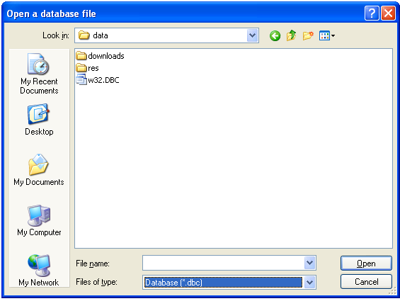

# Creating an Open dialog box to specify the drive, directory, and name of a file to open (Shell32 version)

## Before you begin:
This is exactly the same functionality as in <a href="?example=363">another example</a> using the GetOpenFileName function. [another example](sample_363.md)  

  
And it is achieved with less amount of more simple code, which is because of Shell32 functions being generally more friendly to developer :)  

See also:<UL><LI style="padding-bottom: 7px;"><a href="?example=482">How to position the GETPRINTER() dialog</a>

<LI style="padding-bottom: 7px;"><a href="?example=424">Using Extended MessageBox() Class</a>[Using Extended MessageBox() Class](sample_424.md)  
<LI style="padding-bottom: 7px;"><a href="?example=418">Extended MessageBox Class</a>[Extended MessageBox Class](sample_418.md)  
<LI style="padding-bottom: 7px;"><a href="?example=434">How to change font name and size in the MessageBox dialog</a>[How to change font name and size in the MessageBox dialog](sample_434.md)  
<LI style="padding-bottom: 7px;"><a href="?example=363">Creating the Open dialog box to specify the drive, directory, and name of a file to open</a>[Creating the Open dialog box to specify the drive, directory, and name of a file to open](sample_363.md)  
<LI style="padding-bottom: 7px;"><a href="?example=265">Creating the Save dialog box to specify the drive, directory, and name of a file to save</a>[Creating the Save dialog box to specify the drive, directory, and name of a file to save](sample_265.md)  
<LI style="padding-bottom: 7px;"><a href="?example=364">How to display a dialog box that enables the user to select a folder (an alternative to the GETDIR)</a>[How to display a dialog box that enables the user to select a folder (an alternative to the GETDIR)](sample_364.md)  
  
***  


## Code:
```foxpro  
#DEFINE CP_ACP         0
#DEFINE CP_OEMCP       1
#DEFINE MB_PRECOMPOSED 1
DO decl

LOCAL lcFilename, lcPath, lcExt, lcFilter, lcTitle

lcTitle = a2u("Open a database file")
lcPath = a2u(SYS(5)+SYS(2003))
lcExt = a2u("DBC")
lcFilter = a2u("Database (*.dbc)" + Chr(0) + "*.dbc" + Chr(0) +;
	"All files" + Chr(0) + "*.*" + Chr(0)+Chr(0))

#DEFINE cnBufsize  250  && provide a sufficient buffer
lcFilename = a2u(PADR("test.dbc", cnBufsize))

IF GetFileNameFromBrowse(GetActiveWindow(),;
	@lcFilename, cnBufsize,;
	lcPath, lcExt, lcFilter, lcTitle) <> 0
	? "Returned:", u2a(lcFilename)
ENDIF
* end of main

FUNCTION u2a(cText)
* converting a Unicode string to an ANSI string
	LOCAL lcBuffer, lnBufsize
	cText = SUBSTR(cText, 1, AT(Chr(0)+Chr(0),cText))

	* first calling to define required buffer size
	lcBuffer = ""
	lnBufsize = WideCharToMultiByte(CP_ACP, 0,;
		cText, Len(cText), @lcBuffer, 0, "?", 0)
		
	lcBuffer = Repli(Chr(0), lnBufsize)
	= WideCharToMultiByte(CP_ACP, 0,;
		cText, Len(cText), @lcBuffer, lnBufsize, "?", 0)
RETURN SUBSTR(lcBuffer, 1, AT(Chr(0),lcBuffer)-1)

FUNCTION a2u(cText)
* converting an ANSI string to a Unicode string
	LOCAL lcBuffer, lnBufsize
	
	* first calling to define required buffer size
	lcBuffer = ""
	lnBufsize = MultiByteToWideChar(CP_ACP, MB_PRECOMPOSED,;
		cText, Len(cText), @lcBuffer, 0)

	lcBuffer = Repli(Chr(0), lnBufsize*2)  && in wide chars
	= MultiByteToWideChar(CP_ACP, MB_PRECOMPOSED,;
		cText, Len(cText), @lcBuffer, lnBufsize)
RETURN lcBuffer

PROCEDURE decl
	DECLARE INTEGER GetActiveWindow IN user32

	DECLARE INTEGER GetFileNameFromBrowse IN shell32;
		INTEGER hwnd, STRING @pszFilePath, LONG cchFilePath,;
		STRING pszWorkingDir, STRING pszDefExt,;
		STRING pszFilters, STRING szTitle

	DECLARE INTEGER WideCharToMultiByte IN kernel32;
		INTEGER CodePg, INTEGER dwFlags,;
		STRING lpWideCharStr, INTEGER cchWideChar,;
		STRING @lpMultiByteStr, INTEGER cbMultiByte,;
		STRING lpDefaultChar, INTEGER lpUsedDefaultChar

	DECLARE INTEGER MultiByteToWideChar IN kernel32;
		INTEGER CodePage, LONG dwFlags, STRING lpMultiByteStr,;
		INTEGER cbMultiByte, STRING @lpWideCharStr,;
		INTEGER cchWideChar  
```  
***  


## Listed functions:
[GetActiveWindow](../libraries/user32/GetActiveWindow.md)  
[GetFileNameFromBrowse](../libraries/shell32/GetFileNameFromBrowse.md)  
[MultiByteToWideChar](../libraries/kernel32/MultiByteToWideChar.md)  
[WideCharToMultiByte](../libraries/kernel32/WideCharToMultiByte.md)  

## Comment:
Also in this example you can find two routines for converting strings from ANSI to Unicode and from Unicode to ANSI using MultiByteToWideChar and  WideCharToMultiByte functions.  
  
***  

