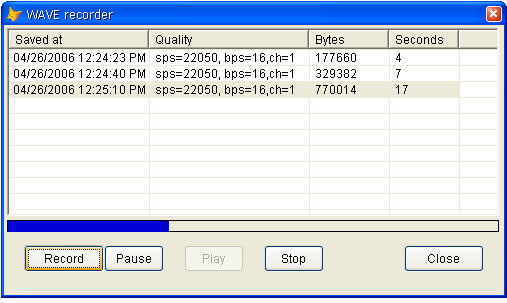
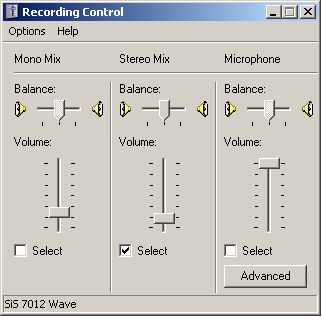

[ Home ](https://github.com/VFPX/Win32API)  

# WAV file recorder

## Before you begin:
This code is based on **TWaveRecorder** class defined in example <a href="?example=420">Custom class for .WAV recording</a>.[Custom class for .WAV recording](sample_420.md)  

  
The recorder is able to record audio coming from playback devices like Wave, Microphone etc. Check active playback and recording devices and their volumes before running this code.  

  

See also:

* [WAV file player](sample_417.md)  
* [Controlling master audio volume by sending WM_APPCOMMAND messages](sample_592.md)  
  
***  


## Code:
```foxpro  
LOCAL obj
obj = CREATEOBJECT("Tform")
obj.Show(1)
* end of main

DEFINE CLASS Tform As Form
#DEFINE ccTempWaveFile "temp$$$.wav"
#DEFINE ccCursor "csSound"
	rc=NULL
	state="IDLE"
	Width=500
	Height=270
	BorderStyle=2
	MaxButton=.F.
	MinButton=.F.
	Autocenter=.T.
	KeyPreview=.T.
	Caption="WAVE recorder"

	ADD OBJECT cmdRecord As CommandButton WITH;
	Left=20, Top=220, Width=80, Height=27, Caption="Record"

	ADD OBJECT cmdPause As CommandButton WITH;
	Left=100, Top=220, Width=60, Height=27, Caption="Pause"

	ADD OBJECT cmdReplay As CommandButton WITH;
	Left=180, Top=220, Width=60, Height=27, Caption="Play"

	ADD OBJECT cmdStop As CommandButton WITH;
	Left=260, Top=220, Width=60, Height=27, Caption="Stop"

	ADD OBJECT cmdClose As CommandButton WITH Cancel=.T.,;
	Left=400, Top=220, Width=80, Height=27, Caption="Close"
	
	ADD OBJECT progress0 As Shape WITH;
	Left=3, Top=195, Width=492, Height=12
	
	ADD OBJECT progress As Shape WITH Visible=.F., BorderStyle=0,;
	Left=4, Top=196, Width=490, Height=11, BackColor=Rgb(0,0,212)

	ADD OBJECT lst As OleControl WITH OleClass="MSComctlLib.ListViewCtrl",;
	Left=2, Width=494, Top=2, Height=190

	ADD OBJECT tm As Timer WITH Interval=0

PROCEDURE Init
	THIS.state="IDLE"
	THIS.rc = CREATEOBJECT("TWaveRecorder")

	DECLARE INTEGER sndPlaySound IN winmm;
		STRING lpszSound, INTEGER fuSound

	IF THIS.rc.errorno = 0
		THIS.cmdRecord.Enabled = .T.
	ENDIF
	IF USED(ccCursor)
		USE IN (ccCursor)
	ENDIF

PROCEDURE KeyPress(nKeyCode, nShiftAltCtrl)
	IF nKeyCode=27
		THIS.Release
	ENDIF

PROCEDURE state_ASSIGN(nState)
	DO CASE
	CASE m.nState="IDLE"
		THIS.cmdPause.Caption="Resume"
		THIS.EnableButtons(.T., .F., .T., .T.)
	CASE m.nState="RECORDING"
		THIS.cmdPause.Caption="Pause"
		THIS.EnableButtons(.T., .T., .F., .T.)
	CASE m.nState="PAUSED"
		THIS.cmdPause.Caption="Resume"
		THIS.EnableButtons(.F., .T., .F., .T.)
	ENDCASE
	THIS.state = m.nState

PROTECTED PROCEDURE EnableButtons(lRecord, lPause, lReplay, lStop)
	THIS.cmdRecord.Enabled=m.lRecord
	THIS.cmdPause.Enabled=m.lPause
	THIS.cmdReplay.Enabled=m.lReplay
	THIS.cmdStop.Enabled=m.lStop

PROCEDURE lst.Init
	WITH THIS
		.View=3
		.HideSelection=.F.
		.FullRowSelect=.T.
		.Gridlines=.T.
		.ColumnHeaders.Add(1,,"Saved at", 140)
		.ColumnHeaders.Add(2,,"Quality", 160)
		.ColumnHeaders.Add(3,,"Bytes", 80)
		.ColumnHeaders.Add(4,,"Seconds", 70)
	ENDWITH

PROCEDURE Destroy
	THIS.StopReplaying
	THIS.rc=NULL

PROCEDURE cmdRecord.Click
	ThisForm.StartRecording()

PROCEDURE cmdPause.Click
	ThisForm.PauseRecording

PROCEDURE cmdStop.Click
	ThisForm.OnStop

PROCEDURE OnStop
	DO CASE
	CASE THIS.state="PAUSED"
		ThisForm.StopRecording
	CASE THIS.state="RECORDING"
		ThisForm.StopRecording
	OTHERWISE
		ThisForm.StopReplaying
	ENDCASE

PROCEDURE cmdReplay.Click
	ThisForm.StartReplaying

PROCEDURE cmdClose.Click
	ThisForm.Release

PROCEDURE tm.Timer
	ThisForm.OnTimer

PROCEDURE StartRecording
	THIS.StopReplaying
	IF THIS.rc.StartRecording()
		THIS.progress.Width=0
		THIS.progress.Visible=.T.
		THIS.tm.Interval=10
		THIS.state="RECORDING"
	ENDIF

PROCEDURE PauseRecording
	IF THIS.state="PAUSED"
		THIS.rc.StartRecording(.T.)
		THIS.state="RECORDING"
	ELSE
		THIS.rc.StopRecording
		THIS.state="PAUSED"
	ENDIF

PROCEDURE StopRecording
	IF THIS.state <> "IDLE"
		THIS.tm.Interval = 0
		THIS.rc.StopRecording
		THIS.progress.Width = THIS.progress0.Width
		THIS.progress.Visible = .F.
		THIS.SaveRecord
		THIS.state="IDLE"
	ENDIF

PROCEDURE StopReplaying
	= sndPlaySound(NULL, 0)
	DELETE FILE (ccTempWaveFile)
	THIS.state="IDLE"

PROCEDURE StartReplaying
#DEFINE SND_ASYNC 1
#DEFINE SND_NODEFAULT 2
	THIS.StopReplaying
	IF VARTYPE(THIS.lst.SelectedItem) <> "O"
		RETURN
	ENDIF

	LOCAL nRecno
	nRecno = VAL(THIS.lst.SelectedItem.Tag)

	SELECT (ccCursor)
	IF BETW(nRecno, 1, RECCOUNT())
		GO nRecno
		IF STRTOFILE(wavedata, ccTempWaveFile) <> 0
			= sndPlaySound(ccTempWaveFile,;
				BITOR(SND_ASYNC, SND_NODEFAULT))
		ENDIF
	ENDIF

PROCEDURE SaveRecord
	IF Not THIS.rc.CreateWaveFile(ccTempWaveFile)
		= MESSAGEBOX(TRANSFORM(THIS.rc.errorno) + ". " +;
			THIS.rc.errormessage, 48, "File not saved!")
		RETURN .F.
	ENDIF

	LOCAL cBuffer, nBufsize
	cBuffer = FILETOSTR(ccTempWaveFile)
	nBufsize = LEN(m.cBuffer)
	DELETE FILE ccTempWaveFile
	
	IF NOT USED(ccCursor)
		CREATE CURSOR (ccCursor) (dt T, wavesize I,;
			playtime N(9,2), wavedata M)
	ENDIF

	SELECT (ccCursor)
	APPEND BLANK
	REPLACE dt WITH DATETIME(), wavesize WITH m.nBufsize,;
		playtime WITH m.nBufsize/THIS.rc.GetAvgBytesPerSecond(),;
		wavedata WITH m.cBuffer

	WITH THIS.lst.ListItems.Add(RECCOUNT(ccCursor),,;
			TTOC(DATETIME()))
		.Subitems(1) = THIS.rc.GetQuality()
		.Subitems(2) = LTRIM(STR(wavesize))
		.Subitems(3) = LTRIM(STR(playtime))
		.Tag = LTRIM(STR(RECCOUNT(ccCursor)))
		.Selected = .T.
	ENDWITH
	THIS.lst.SetFocus

PROCEDURE OnTimer
	LOCAL nDone
	WITH THIS.rc
		nDone = .GetPosition()
		DO CASE
		CASE THIS.state = "PAUSED"
		CASE .GetDeviceStatus() = 0
			THIS.StopRecording
		OTHERWISE
			THIS.progress.Width = INT(THIS.progress0.Width *;
				nDone / .GetDataSize())
		ENDCASE
	ENDWITH

ENDDEFINE  
```  
***  


## Listed functions:
[sndPlaySound](../libraries/winmm/sndPlaySound.md)  
