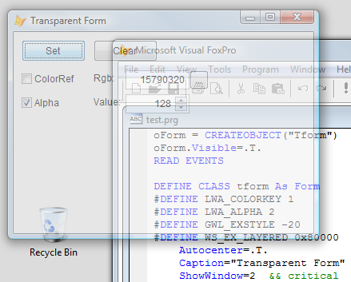

[ Home ](https://github.com/VFPX/Win32API)  

# Semi-transparent Form

## Before you begin:
  

See also:

* [Creating irregularly shaped FoxPro form using transparency color key](sample_033.md)  
* [How to draw a custom Window Caption on FoxPro form](sample_499.md)  
* [A way to make a transparent area in a form -- a hole in the form](sample_126.md)  
* [Round FoxPro form](sample_143.md)  
* [Transparent Menu on top-level form (requires VFP9)](sample_496.md)  
  
***  


## Code:
```foxpro  
oForm = CREATEOBJECT("Tform")
oForm.Visible=.T.
READ EVENTS

DEFINE CLASS tform As Form
#DEFINE LWA_COLORKEY 1
#DEFINE LWA_ALPHA 2
#DEFINE GWL_EXSTYLE -20
#DEFINE WS_EX_LAYERED 0x80000
	Autocenter=.T.
	Caption="Transparent Form"
	ShowWindow=2  && critical
	TransparentModeSet=.F.
	
	ADD OBJECT cmdSet As CommandButton WITH Left=10, Top=10,;
		Height=27, Width=80, Caption="Set"

	ADD OBJECT cmdClear As CommandButton WITH Left=100, Top=10,;
		Height=27, Width=80, Caption="Clear"
	
	ADD OBJECT chRgb As CheckBox WITH;
		Left=10, Top=50, Autosize=.T., BackStyle=0,;
		Caption="ColorRef", Value=.F.
	
	ADD OBJECT lblRgb As Label WITH;
		Left=100, Top=50, Autosize=.T., Caption="Rgb:"
	
	ADD OBJECT txtRgb As TextBox WITH Left=140, Top=48,;
		Width=80, Height=24, Value=RGB(192,192,192)
	
	ADD OBJECT cmdRgb As CommandButton WITH Left=220, Top=48,;
		Width=24, Height=24, Caption="..."
	
	ADD OBJECT chAlpha As CheckBox WITH;
		Left=10, Top=80, Autosize=.T., BackStyle=0,;
		Caption="Alpha", Value=.T.

	ADD OBJECT lblAlpha As Label WITH;
	Left=100, Top=80, Autosize=.T., Caption="Value:"
	
	ADD OBJECT txtAlpha As Spinner WITH Left=140, Top=78,;
		Width=80, Height=24, Value=128,;
		SpinnerLowValue=0, SpinnerHighValue=255,;
		KeyboardLowValue=0, KeyboardHighValue=255

PROCEDURE Init
	THIS.declare
	THIS.txtRgb.Value=THIS.BackColor

PROCEDURE Destroy
	THIS.ClearTransparentMode
	CLEAR EVENTS
	
PROCEDURE SetTransparentMode
	LOCAL nExStyle, nRgb, nAlpha, nFlags
	WITH THIS
		nExStyle = GetWindowLong(.HWnd, GWL_EXSTYLE)
		nExStyle = BITOR(nExStyle, WS_EX_LAYERED)
		= SetWindowLong(.HWnd, GWL_EXSTYLE, nExStyle)
		
		IF NOT .chRgb.Value AND NOT .chAlpha.Value
			.chAlpha.Value=.T.
		ENDIF
		
		nRgb = IIF(.chRgb.Value, .txtRgb.Value, 0)

		nAlpha = IIF(.chAlpha.Value, .txtAlpha.Value, 0)

		nFlags = IIF(.chRgb.Value, LWA_COLORKEY, 0) +;
			IIF(.chAlpha.Value, LWA_ALPHA, 0)

		= SetLayeredWindowAttributes(.HWnd, m.nRgb,;
			m.nAlpha, m.nFlags)
	ENDWITH

PROCEDURE ClearTransparentMode
	LOCAL nExStyle
	nExStyle = GetWindowLong(THIS.HWnd, GWL_EXSTYLE)
	nExStyle = BITXOR(nExStyle, WS_EX_LAYERED)
	= SetWindowLong(THIS.HWnd, GWL_EXSTYLE, nExStyle)

PROCEDURE cmdSet.Click
	ThisForm.SetTransparentMode
	ThisForm.TransparentModeSet=.T.

PROCEDURE cmdClear.Click
	ThisForm.ClearTransparentMode
	ThisForm.TransparentModeSet=.F.

PROCEDURE chRgb.Click
	IF ThisForm.TransparentModeSet
		ThisForm.SetTransparentMode
	ENDIF

PROCEDURE txtRgb.When
RETURN .F.

PROCEDURE cmdRgb.Click
	LOCAL nRgb
	nRgb = GETCOLOR()
	IF nRgb <> -1
		ThisForm.txtRgb.Value = nRgb
		IF ThisForm.TransparentModeSet AND ThisForm.chRgb.Value
			ThisForm.SetTransparentMode
		ENDIF
	ENDIF

PROCEDURE chAlpha.Click
	IF ThisForm.TransparentModeSet
		ThisForm.SetTransparentMode
	ENDIF

PROCEDURE txtAlpha.InteractiveChange
	IF ThisForm.TransparentModeSet;
		AND ThisForm.chAlpha.Value
		ThisForm.SetTransparentMode
	ENDIF

PROCEDURE declare
	DECLARE INTEGER GetWindowLong IN user32;
		INTEGER hWindow, INTEGER nIndex

	DECLARE INTEGER SetWindowLong IN user32;
		INTEGER hWindow, INTEGER nIndex, INTEGER dwNewLong

	DECLARE INTEGER SetLayeredWindowAttributes IN user32;
		INTEGER hWindow, INTEGER crKey,;
		SHORT bAlpha, INTEGER dwFlags

ENDDEFINE  
```  
***  


## Listed functions:
[GetWindowLong](../libraries/user32/GetWindowLong.md)  
[SetLayeredWindowAttributes](../libraries/user32/SetLayeredWindowAttributes.md)  
[SetWindowLong](../libraries/user32/SetWindowLong.md)  

## Comment:
Set <a href="http://msdn.microsoft.com/library/default.asp?url=/library/en-us/dv_foxhelp/html/lngshowwindow_property.asp">Sh0wWindow</a> property of the form to 2 (top-level form). In more accurate words, WS_EX_LAYERED extended style cannot be used for child windows, as stated in <a href="http://msdn.microsoft.com/library/default.asp?url=/library/en-us/winui/winui/windowsuserinterface/windowing/windows/windowfeatures.asp">Window Features</a> aticle on MSDN.  
  
Hit testing of a layered window is based on the shape and transparency of the window. This means that the areas of the window that are color-keyed or whose alpha value is zero will let the mouse messages through.   
  
However, if the layered window has the WS_EX_TRANSPARENT extended window style, the shape of the layered window will be ignored and the mouse events will be passed to other windows underneath the layered window.  
  
See also:  
* [Creating irregularly shaped FoxPro form using transparency color key](sample_033.md)  
* [How to draw a custom Window Caption on FoxPro form](sample_499.md)  
* [A way to make a transparent area in a form -- a hole in the form](sample_126.md)  
* [Round FoxPro form](sample_143.md)  
* [Transparent Menu on top-level form (requires VFP9)](sample_496.md)  
    
***  

