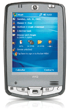

# PocketPC: custom RAPI class for executing routines on remote Windows CE device

## Short description:
The class calls CeCreateProcess RAPI function to create new process on PocketPC device. The new process executes the specified executable file.  
***  


## Before you begin:
  


Use the following code to test   
**TRapiExec** class:  

<div class=precode>LOCAL rapi As TRapiExec  
rapi = CREATEOBJECT("TRapiExec")  
IF NOT rapi.Connected  
	= MESSAGEBOX("Could not detect connection " +;  
		"to Windows CE device.     ", 48, "Not connected")  
	RETURN  
ENDIF  
IF NOT rapi.RunApp("\Windows\Notes.exe",;  
		"\My Documents\Personal\test.txt")  
	= MESSAGEBOX("Error code: " + TRANSFORM(rapi.errorcode) +;  
		" (" + TRANSFORM(rapi.errorcode, "@0") +;  
		")    ", 48, "Error")  
ENDIF  
</div>  
  
***  


## Code:
```foxpro  
***************************************************
* Custom RAPI class for executing routines
* on remote Windows CE device
***************************************************
DEFINE CLASS TRapiExec As Session
#DEFINE WAIT_OBJECT_0  0
#DEFINE RAPIINIT_SIZE  12
#DEFINE PROCINFO_SIZE  16
	errorcode=0
	connected=.F.

PROCEDURE Init
	THIS.declare
	THIS.InitRapi()

PROTECTED PROCEDURE InitRapi
	LOCAL cBuffer, hEvent
	cBuffer = PADR(CHR(RAPIINIT_SIZE), RAPIINIT_SIZE, CHR(0))

	= CeRapiInitEx(@cBuffer)
	hEvent = buf2dword(SUBSTR(cBuffer,5,4))

	IF WaitForSingleObject(hEvent,2000) = WAIT_OBJECT_0
		THIS.connected = .T.
	ELSE
		THIS.UninitRapi
	ENDIF
RETURN THIS.connected

PROTECTED PROCEDURE UninitRapi
	= CeRapiUninit()
	THIS.connected = .F.

PROCEDURE Destroy
	THIS.UninitRapi

FUNCTION RunApp(cApp, cCmdLine) As Boolean
	LOCAL cBuffer, hProcess, hThread
	cBuffer = REPLICATE(CHR(0), PROCINFO_SIZE)
	IF VARTYPE(cCmdLine) <> "C"
		cCmdLine=""
	ENDIF
	IF CeCreateProcess(ToUnicode(m.cApp),;
		ToUnicode(m.cCmdline), 0,0,0,0,0,0,0, @cBuffer) = 0
		THIS.errorcode=CeGetLastError()
		RETURN .F.
	ENDIF
	hProcess = buf2dword(SUBSTR(cBuffer, 1,4))
	hThread = buf2dword(SUBSTR(cBuffer, 5,4))
	= CeCloseHandle(m.hThread)
	= CeCloseHandle(m.hProcess)
RETURN .T.

PROTECTED PROCEDURE declare
	DECLARE INTEGER CeRapiUninit IN rapi
	DECLARE INTEGER CeRapiGetError IN rapi
	DECLARE INTEGER CeGetLastError IN rapi
	DECLARE INTEGER CeRapiInitEx IN rapi STRING @pRapiInit
	DECLARE INTEGER CeCloseHandle IN rapi INTEGER hObject

	DECLARE INTEGER WaitForSingleObject IN kernel32;
		INTEGER hHandle, INTEGER dwMilliseconds

	DECLARE INTEGER CeCreateProcess IN rapi;
		STRING lpAppName, STRING lpCmdLine, INTEGER lpProcAttr,;
		INTEGER lpThreadAttr, INTEGER bInheritHandles,;
		INTEGER dwCreationFlags, INTEGER lpEnvironment,;
		INTEGER lpCurrDir, INTEGER lpStartupInfo, STRING @lpProcInfo

	DECLARE INTEGER CeRapiInvoke IN rapi;
		STRING pDllPath, STRING pFunctionName, INTEGER cbInput,;
		STRING @pInput, INTEGER @pcbOutput, STRING @ppOutput,;
		INTEGER @ppIRAPIStream, INTEGER dwReserved
ENDDEFINE

********************* static members **************************
FUNCTION buf2dword(lcBuffer)
RETURN Asc(SUBSTR(lcBuffer, 1,1)) + ;
	BitLShift(Asc(SUBSTR(lcBuffer, 2,1)),  8) +;
	BitLShift(Asc(SUBSTR(lcBuffer, 3,1)), 16) +;
	BitLShift(Asc(SUBSTR(lcBuffer, 4,1)), 24)

FUNCTION ToUnicode(cStr)
RETURN STRCONV(cStr+CHR(0), 5)

FUNCTION FromUnicode(cStr)
RETURN STRTRAN(STRCONV(cStr, 6), CHR(0), "")  
```  
***  


## Listed functions:
[CeCloseHandle](../libraries/rapi/CeCloseHandle.md)  
[CeCreateProcess](../libraries/rapi/CeCreateProcess.md)  
[CeGetLastError](../libraries/rapi/CeGetLastError.md)  
[CeRapiGetError](../libraries/rapi/CeRapiGetError.md)  
[CeRapiInitEx](../libraries/rapi/CeRapiInitEx.md)  
[CeRapiInvoke](../libraries/rapi/CeRapiInvoke.md)  
[CeRapiUninit](../libraries/rapi/CeRapiUninit.md)  
[WaitForSingleObject](../libraries/kernel32/WaitForSingleObject.md)  

## Comment:
**RunApp** method of the class accepts two parameters: *AppName* and *CommandLine*.  
  
Try the code calling various executables located inside \Windows directory on your PocketPC: *Notes.exe, pxl.exe, sndplay.exe, tasks.exe, iexplore.exe, pword.exe* etc.  
  
* * *  
At this point I am not aware how to terminate a remote process. There might be a way, I think, by using the CeRapiInvoke.  
  
* * *  
CeRapiInvoke function, I am still struggling with, can be used to remotely execute routines in DLLs stored on Window CE device. This function accepts DLL and function names as parameters, as well as buffer with input parameters for the remote call and buffer for output parameters.  
  
So far I was successful only in calling functions, which do not require input parameters, like *Random* and *GetProcessHeap* (both located in Coredll.dll) and similar to them. Hopefully I will be able to add this functionality to the class some time later.  
  
* * *  
This is how to create new email message on your Pocket PC:<code><font color=#0000a0>  
cApp="\Windows\tmail.exe"  
cCmd=[-TO "info@yourcompany.com" -SUBJECT "Test message" ] +;  
	[-BODY "Wake up!"]  
rapi.RunApp(cApp, cCmd)  
</font></code>  
Note that the message will be stored in Drafts folder, not sent. Use other command line options: -CC, -BCC, -ATTACHMENT.  
  
***  

