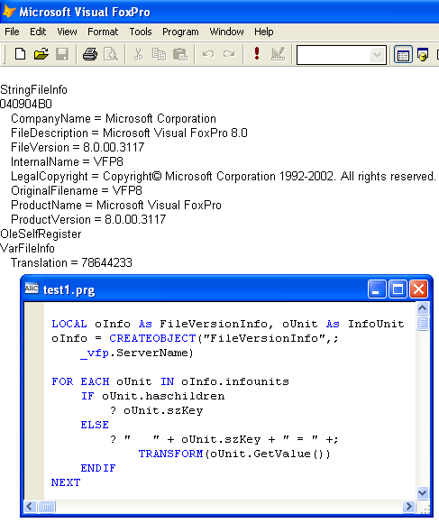

<link rel="stylesheet" type="text/css" href="../css/win32api.css">  
<link rel="stylesheet" href="https://cdnjs.cloudflare.com/ajax/libs/font-awesome/4.7.0/css/font-awesome.min.css">

# How to retrieve version information for the specified file

## Short description:
The FileVersionInfo class encapsulates GetFileVersionInfo API call and provides read-only access to structures VS_VERSIONINFO and VS_FIXEDFILEINFO.  
***  


## Before you begin:
Version information makes it easier for applications to install files properly and enables setup programs to analyze files currently installed. The version-information resource contains the version number, intended operating system, and original file name.  

The *FileVersionInfo* class encapsulates GetFileVersionInfo API call and provides read-only access to structures VS_VERSIONINFO and VS_FIXEDFILEINFO.  

**Usage:**  

  

See also:

<a href="?example=242">Retrieving file information for the VFP executable running</a>[Retrieving file information for the VFP executable running](sample_242.md)  
  
***  


## Code:
```foxpro  
DEFINE CLASS FileVersionInfo As Session
#DEFINE ERROR_RESOURCE_DATA_NOT_FOUND 1812
#DEFINE ERROR_RESOURCE_TYPE_NOT_FOUND 1813
#DEFINE ERROR_RESOURCE_NAME_NOT_FOUND 1814
#DEFINE ERROR_RESOURCE_LANG_NOT_FOUND 1815
	filename=""
	errorcode=0
	errormessage=""
	fixedfileinfo=0  && encaps. VS_FIXEDFILEINFO structure
	infounits=0  && encaps. StringFileInfo Structure

PROCEDURE Init(cFilename)
	THIS.declare
	IF VARTYPE(m.cFilename)="C"
		THIS.GetFileVersionInfo(m.cFilename)
	ENDIF

PROCEDURE GetInfoUnit(szKey)
	LOCAL oUnit As InfoUnit
	FOR EACH oUnit IN THIS.infounits
		IF UPPER(ALLTRIM(oUnit.szKey)) == UPPER(ALLTRIM(m.szKey))
			RETURN oUnit
		ENDIF
	NEXT
RETURN Null

PROCEDURE GetFileVersionInfo(cFilename)
#DEFINE ccKey STRCONV("VS_VERSION_INFO",5)

	THIS.filename = m.cFilename
	
	LOCAL nBufsize, cBuffer, nTotalLength, nValuelength, nDataType,;
		nOffsetToValue, nOffsetToChildren
	nBufsize = GetFileVersionInfoSize(THIS.filename, 0)
	IF nBufsize = 0
		THIS.errorcode = GetLastError()
		THIS.errormessage = "GetFileVersionInfoSize failed."
		RETURN
	ENDIF

	cBuffer = REPLICATE(CHR(0), nBufsize)
	IF GetFileVersionInfo(THIS.filename, 0, nBufsize, @cBuffer) = 0
		THIS.errorcode = GetLastError()
		THIS.errormessage = "GetFileVersionInfo failed."
		RETURN
	ENDIF
	
	nTotalLength = buf2word(SUBSTR(cBuffer, 1,2))
	nValuelength = buf2word(SUBSTR(cBuffer, 3,2))
	nDataType = buf2word(SUBSTR(cBuffer, 5,2))
	
	* 3 WORDs + ccKey + final Unicode Chr(0)
	nOffsetToValue = 6 + LEN(ccKey) + 2
	nOffsetToValue = nOffsetToValue + MOD(nOffsetToValue,4)
	
	THIS.fixedfileinfo = CREATEOBJECT("FixedFileInfo",;
		SUBSTR(cBuffer, nOffsetToValue+1, nValuelength))
	
	nOffsetToChildren = nOffsetToValue + nValuelength
	nOffsetToChildren = nOffsetToChildren + MOD(nOffsetToChildren,4)
	
	LOCAL cInfoUnits
	cInfoUnits = SUBSTR(cBuffer, nOffsetToChildren+1)
	THIS.infounits = CREATEOBJECT("Collection")

	DO WHILE .T.
		oUnit = CREATEOBJECT("InfoUnit", m.cInfoUnits)
		IF oUnit.EmptyUnit()
			EXIT
		ELSE
			THIS.infounits.Add(oUnit, oUnit.szKey)
			m.cInfoUnits = oUnit.buffer
			oUnit = Null
		ENDIF
	ENDDO

PROTECTED PROCEDURE declare
	DECLARE INTEGER GetLastError IN kernel32

	DECLARE INTEGER GetFileVersionInfoSize IN version.dll;
		STRING lptstrFilename, INTEGER lpdwHandle

	DECLARE INTEGER GetFileVersionInfo IN version.dll;
	STRING lptstrFilename, INTEGER dwHandle,;
	INTEGER dwLen, STRING @lpData

ENDDEFINE

DEFINE CLASS InfoUnit As Session
PROTECTED rawvalue, stringvalue, numericvalue
	datalength=0
	valuelength=0
	unitdatatype=0
	szKey=""
	buffer=""
	stringvalue=""
	numericvalue=0
	rawvalue=""
	haschildren=.F.

PROCEDURE Init(cBuffer)
	THIS.datalength = buf2word(SUBSTR(cBuffer, 1,2))
	THIS.valuelength = buf2word(SUBSTR(cBuffer, 3,2))
	THIS.unitdatatype = buf2word(SUBSTR(cBuffer, 5,2))
	
	LOCAL nOffset, cStr
	nOffset = 6  && 3 WORDS
	THIS.szKey = ""
	DO WHILE nOffset < LEN(cBuffer)-1
		cStr = SUBSTR(cBuffer, nOffset+1, 2)
		IF cStr = CHR(0) + CHR(0)
			EXIT
		ENDIF
		THIS.szKey = THIS.szKey + cStr
		nOffset = nOffset + 2
	ENDDO
	
	THIS.szKey = StrConv(THIS.szKey, 6)

	nOffset = nOffset + 2  && final zero word
	nOffset = nOffset + MOD(nOffset ,4)
	THIS.buffer = SUBSTR(cBuffer, nOffset+1)
	
	IF THIS.valuelength = 0
		THIS.haschildren = .T.
	ELSE
		IF THIS.unitdatatype=0
		* binary value
			THIS.rawvalue = SUBSTR(THIS.buffer, 1, THIS.valuelength)
			DO CASE
			CASE THIS.valuelength=1  && byte
				THIS.numericvalue = ASC(THIS.rawvalue)
			CASE THIS.valuelength=2  && word
				THIS.numericvalue = buf2word(THIS.rawvalue)
			CASE THIS.valuelength=4  && dword
				THIS.numericvalue = buf2dword(THIS.rawvalue)
			OTHERWISE
			ENDCASE
			nOffset = nOffset + THIS.valuelength
		ELSE
		* Unicode string
			THIS.rawvalue = SUBSTR(THIS.buffer, 1, THIS.valuelength*2)
			THIS.stringvalue = STRTRAN(THIS.rawvalue, CHR(0), "")
			nOffset = nOffset + THIS.valuelength*2
		ENDIF
		nOffset = nOffset + MOD(nOffset ,4)
		THIS.buffer = SUBSTR(cBuffer, nOffset+1)
	ENDIF

PROCEDURE EmptyUnit
RETURN EMPTY(THIS.szKey)

PROCEDURE GetValue
	IF THIS.valuelength > 0
		IF THIS.unitdatatype=0
			RETURN IIF(THIS.valuelength > 4,;
				THIS.rawvalue, THIS.numericvalue)
		ELSE
			RETURN THIS.stringvalue
		ENDIF
	ENDIF
RETURN THIS.stringvalue
ENDDEFINE

DEFINE CLASS FixedFileInfo As Session
	  dwSignature=0
	  dwStrucVersion=0
	  dwFileVersionMS=0
	  dwFileVersionLS=0
	  dwProductVersionMS=0
	  dwProductVersionLS=0
	  dwFileFlagsMask=0
	  dwFileFlags=0
	  dwFileOS=0
	  dwFileType=0
	  dwFileSubtype=0
	  dwFileDateMS=0
	  dwFileDateLS=0

PROCEDURE Init(cBuffer)
	  THIS.dwSignature = buf2dword(SUBSTR(cBuffer, 1,4))
	  THIS.dwStrucVersion = buf2dword(SUBSTR(cBuffer, 5,4))
	  THIS.dwFileVersionMS = buf2dword(SUBSTR(cBuffer, 9,4))
	  THIS.dwFileVersionLS = buf2dword(SUBSTR(cBuffer, 13,4))
	  THIS.dwProductVersionMS = buf2dword(SUBSTR(cBuffer, 17,4))
	  THIS.dwProductVersionLS = buf2dword(SUBSTR(cBuffer, 21,4))
	  THIS.dwFileFlagsMask = buf2dword(SUBSTR(cBuffer, 25,4))
	  THIS.dwFileFlags = buf2dword(SUBSTR(cBuffer, 29,4))
	  THIS.dwFileOS = buf2dword(SUBSTR(cBuffer, 33,4))
	  THIS.dwFileType = buf2dword(SUBSTR(cBuffer, 37,4))
	  THIS.dwFileSubtype = buf2dword(SUBSTR(cBuffer, 41,4))
	  THIS.dwFileDateMS = buf2dword(SUBSTR(cBuffer, 45,4))
	  THIS.dwFileDateLS = buf2dword(SUBSTR(cBuffer, 49,4))
ENDDEFINE

FUNCTION buf2dword(lcBuffer)
RETURN Asc(SUBSTR(lcBuffer, 1,1)) + ;
	BitLShift(Asc(SUBSTR(lcBuffer, 2,1)),  8) +;
	BitLShift(Asc(SUBSTR(lcBuffer, 3,1)), 16) +;
	BitLShift(Asc(SUBSTR(lcBuffer, 4,1)), 24)

FUNCTION buf2word(lcBuffer)
RETURN Asc(SUBSTR(lcBuffer, 1,1)) + ;
       Asc(SUBSTR(lcBuffer, 2,1)) * 256  
```  
***  


## Listed functions:
[GetFileVersionInfo](../libraries/version/GetFileVersionInfo.md)  
[GetFileVersionInfoSize](../libraries/version/GetFileVersionInfoSize.md)  
[GetLastError](../libraries/kernel32/GetLastError.md)  

## Comment:
VFP <a href="http://msdn.microsoft.com/en-us/library/7tb3a512(VS.80).aspx">AGETFILEVERSION() Function</a> returns similar data.  
  
See also <a href="http://msdn.microsoft.com/library/default.asp?url=/library/en-us/winui/winui/windowsuserinterface/resources/versioninformation.asp">Version Information</a> article on MSDN.  
  
The presence of *OleSelfRegister* in the version resource means that the file (DLL or EXE) can self-register itself. The developer decides whether to add this string to the version information.  
  
Since all information resources are enumerated in a method of the class, there is no apparent need in using the VerQueryValue API call.   
  
***  

