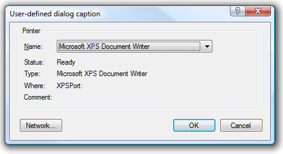

<link rel="stylesheet" type="text/css" href="../css/win32api.css">  
<link rel="stylesheet" href="https://cdnjs.cloudflare.com/ajax/libs/font-awesome/4.7.0/css/font-awesome.min.css">

# How to position the GETPRINTER() dialog

## Short description:
The GETPRINTER() dialog normaly appears at the left top corner of the main window of FoxPro. What if you want it to popup in the middle of the screen? The interface has no input parameters that can be used to position the dialog. Still the Timer control and several API calls can solve this small problem.  
***  


## Before you begin:
The GETPRINTER() dialog normaly appears at the left top corner of the main window of FoxPro.  

  

*What if you want it to popup in the middle of the screen? *  

The interface has no input parameters that can be used to position the dialog. Still the Timer control and several API calls can solve this small problem.  

The same technique is used in another example <a href="?example=424">Using Extended MessageBox() Class</a>. First you start a Timer, then call the GETPRINTER(). Amazingly, the Timer keeps ticking behind this otherwise perfectly modal window. So from the Timer event you can access the dialog and move it.[Using Extended MessageBox() Class](sample_424.md)  

This is not the ideal solution, because the dialog may "jump" -- *fixed [May 9, 2006] by locking and subsequently unlocking drawing in the Windows desktop*.   

See also:<UL><LI style="padding-bottom: 7px;"><a href="?example=424">Using Extended MessageBox() Class</a>

<LI style="padding-bottom: 7px;"><a href="?example=418">Extended MessageBox Class</a>[Extended MessageBox Class](sample_418.md)  
<LI style="padding-bottom: 7px;"><a href="?example=434">How to change font name and size in the MessageBox dialog</a>[How to change font name and size in the MessageBox dialog](sample_434.md)  
<LI style="padding-bottom: 7px;"><a href="?example=365">Creating an Open dialog box to specify the drive, directory, and name of a file to open (Shell32 version)</a>[Creating an Open dialog box to specify the drive, directory, and name of a file to open (Shell32 version)](sample_365.md)  
<LI style="padding-bottom: 7px;"><a href="?example=363">Creating the Open dialog box to specify the drive, directory, and name of a file to open</a>[Creating the Open dialog box to specify the drive, directory, and name of a file to open](sample_363.md)  
<LI style="padding-bottom: 7px;"><a href="?example=265">Creating the Save dialog box to specify the drive, directory, and name of a file to save</a>[Creating the Save dialog box to specify the drive, directory, and name of a file to save](sample_265.md)  
<LI style="padding-bottom: 7px;"><a href="?example=364">How to display a dialog box that enables the user to select a folder (an alternative to the GETDIR)</a>[How to display a dialog box that enables the user to select a folder (an alternative to the GETDIR)](sample_364.md)  
  
***  


## Code:
```foxpro  
WITH _SCREEN
	IF VARTYPE(.printerdlg) <> "U"
		.RemoveObject("printerdlg")
	ENDIF
	.AddObject("printerdlg", "printerdlg")
	.printerdlg.ShowDialog(.Width-500, .Height-300)

	IF NOT EMPTY(.printerdlg.printername)
		= MESSAGEBOX("Printer selected: " + .printerdlg.printername)
	ENDIF
ENDWITH
* end of main

DEFINE CLASS PrinterDlg As Timer
#DEFINE GETPRINTER_CAPTION "Printer"
PROTECTED xpos, ypos
	hDialog=0
	printername=""

PROCEDURE ShowDialog(nX, nY)
	* Victor Espinoza`s suggestion proves correct:
	* locking drawing in the desktop window and unlocking it
	* later in SetPosition method hides the "jump"
	= LockWindowUpdate(GetDesktopWindow())

	THIS.xpos = m.nX
	THIS.ypos = m.nY
	THIS.Interval=100
	THIS.printername = GETPRINTER()

PROCEDURE Init
	DECLARE INTEGER GetActiveWindow IN user32
	DECLARE INTEGER LockWindowUpdate IN user32 INTEGER hWndLock
	DECLARE INTEGER GetDesktopWindow IN user32

	DECLARE INTEGER GetWindowText IN user32;
		INTEGER hwnd, STRING @lpString, INTEGER cch

	DECLARE INTEGER SetWindowText IN user32;
		INTEGER hWindow, STRING lpString

	DECLARE INTEGER SetWindowPos IN user32;
		INTEGER hwnd, INTEGER hWndInsertAfter, INTEGER x,;
		INTEGER y, INTEGER cx, INTEGER cy, INTEGER wFlags

PROCEDURE Timer
	IF THIS.hDialog = 0
		IF THIS.DialogFound()
			THIS.SetPosition
		ENDIF
		THIS.Interval = 0
	ENDIF

PROTECTED FUNCTION DialogFound
	LOCAL hWindow, cTitle
	hWindow = GetActiveWindow()
	cTitle = THIS.GetWinText(hWindow)
	THIS.hDialog = IIF(cTitle=GETPRINTER_CAPTION, hWindow, 0)
RETURN (THIS.hDialog <> 0)

PROTECTED PROCEDURE SetPosition
#DEFINE HWND_TOP  0
#DEFINE SWP_NOSIZE 1
#DEFINE SWP_SHOWWINDOW 0x40

	= SetWindowPos(THIS.hDialog, HWND_TOP,;
		THIS.xpos, THIS.ypos, 0,0,;
		SWP_SHOWWINDOW+SWP_NOSIZE)

	= SetWindowText(THIS.hDialog, "User-defined dialog caption")

	* unlocks updates in the desktop window;
	* see another call to this function above
	= LockWindowUpdate(0)

PROTECTED FUNCTION GetWinText(hWindow)
	LOCAL nBufsize, cBuffer
	nBufsize = 128
	cBuffer = REPLICATE(Chr(0), nBufsize)
	nBufsize = GetWindowText(hWindow, @cBuffer, nBufsize)
RETURN Iif(nBufsize=0, "", Left(cBuffer, nBufsize))

ENDDEFINE  
```  
***  


## Listed functions:
[GetActiveWindow](../libraries/user32/GetActiveWindow.md)  
[GetDesktopWindow](../libraries/user32/GetDesktopWindow.md)  
[GetWindowText](../libraries/user32/GetWindowText.md)  
[LockWindowUpdate](../libraries/user32/LockWindowUpdate.md)  
[SetWindowPos](../libraries/user32/SetWindowPos.md)  
[SetWindowText](../libraries/user32/SetWindowText.md)  

## Comment:
Try this approach with other dialogs, like GETFONT(), GETFILE(). Note that in case of another dialog you must use the window title constant different from GETPRINTER_CAPTION.  
  
Technically, you can even play an AVI on the dialog. Take a look at <a href="?example=430">How to play AVI file on the _screen</a> example. BTW, the *TAvi* also inherits the Timer class.  
  
***  

