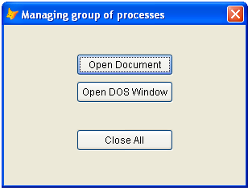

# How to make application automatically close all documents it opened

## Short description:
Imagine FoxPro application that has opened several windows like Word, Excel, PDF, browser, picture viewer etc. Closing all those documents automatically on exit from the application, sometimes this can be a good idea.

Here is one of several possible ways to get it done. Windows XP/2K introduces a Job Object, a tool that can manage a group of processes as a single process. In other words, operations performed on the job object affect all processes associated with it.
  
***  


## Before you begin:
Imagine FoxPro application that has opened several windows like Word, Excel, PDF, browser, picture viewer, DOS windows etc. Closing all those documents automatically on exit from the application, sometimes this can be a good idea.  

Windows XP/2K introduces a *Job Object*, a tool that can manage a group of processes as a single process. In other words, operations performed on the job object affect all processes associated with it.  

The processes are associated with a job object through their handles. FoxPro RUN command does not return a handle of a started process. For that reason, the CreateProcess API function is used instead of RUN.  

  
Click on *Open Document* button and open several files like texts, spreadsheets, pictures. Then click on *Close All* button to close all windows that have been opened.  

  
***  


## Code:
```foxpro  
LOCAL oForm
oForm = CREATEOBJECT("TForm")
oForm.Show(1)
* end of main

DEFINE CLASS TForm As Form
#DEFINE MAX_PATH 260
	Width=300
	Height=200
	BorderStyle=2
	MinButton=.F.
	MaxButton=.F.
	Autocenter=.T.
	Caption="Managing group of processes"
	hJob=0

	ADD OBJECT cmdOpenApp As CommandButton WITH;
	Left=90, Top=36, Width=120, Height=27, Caption="Open Document"

	ADD OBJECT cmdOpenDos As CommandButton WITH;
	Left=90, Top=70, Width=120, Height=27, Caption="Open DOS Window"

	ADD OBJECT cmdClose As CommandButton WITH;
	Left=90, Top=130, Width=120, Height=27, Caption="Close All"

PROCEDURE Init
	THIS.declare

PROCEDURE Destroy
	THIS.CloseJob

PROCEDURE cmdOpenApp.Click
	ThisForm.AddToJob

PROCEDURE cmdOpenDos.Click
	ThisForm.OpenDosWindow

PROCEDURE AddToJob
	LOCAL cPath, cDocName, hProcess, nResult

	cPath = SYS(5) + SYS(2003)
	cDocName = GETFILE("*;TXT;DOC;XLS;MDB;PDF;JPG;BMP;GIF")
	SET DEFAULT TO (m.cPath)

	IF NOT EMPTY(cDocName)
		hProcess = THIS.OpenDoc(cDocName)
		
		IF hProcess <> 0
			IF THIS.hJob = 0
				THIS.OpenJob
			ENDIF
			
			nResult = AssignProcessToJobObject(THIS.hJob, hProcess)
			
			IF nResult = 0
				? "AssignProcessToJobObject faied:", GetLastError()
			ENDIF

		ENDIF
	ENDIF

PROCEDURE cmdClose.Click
	ThisForm.CloseJob

PROCEDURE OpenJob
	THIS.hJob = CreateJobObject(0, SUBSTR(SYS(2015), 3))

PROCEDURE CloseJob
	IF THIS.hJob <> 0
		
		LOCAL nResult
		nResult = TerminateJobObject(THIS.hJob, 0)
	
		IF nResult = 0
			ACTIVATE SCREEN
			? "TerminateJobObject failed:", GetLastError()
		ENDIF
		
		= CloseHandle(THIS.hJob)
		THIS.hJob=0
	ENDIF

PROCEDURE OpenDosWindow
	LOCAL cSystem32, cAppName, hProcess
	
	cSystem32 = THIS.GetSystem32Directory()
	cAppName = cSystem32 + "\cmd.exe"
	
	IF NOT FILE(cAppName)
		cAppName = cSystem32 + "\command.com"
	ENDIF

	IF FILE(cAppName)
		hProcess = THIS.StartProcess(cAppName, "")
		IF hProcess <> 0
			IF THIS.hJob = 0
				THIS.OpenJob
			ENDIF
			= AssignProcessToJobObject(THIS.hJob, hProcess)
		ENDIF
	ENDIF

PROCEDURE GetSystem32Directory
	LOCAL cBuffer, nResult
	cBuffer = REPLICATE(CHR(0), MAX_PATH)
	nResult = GetSystemDirectory(@cBuffer, Len(cBuffer))
RETURN SUBSTR(cBuffer, 1, nResult)

PROCEDURE OpenDoc(cDocName)
	LOCAL cAppName
	cAppName = THIS.GetAppName(cDocName)

	IF LEN(cAppName)=0
		WAIT WINDOW NOWAIT "Default application not found for " +;
			CHR(13) + cDocName
		RETURN 0
	ENDIF

	WAIT WINDOW NOWAIT cAppName
RETURN THIS.StartProcess(m.cAppName, m.cDocName)

PROCEDURE StartProcess(cAppName, cCmdLine)
#DEFINE START_INFO_SIZE  68

#DEFINE CREATE_BREAKAWAY_FROM_JOB 0x01000000
#DEFINE NORMAL_PRIORITY_CLASS 0x00000020

	LOCAL cProcInfo, cStartInfo, nResult, hProcess, nFlags
	
	nFlags = BITOR(CREATE_BREAKAWAY_FROM_JOB, NORMAL_PRIORITY_CLASS)

	hProcess = 0
	cProcInfo = Repli(Chr(0), 16)
	cStartInfo = PADR(Chr(START_INFO_SIZE), START_INFO_SIZE, Chr(0))
	
	IF NOT EMPTY(m.cCmdLine)
		cCmdLine = [ "] + ALLTRIM(cCmdLine) + ["]
	ENDIF

	nResult = CreateProcess(cAppName, cCmdLine, 0,0,0,;
		nFlags,0, SYS(5)+SYS(2003),;
		@cStartInfo, @cProcInfo)

	IF nResult <> 0
	* retrieve process handle from PROCINFO structure
		hProcess = buf2dword(SUBSTR(cProcInfo, 1,4))
	ENDIF
RETURN m.hProcess

FUNCTION GetAppName(cFileName)
	LOCAL cResult
	cResult = REPLICATE(CHR(0), MAX_PATH)
	= FindExecutable(cFileName, "", @cResult)
RETURN ALLTRIM(STRTRAN(cResult, CHR(0), ""))

PROTECTED PROCEDURE declare
	DECLARE INTEGER GetLastError IN kernel32
	
	DECLARE INTEGER CloseHandle IN kernel32 INTEGER hObject

	DECLARE INTEGER TerminateJobObject IN kernel32;
		INTEGER hJob, LONG uExitCode

	DECLARE INTEGER CreateJobObject IN kernel32;
		INTEGER lpJobAttributes, STRING lpName

	DECLARE INTEGER AssignProcessToJobObject IN kernel32;
		INTEGER hJob, INTEGER hProcess

	DECLARE INTEGER FindExecutable IN shell32;
		STRING lpFile, STRING lpDir, STRING @lpResult

	DECLARE INTEGER GetSystemDirectory IN kernel32;
		STRING @ lpBuffer, INTEGER nSize

	DECLARE INTEGER CreateProcess IN kernel32;
		STRING lpApplicationName, STRING lpCommandLine,;
		INTEGER lpProcessAttr, INTEGER lpThreadAttr,;
		INTEGER bInheritHandles, INTEGER dwCreationFlags,;
		INTEGER lpEnvironment, STRING lpCurrentDirectory,;
		STRING @lpStartupInfo, STRING @lpProcessInformation

ENDDEFINE

FUNCTION buf2dword(lcBuffer)
RETURN Asc(SUBSTR(lcBuffer, 1,1)) + ;
	BitLShift(Asc(SUBSTR(lcBuffer, 2,1)),  8) +;
	BitLShift(Asc(SUBSTR(lcBuffer, 3,1)), 16) +;
	BitLShift(Asc(SUBSTR(lcBuffer, 4,1)), 24)  
```  
***  


## Listed functions:
[AssignProcessToJobObject](../libraries/kernel32/AssignProcessToJobObject.md)  
[CloseHandle](../libraries/kernel32/CloseHandle.md)  
[CreateJobObject](../libraries/kernel32/CreateJobObject.md)  
[CreateProcess](../libraries/kernel32/CreateProcess.md)  
[FindExecutable](../libraries/shell32/FindExecutable.md)  
[GetLastError](../libraries/kernel32/GetLastError.md)  
[GetSystemDirectory](../libraries/kernel32/GetSystemDirectory.md)  
[TerminateJobObject](../libraries/kernel32/TerminateJobObject.md)  
