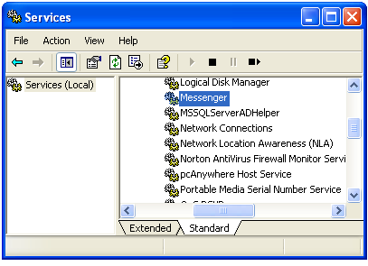

[ Home ](https://github.com/VFPX/Win32API)  

# Using the NetMessageBufferSend to send messages on the network

## Short description:
The code sample explains how to broadcast system alerts using the NetMessageBufferSend as an alternative to NET SEND command.  
***  


## Before you begin:
This example shows how to broadcast system alerts using the NetMessageBufferSend as an alternative to NET SEND command.  

On Windows XP computer, make sure that the Messenger service is running:  

  
If the Messenger service is not running, upon creating an instance of the NetMessages object you will get error code 2184 (The service has not been started).  

If a service is stopped and not disabled, you can start it programmatically using <a href="?example=476">VFP Windows Services class library</a> :[VFP Windows Services class library](sample_476.md)  

<div class="precode">#DEFINE SERVICE_WIN32 0x30  
#DEFINE SERVICE_RUNNING 4  

LOCAL ws As winservices, srv As winservice  
ws = CREATEOBJECT("winservices",;  
	Null, Null, SERVICE_WIN32)  

srv = ws.GetService("Messenger")  
IF srv.currentstate <> SERVICE_RUNNING  
	= MESSAGEBOX("The Messenger service is off!")  
*	srv.StartService  
ENDIF</div>  

See also:

* [Using mailslots to send messages on the network](sample_269.md)  
* [Peer-to-peer LAN messenger built with Mailslot API functions](sample_410.md)  
* [How to create non-blocking Winsock server](sample_412.md)  
* [A client for testing non-blocking Winsock server](sample_413.md)  
* [Using WM_COPYDATA for interprocess communication](sample_536.md)  

  
***  


## Code:
```foxpro  
DEFINE CLASS NetMessages As Relation
#DEFINE MAX_PREFERRED_LENGTH -1
	errorno=0
	errormessage=""
	servername=NULL
	messagenames=0

PROCEDURE Init(cServerName)
	THIS.messagenames = CREATEOBJECT("Collection")
	THIS.declare
	THIS.servername = m.cServerName

PROCEDURE servername_ASSIGN(cServerName)
	IF VARTYPE(cServerName) = "C"
		THIS.servername = m.cServerName
	ENDIF
	THIS.EnumMessageNames

PROCEDURE servername_ACCESS
RETURN THIS.servername

PROCEDURE SendMessage(cRecipient, cMessage)
* cRecipient: computer name, ip address, message alias
	LOCAL cServer

	cServer=IIF(ISNULL(THIS.servername), NULL,;
		STRCONV(THIS.servername+CHR(0),5))
		
	cRecipient = STRCONV(cRecipient+CHR(0),5)
	cMessage = STRCONV(cMessage+CHR(0),5)

	THIS.errorno = NetMessageBufferSend(m.cServer, m.cRecipient,;
		NULL, @cMessage, LEN(cMessage))
	
	IF THIS.errorno <> 0
		THIS.errormessage="NetMessageBufferSend failed."
	ENDIF
RETURN (THIS.errorno=0)

PROCEDURE MessageNameExists(cName)
	cName = UPPER(STRCONV(ALLTRIM(cName),5))
	FOR EACH cStoredName IN THIS.messagenames
		IF cName == cStoredName
			RETURN .T.
		ENDIF
	NEXT
RETURN .F.

PROCEDURE AddMessageName(cName)
	LOCAL cServer

	cServer=IIF(ISNULL(THIS.servername), NULL,;
		STRCONV(THIS.servername+CHR(0),5))

	cName = STRCONV(cName+CHR(0),5)
	THIS.errorno = NetMessageNameAdd(cServer, cName)

	IF THIS.errorno=0
		THIS.EnumMessageNames
	ELSE
		THIS.errormessage="NetMessageNameAdd failed."
	ENDIF
RETURN (THIS.errorno=0)

PROCEDURE DeleteMessageName(cName)
	LOCAL cServer

	cServer=IIF(ISNULL(THIS.servername), NULL,;
		STRCONV(THIS.servername+CHR(0),5))

	cName = STRCONV(cName+CHR(0),5)
	THIS.errorno = NetMessageNameDel(cServer, cName)

	IF THIS.errorno=0
		THIS.EnumMessageNames
	ELSE
		THIS.errormessage="NetMessageNameDel failed."
	ENDIF
RETURN (THIS.errorno=0)

PROCEDURE EnumMessageNames
	DO WHILE THIS.messagenames.Count > 0
		THIS.messagenames.Remove(1)
	ENDDO

	LOCAL cServer, hBuffer, nBufsize, cBuffer,;
		nRead, nTotal, nIndex, nOffset, cName, cChar

	cServer=IIF(ISNULL(THIS.servername), NULL,;
		STRCONV(THIS.servername+CHR(0),5))
	STORE 0 TO hBuffer, nRead, nTotal

	THIS.errorno = NetMessageNameEnum(cServer, 0, @hBuffer,;
		MAX_PREFERRED_LENGTH, @nRead, @nTotal, 0)

	IF THIS.errorno=0
		nBufsize=0
		= NetApiBufferSize(hBuffer, @nBufsize)
		cBuffer = REPLICATE(CHR(0), nBufsize)
		= CopyMemory(@cBuffer, hBuffer, nBufsize)

		FOR nIndex=0 TO nRead-1
			nOffset = buf2dword(SUBSTR(cBuffer, nIndex*4+1,4))
			nOffset = nOffset - hBuffer + 1
			cName=""
			DO WHILE BETWEEN(nOffset, 1, LEN(cBuffer))
				cChar = SUBSTR(cBuffer, nOffset, 2)
				IF cChar = CHR(0)+CHR(0)
					EXIT
				ENDIF
				cName = cName + m.cChar
				nOffset = nOffset + 2
			ENDDO
			THIS.messagenames.Add(UPPER(cName))
		NEXT
	ELSE
		THIS.errormessage="NetMessageNameEnum failed."
	ENDIF

	IF hBuffer <> 0
		= NetApiBufferFree(hBuffer)
	ENDIF
RETURN (THIS.errorno=0)

PROCEDURE declare
	DECLARE INTEGER NetMessageBufferSend IN netapi32;
		STRING servername, STRING msgname, STRING fromname,;
		STRING @buf, INTEGER buflen

	DECLARE INTEGER NetMessageNameEnum IN netapi32;
		STRING servername, INTEGER lvl, INTEGER @bufptr,;
		INTEGER prefmaxlen, INTEGER @entriesread,;
		INTEGER @totalentries, INTEGER resume_handle

	DECLARE INTEGER NetApiBufferFree IN netapi32 INTEGER Buffer
	DECLARE INTEGER GetLastError IN kernel32

	DECLARE INTEGER NetApiBufferSize IN netapi32;
		INTEGER Buffer, INTEGER @ByteCount

	DECLARE RtlMoveMemory IN kernel32 As CopyMemory;
		STRING @dst, INTEGER src, INTEGER bufsize

	DECLARE INTEGER NetMessageNameAdd IN netapi32;
		STRING servername, STRING msgname

	DECLARE INTEGER NetMessageNameDel IN netapi32;
		STRING servername, STRING msgname

ENDDEFINE

FUNCTION buf2dword(lcBuffer)
RETURN Asc(SUBSTR(lcBuffer, 1,1)) + ;
	BitLShift(Asc(SUBSTR(lcBuffer, 2,1)),  8) +;
	BitLShift(Asc(SUBSTR(lcBuffer, 3,1)), 16) +;
	BitLShift(Asc(SUBSTR(lcBuffer, 4,1)), 24)  
```  
***  


## Listed functions:
[GetLastError](../libraries/kernel32/GetLastError.md)  
[NetApiBufferFree](../libraries/netapi32/NetApiBufferFree.md)  
[NetApiBufferSize](../libraries/netapi32/NetApiBufferSize.md)  
[NetMessageBufferSend](../libraries/netapi32/NetMessageBufferSend.md)  
[NetMessageNameAdd](../libraries/netapi32/NetMessageNameAdd.md)  
[NetMessageNameDel](../libraries/netapi32/NetMessageNameDel.md)  
[NetMessageNameEnum](../libraries/netapi32/NetMessageNameEnum.md)  

## Comment:
Note that this code sample does not work on Win9* computers.  
  
Sending a message:  
<div class=precode>obj = CREATEOBJECT("NetMessages")  
IF obj.errorno = 0  
	obj.SendMessage("WKSTATION1", "Test message")  
ENDIF  
</div>  
Sending a message from a server (must have admin rights):  
<div class=precode>obj = CREATEOBJECT("NetMessages", "MYSERVER")  
IF obj.errorno = 0  
	obj.SendMessage("WKSTATION1", "Test message")  
ENDIF  
</div>  
Sending a message to all domain computers (note an asterick after the domain name):  
<div class=precode>obj = CREATEOBJECT("NetMessages")  
IF obj.errorno = 0  
	obj.SendMessage("MYDOMAIN*", "Test message")  
ENDIF  
</div>  
Sometimes it takes time for the NetMessageBufferSend to return control. The mailslot approach turns around much faster.  
  
Use [domain name]* to broadcast a message to all domain computers.  
  
On the target computer, TCP port 139 (NetBIOS) is assigned to receive messages.  
  
* * *  
C# version contains classes NetMessage and NetMessageThread.   
  
The first class sends messages while staying in the main thread of the calling process. Exactly as FoxPro does. It causes the process wait until the NetMessageBufferSend returns. Sometimes this delay becomes noticeable -- up to 1 minute -- especially when the message receipient is disconnected or the network name is invalid or does not exist.  
  
The NetMessageThread class sends messages using a separate thread it creates for each message. The calling process immediately gets the control back, because the delay belongs to another thread.  
  
***  

