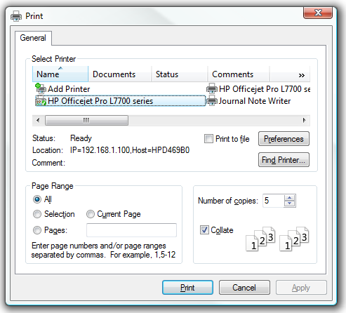

[ Home ](https://github.com/VFPX/Win32API)  

# How to display the Print property sheet

## Before you begin:
The <a href="http://msdn2.microsoft.com/en-us/library/ms646966.aspx">Print property sheet</a> is a standard user interface that enables the user to specify the properties of a particular print job. [Print property sheet](sample_000.md)  

  

The first page of a Print property sheet is the General page. The property sheet can also have additional application-specific and driver-specific property pages following the General page. The lower portion of the General page is a child dialog box template with controls similar to those of the Print Dialog Box.   

See also:

* [Printing Image File, programmatically set print page orientation to landscape](sample_555.md)  
  
***  


## Code:
```foxpro  
#DEFINE PRINTDLGEX_LEN 84
#DEFINE PD_RETURNDC 0x100
#DEFINE PD_RETURNDEFAULT 0x400
#DEFINE PD_COLLATE 0x00000010
#DEFINE START_PAGE_GENERAL 0xffffffff

DO declare

*!*	typedef struct tagPRINTPAGERANGE {
*!*	    DWORD nFromPage;
*!*	    DWORD nToPage;
*!*	} PRINTPAGERANGE, *LPPRINTPAGERANGE;

LOCAL oPrintPageRange As PChar, nFlags, cPrintDlgEx

* lpPageRanges must be non-NULL
* allocating space for 10 PRINTPAGERANGE structures
oPrintPageRange = CREATEOBJECT("PChar",;
	REPLICATE(CHR(0),80))

nFlags = BITOR(PD_RETURNDC,PD_COLLATE)

* populate PRINTDLGEX structure
cPrintDlgEx = num2dword(PRINTDLGEX_LEN) +;
	num2dword(_screen.HWnd) +;
	num2dword(0) +;
	num2dword(0) +;
	num2dword(0) +;
	num2dword(m.nFlags) +;
	num2dword(0) +;
	num2dword(0) +;
	num2dword(0) +;
	num2dword(10) +;
	num2dword(oPrintPageRange.GetAddr()) +;
	num2dword(1) +;
	num2dword(10) +;
	num2dword(5) +;
	num2dword(0) +;
	num2dword(0) +;
	num2dword(0) +;
	num2dword(0) +;
	num2dword(0) +;
	num2dword(START_PAGE_GENERAL) +;
	num2dword(0)

LOCAL nResult, nResultAction, hDC
nResult = PrintDlgEx(@cPrintDlgEx)

IF nResult = 0
	* the outcome of the dialog: PD_RESULT_APPLY,
	* PD_RESULT_CANCEL or PD_RESULT_PRINT
	nResultAction = buf2dword(SUBSTR(cPrintDlgEx, 81, 4))

	* handle to a device context for
	* the selected printer
	hDC = buf2dword(SUBSTR(cPrintDlgEx, 17, 4))

	? nResultAction, hDC
ELSE
	? "Error:", TRANSFORM(m.nResult, "@0")
ENDIF
* end of main

PROCEDURE declare
	DECLARE INTEGER PrintDlgEx IN comdlg32 STRING @lppd

FUNCTION buf2dword(lcBuffer)
RETURN Asc(SUBSTR(lcBuffer, 1,1)) + ;
	BitLShift(Asc(SUBSTR(lcBuffer, 2,1)),  8) +;
	BitLShift(Asc(SUBSTR(lcBuffer, 3,1)), 16) +;
	BitLShift(Asc(SUBSTR(lcBuffer, 4,1)), 24)

FUNCTION num2dword(lnValue)
#DEFINE m0 256
#DEFINE m1 65536
#DEFINE m2 16777216
	IF lnValue < 0
		lnValue = 0x100000000 + lnValue
	ENDIF
	LOCAL b0, b1, b2, b3
	b3 = Int(lnValue/m2)
	b2 = Int((lnValue - b3*m2)/m1)
	b1 = Int((lnValue - b3*m2 - b2*m1)/m0)
	b0 = Mod(lnValue, m0)
RETURN Chr(b0)+Chr(b1)+Chr(b2)+Chr(b3)

DEFINE CLASS PChar As Custom
	PROTECTED hMem

PROCEDURE Init(lcString)
	THIS.hMem = 0
	THIS.setValue(lcString)

PROCEDURE Destroy
	THIS.ReleaseString

FUNCTION GetAddr  && returns a pointer to the string
RETURN THIS.hMem

FUNCTION GetValue && returns string value
	LOCAL lnSize, lcBuffer
	lnSize = THIS.getAllocSize()
	lcBuffer = SPACE(lnSize)

	IF THIS.hMem <> 0
		DECLARE RtlMoveMemory IN kernel32 As Heap2Str;
			STRING @, INTEGER, INTEGER
		= Heap2Str(@lcBuffer, THIS.hMem, lnSize)
	ENDIF
RETURN lcBuffer

FUNCTION GetAllocSize  && returns allocated memory size (string length)
	DECLARE INTEGER GlobalSize IN kernel32 INTEGER hMem
RETURN Iif(THIS.hMem=0, 0, GlobalSize(THIS.hMem))

PROCEDURE SetValue(lcString) && assigns new string value
#DEFINE GMEM_FIXED 0
	THIS.ReleaseString

	DECLARE INTEGER GlobalAlloc IN kernel32 INTEGER, INTEGER
	DECLARE RtlMoveMemory IN kernel32 As Str2Heap;
		INTEGER, STRING @, INTEGER

	LOCAL lnSize
	lcString = lcString + Chr(0)
	lnSize = Len(lcString)
	THIS.hMem = GlobalAlloc(GMEM_FIXED, lnSize)
	IF THIS.hMem <> 0
		= Str2Heap(THIS.hMem, @lcString, lnSize)
	ENDIF

PROCEDURE ReleaseString  && releases allocated memory
	IF THIS.hMem <> 0
		DECLARE INTEGER GlobalFree IN kernel32 INTEGER
		= GlobalFree(THIS.hMem)
		THIS.hMem = 0
	ENDIF
ENDDEFINE  && pchar  
```  
***  


## Listed functions:
[GlobalAlloc](../libraries/kernel32/GlobalAlloc.md)  
[GlobalFree](../libraries/kernel32/GlobalFree.md)  
[GlobalSize](../libraries/kernel32/GlobalSize.md)  
[PrintDlgEx](../libraries/comdlg32/PrintDlgEx.md)  

## Comment:
When populating the PRINTDLGEX structure, note that the hwndOwner member cannot be NULL. It must refer to a valid window. As well the lpPageRanges must point at a valid memory block.  
  
***  

