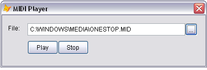

# Using Multimedia Command Strings to play MIDI files

## Before you begin:
The mciSendString can be used to play various media files including MIDI files.  

  

See also:

* [How to play MIDI notes](sample_537.md)  
* [How to play a waveform sound](sample_251.md)  
* [Playing WAV sounds simultaneously](sample_523.md)  
* [WAV file player](sample_417.md)  

  
***  


## Code:
```foxpro  
LOCAL oForm As Tform
oForm = CREATEOBJECT("Tform")
oForm.Show(1)
* end of main

DEFINE CLASS Tform As Form
	Width=400
	Height=100
	Caption="MIDI Player"
	Autocenter=.T.
	MinButton=.F.
	MaxButton=.F.
	BorderStyle=2
	player=NULL
	lastpath=""
	
	ADD OBJECT Label1 As Label WITH Left=12,;
		Top=18, Autosize=.T., Caption="File:"

	ADD OBJECT txtMidiFile As TextBox WITH Left=50,;
		Top=16, Width=310, Height=24
	
	ADD OBJECT cmdMidiFile As CommandButton WITH Left=360,;
		Top=16, Width=24, Height=24, Caption="..."
		
	ADD OBJECT cmdPlay As CommandButton WITH Left=50,;
		Top=50, Width=60, Height=27, Caption="Play"

	ADD OBJECT cmdStop As CommandButton WITH Left=110,;
		Top=50, Width=60, Height=27, Caption="Stop"

PROCEDURE Init
	THIS.player = CREATEOBJECT("MCIPlayer")

PROCEDURE cmdStop.Click
	ThisForm.player.CloseMidi

PROCEDURE cmdPlay.Click
	ThisForm.PlayMidiFile

PROCEDURE cmdMidiFile.Click
	ThisForm.SelectMidiFile

PROCEDURE SelectMidiFile
	LOCAL cCurrentPath, cResult
	cCurrentPath = SYS(5) + SYS(2003)
	IF EMPTY(THIS.lastpath)
		THIS.lastpath = GETENV("SystemRoot") + "\Media"
	ENDIF

	IF DIRECTORY(THIS.lastpath)
		SET DEFAULT TO (THIS.lastpath)
	ENDIF
	cResult = GETFILE("MID;MIDI;", "Select MIDI File:", "Open", 0)
	SET DEFAULT TO (cCurrentPath)

	IF NOT EMPTY(m.cResult)
		THIS.txtMidiFile.Value = m.cResult
	ENDIF

PROCEDURE PlayMidiFile
	LOCAL cFilename
	cFilename = ThisForm.txtMidiFile.Value
	ThisForm.player.PlayMidiFile(cFilename)

ENDDEFINE

DEFINE CLASS MCIPlayer As Session
PROTECTED MidiAlias
	MidiAlias="midi_"+SYS(2015)

PROCEDURE Init
	THIS.declare

PROCEDURE Destroy
	THIS.CloseMidi

PROCEDURE PlayMidiFile(cFilename)
	IF THIS.OpenMidi(cFilename)
		THIS.PlayMidi
	ENDIF

PROTECTED PROCEDURE OpenMidi(cFilename)
	IF NOT FILE(m.cFilename)
		RETURN .F.
	ENDIF

	THIS.CloseMidi
	LOCAL nResult
	nResult = mciSendString("open " + m.cFilename +;
		" type sequencer alias "+THIS.MidiAlias, "", 0,0)

	IF m.nResult <> 0
		LOCAL cErrMsg
		cErrMsg = THIS.GetErr(m.nResult)
		= MESSAGEBOX(m.cErrMsg, 48, "Failed to open MIDI file")
		RETURN .F.
	ENDIF
RETURN .T.

PROTECTED PROCEDURE PlayMidi
	LOCAL nResult
	nResult = mciSendString("play "+THIS.MidiAlias, "", 0,0)

	IF m.nResult <> 0
		LOCAL cErrMsg
		cErrMsg = THIS.GetErr(m.nResult)
		= MESSAGEBOX(m.cErrMsg, 48, "Failed to play MIDI file")
	ENDIF

PROCEDURE CloseMidi
	= mciSendString("stop "+THIS.MidiAlias, "", 0,0)
	= mciSendString("close "+THIS.MidiAlias, "", 0,0)

PROTECTED FUNCTION GetErr(lnError)
	LOCAL cBuffer
	cBuffer = REPLICATE(CHR(0), 250)
	= mciGetErrorString(lnError, @cBuffer, LEN(cBuffer))
RETURN SUBSTR(cBuffer, 1, AT(Chr(0),cBuffer)-1)

PROTECTED PROCEDURE declare
	DECLARE INTEGER mciSendString IN winmm;
		STRING lpszCommand, STRING @lpszReturnString,;
		INTEGER cchReturn, INTEGER hwndCallback

	DECLARE INTEGER mciGetErrorString IN winmm;
		INTEGER fdwError, STRING @lpszErrorText,;
		INTEGER cchErrorText

ENDDEFINE  
```  
***  


## Listed functions:
[mciGetErrorString](../libraries/winmm/mciGetErrorString.md)  
[mciSendString](../libraries/winmm/mciSendString.md)  
