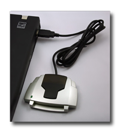

<link rel="stylesheet" type="text/css" href="../css/win32api.css">  
<link rel="stylesheet" href="https://cdnjs.cloudflare.com/ajax/libs/font-awesome/4.7.0/css/font-awesome.min.css">

# Smart Card Database Query Functions

## Before you begin:
  
  
The smart card resource manager manages the access to readers and smart cards. It identifies and tracks resources, allocates readers and resources across multiple applications, and supports transaction primitives for accessing services that are available on a specified smart card.  

The Smart Card Database contains a list of known smart cards, the interfaces and primary service provider of each card, and known smart card readers and reader groups.</td></tr></table>  
Purchase complete VFP solution.  
<a href="http://www.news2news.com/vfp/?solution=2&src=x539"></a>[](sample_000.md)  
  
***  


## Code:
```foxpro  
DEFINE CLASS SmartCards As Session
#DEFINE SCARD_SCOPE_USER 0
#DEFINE SCARD_SCOPE_SYSTEM 2
#DEFINE SCARD_S_SUCCESS 0
#DEFINE SCARD_E_NO_SERVICE 0x8010001D

	hContext=0
	ReaderGroups=NULL
	Readers=NULL

PROCEDURE Init
	THIS.declare
	IF NOT THIS.EstablishContext()
		= MESSAGEBOX("SCardEstablishContext " +;
			"call failed.", 48, "Class Initialization Error")
		RETURN .F.
	ENDIF

	THIS.ReaderGroups = CREATEOBJECT("Collection")
	THIS.Readers = CREATEOBJECT("Collection")
	
	THIS.GetReaderGroups
	THIS.GetReaders

PROCEDURE Destroy
	THIS.ReleaseContext

PROTECTED PROCEDURE EstablishContext
	THIS.ReleaseContext

	LOCAL nResult, hContext
	STORE 0 TO nResult, hContext
	nResult = SCardEstablishContext(SCARD_SCOPE_USER,;
		0, 0, @hContext)

	THIS.hContext = m.hContext
RETURN (nResult=0)

PROTECTED PROCEDURE ReleaseContext
	IF THIS.hContext <> 0
		= SCardReleaseContext(THIS.hContext)
		THIS.hContext=0
	ENDIF

PROCEDURE GetReaderGroups
	DO WHILE THIS.ReaderGroups.Count > 0
		THIS.ReaderGroups.Remove(1)
	ENDDO

	LOCAL cBuffer, nBufsize, nResult
	nBufsize=1024
	cBuffer=REPLICATE(CHR(0), nBufsize)
	
	nResult = SCardListReaderGroups(THIS.hContext,;
		@cBuffer, @nBufsize)

	IF nResult <> SCARD_S_SUCCESS
		RETURN .F.
	ENDIF

	LOCAL nItemCount, nItemIndex, cItem
	nItemCount = ALINES(arrSCardItems, cBuffer, CHR(0))

	FOR nItemIndex=1 TO nItemCount
		cItem = STRTRAN(arrSCardItems[nItemIndex], CHR(0), "")
		IF LEN(m.cItem) > 0
			THIS.ReaderGroups.Add(m.cItem)
		ENDIF
	NEXT

PROCEDURE GetReaders()
	DO WHILE THIS.Readers.Count > 0
		THIS.Readers.Remove(1)
	ENDDO

	LOCAL cBuffer, nBufsize, nResult
	nBufsize=1024
	cBuffer=REPLICATE(CHR(0), nBufsize)
	
	nResult = SCardListReaders(THIS.hContext,;
		NULL, @cBuffer, @nBufsize)

	IF nResult <> SCARD_S_SUCCESS
		RETURN .F.
	ENDIF

	LOCAL nItemCount, nItemIndex, cItem
	nItemCount = ALINES(arrSCardItems, cBuffer, CHR(0))

	FOR nItemIndex=1 TO nItemCount
		cItem = STRTRAN(arrSCardItems[nItemIndex], CHR(0), "")
		IF LEN(m.cItem) > 0
			THIS.Readers.Add(m.cItem)
		ENDIF
	NEXT

PROTECTED PROCEDURE declare
	DECLARE LONG SCardEstablishContext IN Winscard;
		INTEGER dwScope, INTEGER pvReserved1,;
		INTEGER pvReserved2, INTEGER @phContext
	
	DECLARE LONG SCardReleaseContext IN Winscard;
		INTEGER hContext

	DECLARE LONG SCardListReaderGroups IN Winscard;
		LONG hContext, STRING @mszGroups,;
		LONG @pcchGroups

	DECLARE LONG SCardListReaders IN Winscard;
		INTEGER hContext, STRING mszGroups,;
		STRING @mszReaders, LONG @pcchReaders

	DECLARE LONG SCardListCards IN Winscard;
		INTEGER hContext, INTEGER pbAtr,;
		INTEGER rgguidInterfaces, LONG cguidInterfaceCount,;
		STRING @mszCards, LONG @pcchCards

	DECLARE LONG SCardListInterfaces IN Winscard;
		INTEGER hContext, STRING szCard,;
		STRING @pguidInterfaces, LONG @pcguidInterfaces

	DECLARE LONG SCardGetProviderId IN Winscard;
		INTEGER hContext, STRING szCard,;
		STRING @pguidProviderId

	DECLARE INTEGER StringFromGUID2 IN ole32;
		STRING rguid, STRING @lpsz, INTEGER cchMax

ENDDEFINE  
```  
***  


## Listed functions:
[SCardEstablishContext](../libraries/winscard/SCardEstablishContext.md)  
[SCardGetProviderId](../libraries/winscard/SCardGetProviderId.md)  
[SCardListCards](../libraries/winscard/SCardListCards.md)  
[SCardListInterfaces](../libraries/winscard/SCardListInterfaces.md)  
[SCardListReaderGroups](../libraries/winscard/SCardListReaderGroups.md)  
[SCardListReaders](../libraries/winscard/SCardListReaders.md)  
[SCardReleaseContext](../libraries/winscard/SCardReleaseContext.md)  
[StringFromGUID2](../libraries/ole32/StringFromGUID2.md)  

## Comment:
Use the following code to test the SmartCard classes:  
  
<div class="precode">LOCAL oSmartCards As SmartCards  
oSmartCards = CREATEOBJECT("SmartCards")  
  
FOR EACH cReaderGroup IN oSmartCards.ReaderGroups  
	? cReaderGroup  
NEXT  
  
FOR EACH cReader IN oSmartCards.Readers  
	? cReader  
NEXT</div>  
  
***  

