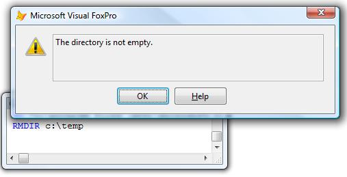

<link rel="stylesheet" type="text/css" href="../css/win32api.css">  
<link rel="stylesheet" href="https://cdnjs.cloudflare.com/ajax/libs/font-awesome/4.7.0/css/font-awesome.min.css">

# How to remove a directory that is not empty

## Short description:
As you know, the RMDIR generates an error message when an attempt made to remove a directory that is not empty. This example shows how to remove a directory with files based on the SHFileOperation call.  
***  


## Before you begin:
As you know, a call to RMDIR() generates an error (#1962) if the target directory is not empty, i.e. contains files or subdirectories.  

  
The most obvious way to overcome this sometimes useful obstacle is writing a recursion that combines ADIR and DELETE FILE | RMDIR calls.   

As an alternative, the Windows Scripting has its own solution:  
<div class="precode">fso = CREATEOBJECT("Scripting.FileSystemObject")  
fso.DeleteFolder("c:\temp\test")  
</div>  
And still one more way exists, presented in the code sample below. A directory can be recursively deleted by calling the SHFileOperation API function.  

See also:

* [Deleting file into the Recycle Bin](sample_321.md)  
* [How to empty the Recycle Bin](sample_301.md)  
* [Displaying standard progress dialog box when copying file](sample_508.md)  
  
***  


## Code:
```foxpro  
FUNCTION DeleteDirectory(cTargetPath As String) As Number
* returns 0 on success or error code if fails
#DEFINE FO_DELETE 3
#DEFINE FOF_ALLOWUNDO 64
#DEFINE FOF_SILENT 4
#DEFINE FOF_NOCONFIRMATION 0x10
#DEFINE FOF_NOERRORUI 0x400

	DECLARE INTEGER SHFileOperation IN Shell32;
		STRING @lpFileOp

	LOCAL oTarget, cBuffer, hWindow, nFlags

	oTarget = CREATEOBJECT("PChar", cTargetPath)
	
	* call the GetActiveWindow API with earlier VFP versions
	hWindow = _screen.HWnd

	* complete silent mode
	* for earlier VFP versions with limited BITOR()
	* just sum the flags together
	nFlags = BITOR(FOF_SILENT, FOF_NOCONFIRMATION,;
		FOF_NOERRORUI)

	* populating the SHFILEOPSTRUCT structure
	cBuffer = num2dword(hWindow) +;
		num2dword(FO_DELETE) +;
		num2dword(oTarget.GetAddr()) +;
		num2dword(0) + num2word(nFlags) +;
		num2word(0) + num2dword(0) + num2dword(0)

RETURN SHFileOperation(@cBuffer)

FUNCTION num2word(lnValue)
RETURN Chr(MOD(m.lnValue,256)) + CHR(INT(m.lnValue/256))

FUNCTION num2dword(lnValue)
#DEFINE m0 0x0000100
#DEFINE m1 0x0010000
#DEFINE m2 0x1000000
	IF lnValue < 0
		lnValue = 0x100000000 + lnValue
	ENDIF
	LOCAL b0, b1, b2, b3
	b3 = Int(lnValue/m2)
	b2 = Int((lnValue - b3*m2)/m1)
	b1 = Int((lnValue - b3*m2 - b2*m1)/m0)
	b0 = Mod(lnValue, m0)
RETURN Chr(b0)+Chr(b1)+Chr(b2)+Chr(b3)

DEFINE CLASS PChar As Session
PROTECTED hMem

PROCEDURE Init(lcString)
	THIS.hMem = 0
	THIS.setValue(lcString)

PROCEDURE Destroy
	THIS.ReleaseString

FUNCTION GetAddr
RETURN THIS.hMem

FUNCTION GetValue
	LOCAL lnSize, lcBuffer
	lnSize = THIS.getAllocSize()
	lcBuffer = SPACE(lnSize)

	IF THIS.hMem <> 0
		DECLARE RtlMoveMemory IN kernel32 As MemToStr;
			STRING @, INTEGER, INTEGER
		= MemToStr(@lcBuffer, THIS.hMem, lnSize)
	ENDIF
RETURN lcBuffer

FUNCTION GetAllocSize
	DECLARE INTEGER GlobalSize IN kernel32 INTEGER hMem
RETURN Iif(THIS.hMem=0, 0, GlobalSize(THIS.hMem))

PROCEDURE SetValue(lcString)
#DEFINE GMEM_FIXED 0
#DEFINE GMEM_MOVEABLE 2
#DEFINE GMEM_ZEROINIT 0x0040

	THIS.ReleaseString

	DECLARE INTEGER GlobalAlloc IN kernel32 INTEGER, INTEGER
	DECLARE RtlMoveMemory IN kernel32 As StrToMem;
		INTEGER, STRING @, INTEGER

	LOCAL lnSize
	lcString = lcString + Chr(0)
	lnSize = Len(lcString)
	THIS.hMem = GlobalAlloc(0x0040, lnSize)
	IF THIS.hMem <> 0
		= StrToMem(THIS.hMem, @lcString, lnSize)
	ENDIF

PROCEDURE ReleaseString
	IF THIS.hMem <> 0
		DECLARE INTEGER GlobalFree IN kernel32 INTEGER
		= GlobalFree (THIS.hMem)
		THIS.hMem = 0
	ENDIF
ENDDEFINE  
```  
***  


## Listed functions:
[GetActiveWindow](../libraries/user32/GetActiveWindow.md)  
[GlobalAlloc](../libraries/kernel32/GlobalAlloc.md)  
[GlobalFree](../libraries/kernel32/GlobalFree.md)  
[GlobalSize](../libraries/kernel32/GlobalSize.md)  
[SHFileOperation](../libraries/shell32/SHFileOperation.md)  

## Comment:
As I see it, the SHFileOperation is a better choice just for being more flexible. That of course comes at a price of extra coding required for handling the <a href="http://msdn.microsoft.com/en-us/library/bb759795(v=vs.85).aspx">SHFILEOPSTRUCT structure</a>.  
  
The SHFileOperation deletes files and subdirectories inside the target directory recursively.   
  
The file deletion process aborts whenever it encounters an undeletable object. The call returns an error code (for example 32, *File Sharing Violation*). The files and subdirectories following the file in question do not get deleted in this take.  
  
* * *  
.NET has more than one way for deleting a directory.  
  
System.IO <a href="http://msdn.microsoft.com/en-us/library/fxeahc5f.aspx">Directory.Delete</a> throws an exception when the path is not an empty directory.  
  
  
While System.IO <a href="http://msdn.microsoft.com/en-us/library/c66e2tts">DirectoryInfo.Delete</a> can delete files and directories recursively.  
  
  
  
***  

