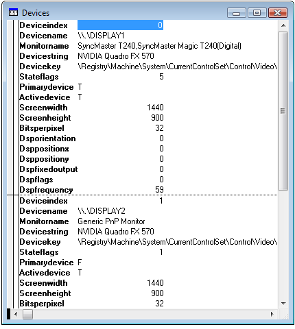

[ Home ](https://github.com/VFPX/Win32API)  

# How to detect if additional monitor is connected and active

## Short description:
Nowadays having two monitors connected to a PC becomes more a common place rather than exception. This code sample explains how to detect all available monitors through enumerating display devices and their properties.  
***  


## Before you begin:
Nowadays having two monitors connected to a PC becomes more a common place rather than exception. This code sample explains how to detect all available monitors through enumerating display devices and their properties.  

  
See also:

* [How to change display settings: screen resolution, screen refresh rate](sample_374.md)  
* [How to adjust monitor brightness (Vista, monitor with DDC support)](sample_543.md)  
  
***  


## Code:
```foxpro  
#DEFINE DISPLAY_DEVICE_ACTIVE 1
#DEFINE DISPLAY_DEVICE_PRIMARY_DEVICE 4
#DEFINE DISPLAY_DEVICE_SIZE  424
#DEFINE ENUM_CURRENT_SETTINGS -1
#DEFINE MONITOR_DEFAULTTONEAREST 2
#DEFINE MONITORINFOEX_SIZE 72

DO declare

CREATE CURSOR devices (deviceindex I, vfpishere L,;
	devicename C(32), monitorname C(128),;
	devicestring C(128), devicekey C(128),;
	stateflags I, primarydevice L, activedevice L,;
	screenwidth I, screenheight I, bitsperpixel I,;
	dsporientation I, dsppositionX I, dsppositionY I,;
	dspfixedoutput I, dspflags I, dspfrequency I)

DO EnumDspDevices

GO TOP
BROWSE NORMAL NOWAIT
* end of main

PROCEDURE EnumDspDevices
	LOCAL cBuffer, nIndex, nFlags, cDeviceName,;
		cDeviceString, cDeviceKey, cMonitorName

	cBuffer = num2dword(DISPLAY_DEVICE_SIZE) +;
		REPLICATE(CHR(0), DISPLAY_DEVICE_SIZE-4)

	nIndex = 0
	DO WHILE .T.
		IF EnumDisplayDevices(NULL, nIndex, @cBuffer, 0)=0
			EXIT
		ENDIF

		cDeviceName = SUBSTR(cBuffer, 5, 32)
		cDeviceName = SUBSTR(cDeviceName, 1,;
			AT(CHR(0),cDeviceName)-1)
		
		cDeviceString = SUBSTR(cBuffer, 37, 128)
		cDeviceString = SUBSTR(cDeviceString, 1,;
			AT(CHR(0),cDeviceString)-1)

		nFlags = buf2word(SUBSTR(cBuffer, 165, 2))

		cDeviceKey = SUBSTR(cBuffer, 297, 128)
		cDeviceKey = SUBSTR(cDeviceKey, 1,;
			AT(CHR(0),cDeviceKey)-1)

		cBuffer = num2dword(DISPLAY_DEVICE_SIZE) +;
			REPLICATE(CHR(0), DISPLAY_DEVICE_SIZE-4)

		= EnumDisplayDevices(cDeviceName, 0, @cBuffer, 0)
		cMonitorName = SUBSTR(cBuffer, 37,128) + Chr(0)
		cMonitorName = SUBSTR(cMonitorName, 1,;
			AT(Chr(0),cMonitorName)-1)

		INSERT INTO devices (deviceindex, devicename,;
			monitorname, devicestring, devicekey, stateflags,;
			primarydevice, activedevice);
		VALUES (nIndex, cDeviceName, cMonitorName,;
			cDeviceString, cDeviceKey, nFlags,;
			BITTEST(nFlags,2), BITTEST(nFlags,0))

		DO EnumDspSettings WITH cDeviceName

		nIndex = nIndex + 1
	ENDDO
	
	LOCAL cMonitorName
	cMonitorName = WhereIsVfp()

	UPDATE devices SET vfpishere=.T.;
	WHERE ALLTRIM(UPPER(devicename))==;
		ALLTRIM(UPPER(cMonitorName))

PROCEDURE EnumDspSettings(cDeviceName)
	LOCAL cBuffer

	cBuffer = REPLICATE(CHR(0), 1024)

	IF NOT EnumDisplaySettings(cDeviceName,;
		ENUM_CURRENT_SETTINGS, @cBuffer) <> 0
		RETURN
	ENDIF

	SELECT devices
	REPLACE;
		screenwidth WITH buf2dword(SUBSTR(cBuffer, 109,4)),;
		screenheight WITH buf2dword(SUBSTR(cBuffer, 113,4)),;
		bitsperpixel WITH buf2dword(SUBSTR(cBuffer, 105,4)),;
		dsppositionX WITH buf2dword(SUBSTR(cBuffer, 45,4)),;
		dsppositionY WITH buf2dword(SUBSTR(cBuffer, 49,4)),;
		dsporientation WITH buf2dword(SUBSTR(cBuffer, 53,4)),;
		dspfixedoutput WITH buf2dword(SUBSTR(cBuffer, 57,4)),;
		dspflags WITH buf2dword(SUBSTR(cBuffer, 117,4)),;
		dspfrequency WITH buf2dword(SUBSTR(cBuffer, 121,4))

FUNCTION WhereIsVfp() As String
* a monitor that has the largest area of intersection
* with the main VFP window
	LOCAL hMonitor, cBuffer, cMonitorName

	hMonitor = MonitorFromWindow(_vfp.hWnd,;
		MONITOR_DEFAULTTONEAREST)

	cBuffer = PADR(CHR(MONITORINFOEX_SIZE),;
		MONITORINFOEX_SIZE, CHR(0))

	= GetMonitorInfo(hMonitor, @cBuffer)
	
	cMonitorName = STRTRAN(SUBSTR(cBuffer,41), CHR(0),"")
RETURN m.cMonitorName
	
PROCEDURE declare
	DECLARE INTEGER EnumDisplaySettings IN user32;
		STRING lpszDeviceName, INTEGER iModeNum, STRING @lpDevMode

	DECLARE INTEGER EnumDisplayDevices IN user32;
		STRING lpDevice, INTEGER iDevNum,;
		STRING @lpDisplayDevice, INTEGER dwFlags

	DECLARE INTEGER MonitorFromWindow IN user32;
		INTEGER hWindow, INTEGER dwFlags

	DECLARE INTEGER GetMonitorInfo IN user32;
		INTEGER hMonitor, STRING @ lpmi

FUNCTION num2dword(lnValue)
#DEFINE m0 0x0000100
#DEFINE m1 0x0010000
#DEFINE m2 0x1000000
	IF lnValue < 0
		lnValue = 0x100000000 + lnValue
	ENDIF
	LOCAL b0, b1, b2, b3
	b3 = Int(lnValue/m2)
	b2 = Int((lnValue - b3*m2)/m1)
	b1 = Int((lnValue - b3*m2 - b2*m1)/m0)
	b0 = Mod(lnValue, m0)
RETURN Chr(b0)+Chr(b1)+Chr(b2)+Chr(b3)

FUNCTION buf2dword(lcBuffer)
RETURN Asc(SUBSTR(lcBuffer, 1,1)) + ;
	BitLShift(Asc(SUBSTR(lcBuffer, 2,1)),  8) +;
	BitLShift(Asc(SUBSTR(lcBuffer, 3,1)), 16) +;
	BitLShift(Asc(SUBSTR(lcBuffer, 4,1)), 24)

FUNCTION buf2word(lcBuffer)
RETURN Asc(SUBSTR(lcBuffer, 1,1)) + ;
       Asc(SUBSTR(lcBuffer, 2,1)) * 256  
```  
***  


## Listed functions:
[EnumDisplayDevices](../libraries/user32/EnumDisplayDevices.md)  
[EnumDisplaySettings](../libraries/user32/EnumDisplaySettings.md)  
[GetMonitorInfo](../libraries/user32/GetMonitorInfo.md)  
[MonitorFromWindow](../libraries/user32/MonitorFromWindow.md)  

## Comment:
In the cursor created by this code sample, each connected monitor is indicated by non-empty *MonitorName* value.   
  
For an active monitor (*the desktop extends to such monitor*), several other values are populated:  
*  
<LI>Screenwidth  
<LI>Screenheight  
<LI>Bitsperpixel  
<LI>DsppositionX  
<LI>DsppositionY*  
  
From the screen dimensions and the display position it is possible to determine whether a given window is visible on a particular display.  
  
* * *  
Read <a href="http://www.microsoft.com/athome/moredone/twomonitors.mspx">Two monitors are better than one</a> by *Tony Northrup* published on Microsoft website. Bet he might be busy writing a sequel "N+1 monitors better than N".  
  
* * *  
Some graphics cards and external units (Matrox) support connections to multiple monitors, three and more.  
  
***  

