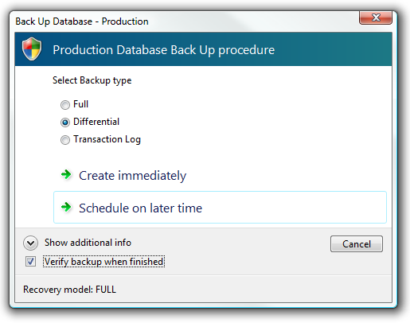

# How to display advanced Task Dialog (Vista)

## Before you begin:
The TaskDialogIndirect displays highly adjustable task dialog.  
  
The task dialog contains application-defined icons, messages, title, verification check box, command links, push buttons, and radio buttons.  

See also:

<a href="?example=557">How to display a Task Dialog (Vista)</a>[How to display a Task Dialog (Vista)](sample_557.md)  
  
***  


## Code:
```foxpro  
#DEFINE TDF_USE_HICON_MAIN 0x0002
#DEFINE TDF_USE_HICON_FOOTER 0x0004
#DEFINE TDF_ALLOW_DIALOG_CANCELLATION 0x0008
#DEFINE TDF_USE_COMMAND_LINKS 0x0010
#DEFINE TDF_USE_COMMAND_LINKS_NO_ICON 0x0020
#DEFINE TDF_EXPAND_FOOTER_AREA 0x0040
#DEFINE TDF_EXPANDED_BY_DEFAULT 0x0080
#DEFINE TDF_VERIFICATION_FLAG_CHECKED 0x0100
#DEFINE TDF_SHOW_PROGRESS_BAR 0x0200
#DEFINE TDF_SHOW_MARQUEE_PROGRESS_BAR 0x0400
#DEFINE TDF_POSITION_RELATIVE_TO_WINDOW 0x1000
#DEFINE TDF_RTL_LAYOUT 0x2000
#DEFINE TDF_NO_DEFAULT_RADIO_BUTTON 0x4000
#DEFINE TDF_CAN_BE_MINIMIZED 0x8000

#DEFINE TDCBF_OK_BUTTON 1
#DEFINE TDCBF_YES_BUTTON 2
#DEFINE TDCBF_NO_BUTTON 4
#DEFINE TDCBF_CANCEL_BUTTON 8
#DEFINE TDCBF_RETRY_BUTTON 0x0010
#DEFINE TDCBF_CLOSE_BUTTON 0x0020

#DEFINE TDCBF_YES_BUTTON 2
#DEFINE TDCBF_NO_BUTTON 4
#DEFINE TDCBF_CANCEL_BUTTON 8

#DEFINE TD_WARNING_ICON -1
#DEFINE TD_ERROR_ICON -2
#DEFINE TD_INFORMATION_ICON -3
#DEFINE TD_SHIELD_ICON -4
#DEFINE TD_SHIELD_GRADIENT_ICON -5
#DEFINE TD_SHIELD_WARNING_ICON -6
#DEFINE TD_SHIELD_ERROR_ICON -7
#DEFINE TD_SHIELD_OK_ICON -8
#DEFINE TD_SHIELD_GRAY_ICON -9
#DEFINE IDI_APPLICATION 0x00007f00
#DEFINE IDI_QUESTION 0x00007f02

LOCAL oDlg As TaskDialog
oDlg = CREATEOBJECT("TaskDialog")

WITH oDlg
	.hwndParent=_screen.HWnd

	.MainIcon=TD_SHIELD_GRADIENT_ICON

	.dwCommonButtons=TDCBF_CANCEL_BUTTON

	.dwFlags=BITOR(TDF_ALLOW_DIALOG_CANCELLATION,;
		TDF_VERIFICATION_FLAG_CHECKED,;
		TDF_EXPAND_FOOTER_AREA, TDF_USE_COMMAND_LINKS)
	
	.WindowTitle="Back Up Database - Production"
	.MainInstruction="Production Database Back Up procedure"
	.Content="Select Backup type:"
	
	.CheckBoxCaption="Verify backup when finished"
	.ExpandedInfo="This string is displayed on the expanded part..."
	.FooterText="Recovery model: FULL"

	.CaptionForCollapse="Less info"
	.CaptionForExpand="More info"

	.UdfButtons.AddButton(1001, "Create immediately")
	.UdfButtons.AddButton(1002, "Schedule on later time")
	.UdfButtons.DefaultButton=2

	.UdfRadioButtons.AddButton(2001, "Full")
	.UdfRadioButtons.AddButton(2002, "Differential")
	.UdfRadioButtons.AddButton(2003, "Transaction Log")
	.UdfRadioButtons.DefaultButton=3
	
	? .ShowDialog(),;
		.SelectedButtonId,;
		.SelectedRadioId,;
		.Checked

ENDWITH

* end of main

DEFINE CLASS TaskDialog As Custom
#DEFINE S_OK 0
#DEFINE TASKDIALOGCONFIG_SIZE 96
	hwndParent=0
	hInstance=0
	dwFlags=0
	dwCommonButtons=0
	WindowTitle=""
	MainInstruction=""
	Content=""
	MainIcon=0
	UdfButtons=NULL
	UdfRadioButtons=NULL
	CheckBoxCaption=""
	ExpandedInfo=""
	CaptionForCollapse=""
	CaptionForExpand=""
	FooterIcon=0
	FooterText=""
	cxWidth=0
	
	DlgResult=0
	SelectedButtonId=0
	SelectedRadioId=0
	Checked=.F.

PROCEDURE Init
	WITH THIS
		.declare
		.UdfButtons = CREATEOBJECT("TDButtons")
		.UdfRadioButtons = CREATEOBJECT("TDButtons")
	ENDWITH

PROCEDURE ShowDialog
	LOCAL cTaskDialogConfig, oWindowTitle As PChar,;
		oMainInstruction As PChar, oContent As PChar,;
		oCheckBoxCaption As PChar, oExpandedInfo As PChar,;
		oCaptionForCollapse As PChar, oCaptionForExpand As PChar,;
		oFooterText As PChar, nMainIcon

	LOCAL nSelectedButtonId, nSelectedRadioId, nChecked

	WITH THIS
		nMainIcon = BITAND(0x0000ffff, .MainIcon)

		oWindowTitle = CREATEOBJECT("PChar",;
			ToUnicode(.WindowTitle))

		oMainInstruction = CREATEOBJECT("PChar",;
			ToUnicode(.MainInstruction))

		oContent = CREATEOBJECT("PChar",;
			ToUnicode(.Content))

		oCheckBoxCaption = CREATEOBJECT("PChar",;
			ToUnicode(.CheckBoxCaption))

		oExpandedInfo = CREATEOBJECT("PChar",;
			ToUnicode(.ExpandedInfo))

		oCaptionForCollapse = CREATEOBJECT("PChar",;
			ToUnicode(.CaptionForCollapse))

		oCaptionForExpand = CREATEOBJECT("PChar",;
			ToUnicode(.CaptionForExpand))

		oFooterText = CREATEOBJECT("PChar",;
			ToUnicode(.FooterText))

		cTaskDialogConfig =;
			num2dword(TASKDIALOGCONFIG_SIZE) +;
			num2dword(.hwndParent) +;
			num2dword(0) +;
			num2dword(.dwFlags) +;
			num2dword(.dwCommonButtons) +;
			num2dword(oWindowTitle.getaddr()) +;
			num2dword(nMainIcon) +;
			num2dword(oMainInstruction.getaddr()) +;
			num2dword(oContent.getaddr()) +;
			num2dword(.UdfButtons.Count) +;
			num2dword(.UdfButtons.GetAddr()) +;
			num2dword(.UdfButtons.GetDefaultButtonId()) +;
			num2dword(.UdfRadioButtons.Count) +;
			num2dword(.UdfRadioButtons.GetAddr()) +;
			num2dword(.UdfRadioButtons.GetDefaultButtonId()) +;
			num2dword(oCheckBoxCaption.GetAddr()) +;
			num2dword(oExpandedInfo.GetAddr()) +;
			num2dword(oCaptionForCollapse.GetAddr()) +;
			num2dword(oCaptionForExpand.GetAddr()) +;
			num2dword(0) +;
			num2dword(oFooterText.GetAddr()) +;
			num2dword(0) +;
			num2dword(0) +;
			num2dword(0)
	
		STORE 0 TO nSelectedButtonId, nSelectedRadioId, nChecked

		.DlgResult = TaskDialogIndirect(cTaskDialogConfig,;
			@nSelectedButtonId, @nSelectedRadioId, @nChecked)

		.SelectedButtonId=m.nSelectedButtonId
		.SelectedRadioId=m.nSelectedRadioId
		.Checked=m.nChecked
	ENDWITH
RETURN THIS.DlgResult

PROTECTED PROCEDURE declare
	DECLARE INTEGER TaskDialogIndirect IN comctl32;
		STRING pTaskConfig, INTEGER @pnButton,;
		INTEGER @pnRadioButton,;
		INTEGER @pfVerificationFlagChecked

ENDDEFINE

DEFINE CLASS TDButton As Custom
	ButtonId=0
	ButtonCaption=0

PROCEDURE Init(nButtonId As Number, cCaption As Number)
	THIS.ButtonId=m.nButtonId
	THIS.ButtonCaption=CREATEOBJECT("PChar",;
		ToUnicode(m.cCaption))

PROCEDURE Destroy
	THIS.ButtonCaption=NULL

PROCEDURE ToString() As String
RETURN num2dword(THIS.ButtonId)+;
	num2dword(THIS.ButtonCaption.GetAddr())

ENDDEFINE

DEFINE CLASS TDButtons As Collection
	DefaultButton=1
	ptButtons=NULL

PROCEDURE Destroy
	THIS.ptButtons=NULL

PROCEDURE AddButton(nButtonId As Number, cCaption As Number)
	LOCAL oButton As TDButton
	oButton = CREATEOBJECT("TDButton", m.nButtonId, m.cCaption)
	THIS.Add(oButton)
	oButton=NULL

FUNCTION GetDefaultButtonId() As Number
	WITH THIS
		RETURN IIF(BETWEEN(.DefaultButton, 1, .Count),;
			.Item(.DefaultButton).ButtonId, 0)
	ENDWITH

FUNCTION GetAddr() As Number
	LOCAL cBuffer, oButton As TDButton
	cBuffer=""
	
	FOR EACH oButton IN THIS
		cBuffer = m.cBuffer + oButton.ToString()
	NEXT
	oButton=NULL
	
	THIS.ptButtons=NULL
	THIS.ptButtons=CREATEOBJECT("PChar", m.cBuffer)
RETURN THIS.ptButtons.GetAddr()

ENDDEFINE

DEFINE CLASS PChar As Session
PROTECTED hMem

PROCEDURE Init(lcString)
	THIS.hMem = 0
	THIS.setValue(lcString)

PROCEDURE Destroy
	THIS.ReleaseString

FUNCTION GetAddr
RETURN THIS.hMem

FUNCTION GetValue
	LOCAL lnSize, lcBuffer
	lnSize = THIS.getAllocSize()
	lcBuffer = SPACE(lnSize)

	IF THIS.hMem <> 0
		DECLARE RtlMoveMemory IN kernel32 As MemToStr;
			STRING @, INTEGER, INTEGER
		= MemToStr(@lcBuffer, THIS.hMem, lnSize)
	ENDIF
RETURN lcBuffer

FUNCTION GetAllocSize
	DECLARE INTEGER GlobalSize IN kernel32 INTEGER hMem
RETURN Iif(THIS.hMem=0, 0, GlobalSize(THIS.hMem))

PROCEDURE SetValue(lcString)
#DEFINE GMEM_FIXED 0
#DEFINE GMEM_MOVEABLE 2
#DEFINE GMEM_ZEROINIT 0x0040

	THIS.ReleaseString

	DECLARE INTEGER GlobalAlloc IN kernel32 INTEGER, INTEGER
	DECLARE RtlMoveMemory IN kernel32 As StrToMem;
		INTEGER, STRING @, INTEGER

	LOCAL lnSize
	lcString = lcString + Chr(0)
	lnSize = Len(lcString)
	THIS.hMem = GlobalAlloc(0x0040, lnSize)
	IF THIS.hMem <> 0
		= StrToMem(THIS.hMem, @lcString, lnSize)
	ENDIF

PROCEDURE ReleaseString
	IF THIS.hMem <> 0
		DECLARE INTEGER GlobalFree IN kernel32 INTEGER
		= GlobalFree (THIS.hMem)
		THIS.hMem = 0
	ENDIF
ENDDEFINE

FUNCTION ToUnicode(cStr As String) As String
RETURN STRCONV(m.cStr+CHR(0), 5)

FUNCTION num2dword(lnValue)
#DEFINE m0 0x0000100
#DEFINE m1 0x0010000
#DEFINE m2 0x1000000
	IF lnValue < 0
		lnValue = 0x100000000 + lnValue
	ENDIF
	LOCAL b0, b1, b2, b3
	b3 = Int(lnValue/m2)
	b2 = Int((lnValue - b3*m2)/m1)
	b1 = Int((lnValue - b3*m2 - b2*m1)/m0)
	b0 = Mod(lnValue, m0)
RETURN CHR(m.b0)+CHR(m.b1)+CHR(m.b2)+CHR(m.b3)  
```  
***  


## Listed functions:
[GlobalAlloc](../libraries/kernel32/GlobalAlloc.md)  
[GlobalFree](../libraries/kernel32/GlobalFree.md)  
[GlobalSize](../libraries/kernel32/GlobalSize.md)  
[TaskDialog](../libraries/comctl32/TaskDialog.md)  
[TaskDialogIndirect](../libraries/comdlg32/TaskDialogIndirect.md)  

## Comment:
TaskDialogCallbackProc related functionality (like the progress bar) is not available when the Task Dialog is programmed in just FoxPro code.  
  
***  

