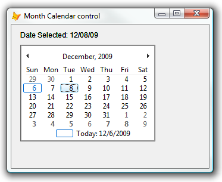

<link rel="stylesheet" type="text/css" href="../css/win32api.css">  
<link rel="stylesheet" href="https://cdnjs.cloudflare.com/ajax/libs/font-awesome/4.7.0/css/font-awesome.min.css">

# Using Month Calendar Control (VFP9, Comctl32.dll)

## Before you begin:
  
The control also provides the application with the means to obtain and set the date information in the control using existing data types.  
  
***  


## Code:
```foxpro  
LOCAL oForm As Tform
oForm=CREATEOBJECT("Tform")
oForm.Show
READ EVENTS
* end of main

DEFINE CLASS Tform As Form
	Caption = "Month Calendar control"
	Height=260
	Width=360
	Autocenter=.T.
*	ShowWindow=2

	ADD OBJECT lblDate1 As Label WITH;
	Left=15, Top=10, Caption="Date Selected:",;
	AutoSize=.T., BackStyle=0

	* add before adding first comctl32 control	
	ADD OBJECT Comctl32Manager1 As Comctl32Manager

	* CtrlId is important if more than one
	* comctl32 control is hosted by the form
	ADD OBJECT MonthCalendar1 As MonthCalendar WITH;
	Left=15, Top=40, CtrlId=1001

PROCEDURE Init
	* setting to arbitrary date
	THIS.MonthCalendar1.SelectedDate=GOMONTH(DATE(), -12)
	THIS.DisplayDate

PROCEDURE Destroy
	CLEAR EVENTS

PROCEDURE DisplayDate
	THIS.lblDate1.Caption= "Date Selected: " +;
		TRANSFORM(THIS.MonthCalendar1.SelectedDate)

PROCEDURE MonthCalendar1.OnCtrlEvent
PARAMETERS hWindow as Integer, nMsgID as Integer,;
	wParam as Integer, lParam as Integer

	* calling the parent -- the must
	MonthCalendar::OnCtrlEvent(m.hWindow,;
		m.nMsgID, m.wParam, m.lParam)

	IF THIS.EventId=-749 && MCN_SELCHANGE
	* selected date changed interactively
		ThisForm.DisplayDate
	ENDIF

ENDDEFINE

DEFINE CLASS Comctl32Manager As Custom
#DEFINE GWL_WNDPROC -4
#DEFINE GWL_HINSTANCE -6
#DEFINE WS_VISIBLE 0x10000000
#DEFINE WS_CHILD 0x40000000
#DEFINE WS_TABSTOP 0x00010000
#DEFINE WS_BORDER 0x00800000
#DEFINE MCS_DAYSTATE 1
#DEFINE HWND_TOP 0
#DEFINE SWP_NOSIZE 0x0001
#DEFINE SWP_NOMOVE 0x0002
#DEFINE SWP_SHOWWINDOW 0x0040
#DEFINE WM_NOTIFY 0x004e
#DEFINE MCM_FIRST 0x1000
#DEFINE MCM_GETMINREQRECT (MCM_FIRST+9)
#DEFINE MCM_SETCURSEL (MCM_FIRST+2)
#DEFINE MCN_FIRST -746
#DEFINE MCN_SELECT (MCN_FIRST-0)
#DEFINE MCN_SELCHANGE (MCN_FIRST-3)
#DEFINE NMHDR_SIZE 12
#DEFINE SYSTEMTIME_SIZE 16
#DEFINE NMSELCHANGE_SIZE (NMHDR_SIZE+SYSTEMTIME_SIZE*2)

	Visible=.F.
	hParentHwnd=0
	hOrigProc=0
	Comctl32Controls=NULL

PROCEDURE Init
	WITH THIS
		.declare
		.hParentHwnd=ThisForm.hWnd
		.hOrigProc=GetWindowLong(.hParentHwnd, GWL_WNDPROC)
		.Comctl32Controls=CREATEOBJECT("Collection")

		* comctl32 messaging is conducted
		* via WM_NOTIFY messages
		BINDEVENT(THIS.hParentHwnd, WM_NOTIFY,;
			THIS, "WindowProc", 1)

		* release first
		BINDEVENT(ThisForm, "Destroy", THIS, "ReleaseControls", 1)
	ENDWITH

PROCEDURE Destroy
	IF THIS.hParentHwnd <> 0
		UNBINDEVENTS(THIS.hParentHwnd, WM_NOTIFY)
		THIS.hParentHwnd=0
		THIS.hOrigProc=0
	ENDIF

PROCEDURE ReleaseControls
	DO WHILE THIS.Comctl32Controls.Count > 0
		THIS.Comctl32Controls.Remove(1)
	ENDDO

PROTECTED PROCEDURE KeyFromCtrlId(nCtrlId As Number) As String
RETURN "c_" + PADL(TRANSFORM(m.nCtrlId),5,"0")

PROTECTED PROCEDURE ControlIsRegistered(nCtrlId As Number) As Boolean
	LOCAL oControl As Comctl32Control, lResult
	oControl=THIS.ControlFromCtrlId(nCtrlId)
	lResult=NOT ISNULL(m.oControl)
	oControl=NULL
RETURN m.lResult

PROTECTED PROCEDURE ControlFromCtrlId(nCtrlId As Number) As Comctl32Control
	LOCAL cCtrlKey, oControl As Comctl32Control,;
		ex As Exception
	cCtrlKey=THIS.KeyFromCtrlId(m.nCtrlId)
	TRY
		oControl=THIS.Comctl32Controls.Item(m.cCtrlKey)
	CATCH TO ex
		oControl=NULL
	ENDTRY
RETURN m.oControl

PROCEDURE RegisterControl(oControl As Comctl32Control)
	LOCAL cCtrlKey, ex As Exception
	cCtrlKey=THIS.KeyFromCtrlId(oControl.CtrlId)
	TRY
		THIS.Comctl32Controls.Add(oControl, m.cCtrlKey)
	CATCH TO ex
	ENDTRY

PROTECTED PROCEDURE WindowProc
PARAMETERS hWindow as Integer, nMsgID as Integer,;
	wParam as Integer, lParam as Integer

	LOCAL nReturn, oNmhdr As NMHdrStruct

	oNmhdr=CREATEOBJECT("NMHdrStruct")
	oNmhdr.FromPtr(m.lParam)
	
	nReturn = CallWindowProc(THIS.hOrigProc, m.hWindow,;
		m.nMsgID, m.wParam, m.lParam)

	IF THIS.ControlIsRegistered( oNmhdr.idFrom )
		THIS.OnCtrlEvent(m.oNmhdr, m.hWindow,;
			m.nMsgID, m.wParam, m.lParam)
	ENDIF

RETURN m.nReturn

PROTECTED PROCEDURE OnCtrlEvent
PARAMETERS oNmhdr As NMHdrStruct, hWindow as Integer, nMsgID as Integer,;
	wParam as Integer, lParam as Integer

	LOCAL oControl As Comctl32Control
	oControl=THIS.ControlFromCtrlId( oNmhdr.idFrom )
	WITH oControl
		.EventId=oNmhdr.EventId
		.OnCtrlEvent(m.hWindow, m.nMsgID, m.wParam, m.lParam)
	ENDWITH

PROTECTED PROCEDURE declare
	DECLARE RtlMoveMemory IN kernel32 As MemToStr;
		STRING @, INTEGER, INTEGER

	DECLARE INTEGER DestroyWindow IN user32;
		INTEGER hWindow

	DECLARE INTEGER GetWindowLong IN user32;
		INTEGER hWindow, INTEGER nIndex

	DECLARE INTEGER CreateWindowEx IN user32 AS CreateWindow;
		INTEGER dwExStyle, STRING lpClassName,;
		STRING lpWindowName, INTEGER dwStyle,;
		INTEGER x, INTEGER y, INTEGER nWidth, INTEGER nHeight,;
		INTEGER hWndParent, INTEGER hMenu, INTEGER hInstance,;
		INTEGER lpParam
		
	DECLARE INTEGER SendMessage IN user32;
	AS SendMessageStr;
		INTEGER hWindow, INTEGER Msg,;
		INTEGER wParam, STRING @lParam

	DECLARE INTEGER SetWindowPos IN user32;
		INTEGER hWindow, INTEGER hWndInsertAfter,;
		INTEGER x, INTEGER y, INTEGER cx, INTEGER cy,;
		INTEGER wFlags

	DECLARE INTEGER CallWindowProc IN user32;
		INTEGER lpPrevWndFunc, INTEGER hWindow, LONG Msg,;
		INTEGER wParam, INTEGER lParam

ENDDEFINE

DEFINE CLASS Comctl32Control As Control && Container, TextBox
	hParentWindow=0
	hWindow=0
	EventId=0
	CtrlId=0

PROCEDURE Init
	WITH THIS
		.hParentWindow=ThisForm.Hwnd
		.RegisterControl
		.DisplayObject
	ENDWITH

PROCEDURE Destroy
	THIS.DestroyObject

PROTECTED PROCEDURE DestroyObject
	IF THIS.hWindow <> 0
		= DestroyWindow(THIS.hWindow)
		THIS.hWindow=0
	ENDIF

PROTECTED PROCEDURE RegisterControl
	ThisForm.Comctl32Manager1.RegisterControl(THIS)

PROCEDURE DisplayObject  && abstract

PROCEDURE OnCtrlEvent  && abstract
PARAMETERS hWindow as Integer, nMsgID as Integer,;
	wParam as Integer, lParam as Integer

ENDDEFINE

DEFINE CLASS MonthCalendar As Comctl32Control
PROTECTED _SelectedDate
	oNMSelChange=NULL
	_SelectedDate={}
	SelectedDate={}

PROCEDURE Init
	Comctl32Control::Init()
	THIS.oNMSelChange=CREATEOBJECT("NMSelChangeStruct")

PROCEDURE SelectedDate_ACCESS() As Date
RETURN THIS._SelectedDate

PROCEDURE SelectedDate_ASSIGN(vValue As Variant)
	LOCAL dDate As Date
	DO CASE
	CASE VARTYPE(m.vValue)="D"
		dDate=m.vValue
	CASE VARTYPE(m.vValue)="T"
		dDate=TTOD(m.vValue)
	OTHERWISE
		RETURN
	ENDCASE

	LOCAL oSystemTime As SystemTimeStruct, cSystemTime
	oSystemTime=CREATEOBJECT("SystemTimeStruct")
	oSystemTime.FromDate(m.dDate)
	cSystemTime=oSystemTime.ToString()
	
	= SendMessageStr(THIS.hWindow, MCM_SETCURSEL, 0, @cSystemTime)
	THIS._SelectedDate=m.dDate

PROCEDURE OnCtrlEvent
PARAMETERS hWindow as Integer, nMsgID as Integer,;
	wParam as Integer, lParam as Integer
	Comctl32Control::OnCtrlEvent(m.hWindow, m.nMsgID,;
		m.wParam, m.lParam)

	WITH THIS
		DO CASE
		CASE INLIST(.EventId, MCN_SELCHANGE, MCN_SELECT)
			.oNMSelChange.FromPtr(m.lParam)
			._SelectedDate=.oNMSelChange.stSelStart.ToDate()
		ENDCASE
	ENDWITH

PROCEDURE DisplayObject
	LOCAL nStyle, hApp, cSizeBuffer

	WITH THIS
		.DestroyObject
		nStyle = BITOR(WS_BORDER, WS_CHILD, WS_VISIBLE, MCS_DAYSTATE)
		hApp = GetWindowLong(.hParentWindow, GWL_HINSTANCE)

		THIS.hWindow=CreateWindow(0, "SysMonthCal32",;
			"", nStyle, .Left, .Top, .Width, .Height,;
			.hParentWindow, .CtrlId, hApp, 0)

		* calculating optimal rectangle
		cSizeBuffer=REPLICATE(CHR(0), 16)
		= SendMessageStr(.hWindow, MCM_GETMINREQRECT,;
			0, @cSizeBuffer)

		.Width=buf2dword(SUBSTR(cSizeBuffer,9,4))
		.Height=buf2dword(SUBSTR(cSizeBuffer,13,4))

		* resizing to optimal rectangle
		= SetWindowPos(.hWindow, HWND_TOP,;
			0, 0, .Width, .Height,;
			BITOR(SWP_NOMOVE, SWP_SHOWWINDOW))
	ENDWITH

ENDDEFINE

DEFINE CLASS NMHdrStruct As Relation
	hwndFrom=0
	idFrom=0
	EventId=0

PROCEDURE FromPtr(nAddr As Number)
	LOCAL cBuffer
	cBuffer = REPLICATE(CHR(0), NMHDR_SIZE)
	MemToStr(@cBuffer, m.lParam, NMHDR_SIZE)
	WITH THIS
		.hwndFrom = buf2dword(SUBSTR(m.cBuffer,1,4))
		.idFrom = buf2dword(SUBSTR(m.cBuffer,5,4))
		.EventId = buf2dword(SUBSTR(m.cBuffer,9,4))
	ENDWITH

ENDDEFINE

DEFINE CLASS NMSelChangeStruct As Relation
	NMHdr=NULL
	stSelStart=NULL
	stSelEnd=NULL

PROCEDURE FromPtr(nAddr As Number)
	LOCAL cBuffer
	cBuffer = REPLICATE(CHR(0), NMSELCHANGE_SIZE)
	MemToStr(@cBuffer, m.lParam, NMSELCHANGE_SIZE)
	WITH THIS
		.NMHdr=CREATEOBJECT("NMHdrStruct")
		.NMHdr.FromPtr(m.nAddr)
		.stSelStart=CREATEOBJECT("SystemTimeStruct")
		.stSelStart.FromStr(SUBSTR(cBuffer,;
			NMHDR_SIZE+1, SYSTEMTIME_SIZE))
		.stSelEnd=CREATEOBJECT("SystemTimeStruct")
		.stSelEnd.FromStr(SUBSTR(cBuffer,;
			NMHDR_SIZE+SYSTEMTIME_SIZE+1, SYSTEMTIME_SIZE))
	ENDWITH
ENDDEFINE

DEFINE CLASS SystemTimeStruct As Relation
	wYear=0
	wMonth=0
	wDayOfWeek=0
	wDay=0
	wHour=0
	wMinute=0
	wSecond=0
	wMilliseconds=0

PROCEDURE FromStr(cBuffer As String)
	WITH THIS
		.wYear=buf2word(SUBSTR(cBuffer,1,2))
		.wMonth=buf2word(SUBSTR(cBuffer,3,2))
		.wDayOfWeek=buf2word(SUBSTR(cBuffer,5,2))
		.wDay=buf2word(SUBSTR(cBuffer,7,2))
		.wHour=buf2word(SUBSTR(cBuffer,9,2))
		.wMinute=buf2word(SUBSTR(cBuffer,11,2))
		.wSecond=buf2word(SUBSTR(cBuffer,13,2))
		.wMilliseconds=buf2word(SUBSTR(cBuffer,15,2))
	ENDWITH

PROCEDURE FromDate(dDate As Date)
	WITH THIS
		.wYear=YEAR(m.dDate)
		.wMonth=MONTH(m.dDate)
		.wDayOfWeek=DOW(m.dDate)
		.wDay=DAY(m.dDate)
		.wHour=0
		.wMinute=0
		.wSecond=0
		.wMilliseconds=0
	ENDWITH

FUNCTION ToString() As String
	LOCAL cResult
	WITH THIS
		cResult = num2word(.wYear) +;
			num2word(.wMonth) +;
			num2word(.wDayOfWeek) +;
			num2word(.wDay) +;
			num2word(.wHour) +;
			num2word(.wMinute) +;
			num2word(.wSecond) +;
			num2word(.wMilliseconds)
	ENDWITH
RETURN m.cResult

FUNCTION ToDate() As Date
	LOCAL cResult, tResult
	WITH THIS
		cResult="{^" + TRANSFORM(.wYear)+"/"+;
			TRANSFORM(.wMonth)+ "/"+TRANSFORM(.wDay)+"}"
	ENDWITH
	TRY
		tResult=EVALUATE(m.cResult)
	CATCH
		tResult=CTOD("")
	ENDTRY
RETURN m.tResult

ENDDEFINE

FUNCTION buf2dword(cBuffer)
RETURN Asc(SUBSTR(cBuffer, 1,1)) + ;
	BitLShift(Asc(SUBSTR(cBuffer, 2,1)),  8) +;
	BitLShift(Asc(SUBSTR(cBuffer, 3,1)), 16) +;
	BitLShift(Asc(SUBSTR(cBuffer, 4,1)), 24)

FUNCTION buf2word(lcBuffer)
RETURN Asc(SUBSTR(lcBuffer, 1,1)) + ;
       Asc(SUBSTR(lcBuffer, 2,1)) * 256

FUNCTION num2word(lnValue)
RETURN Chr(MOD(m.lnValue,256)) + CHR(INT(m.lnValue/256))  
```  
***  


## Listed functions:
[CallWindowProc](../libraries/user32/CallWindowProc.md)  
[CreateWindowEx](../libraries/user32/CreateWindowEx.md)  
[DestroyWindow](../libraries/user32/DestroyWindow.md)  
[GetWindowLong](../libraries/user32/GetWindowLong.md)  
[SendMessage](../libraries/user32/SendMessage.md)  
[SetWindowPos](../libraries/user32/SetWindowPos.md)  

## Comment:
The Date and Time Picker can be programmed in nearly identical way.   
  
  
***  

