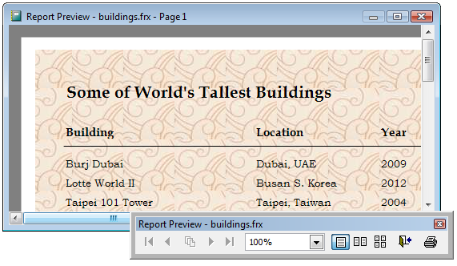

<link rel="stylesheet" type="text/css" href="../css/win32api.css">  
<link rel="stylesheet" href="https://cdnjs.cloudflare.com/ajax/libs/font-awesome/4.7.0/css/font-awesome.min.css">

# Adding a background image to VFP report (VFP9, ReportListener)

## Before you begin:
  
  
Download the texture used in this code sample. Otherwise use any image file (BMP, GIF, JPEG, PNG, or TIFF) of reasonable size and quality.  

See also:

* [Printing vertical text on VFP reports via generated images](sample_510.md)  
  
***  


## Code:
```foxpro  
LOCAL oListener As TListener
oListener = CREATEOBJECT("TListener")

* assign texture file -- a valid image file
oListener.TextureFile="sampletexture001.jpg"

* run existing VFP report
REPORT FORM buildings OBJECT oListener PREVIEW
* end of main

DEFINE CLASS TListener As ReportListener
	ListenerType=1  && renders all pages
	TextureFile=""
	brush=0

PROCEDURE LoadReport
	WITH THIS
		.declare
		.CreateBrush
	ENDWITH
	
PROCEDURE UnloadReport
	THIS.ReleaseBrush

PROTECTED PROCEDURE ReleaseBrush
	IF THIS.brush <> 0
		= GdipDeleteBrush(THIS.brush)
		THIS.brush=0
	ENDIF

PROTECTED PROCEDURE CreateBrush
	THIS.ReleaseBrush

	LOCAL nResult, hImage, hBrush, nScale

	hImage=0
	nResult=GdipLoadImageFromFile(;
		ToUnicode(THIS.TextureFile), @hImage)

	IF m.nResult = 0
	
		hBrush=0
		IF GdipCreateTexture(hImage, 0, @hBrush) = 0
			THIS.brush=hBrush
			
			nScale=10.0  && 960 dpi / 96 dpi
			
			GdipScaleTextureTransform(THIS.brush,;
				m.nScale, m.nScale, 0)
		ENDIF

		GdipDisposeImage(hImage)
	ENDIF
RETURN (THIS.brush <> 0)

PROCEDURE BeforeBand
LPARAMETERS nBandObjCode, nFRXRecNo
	DODEFAULT(nBandObjCode, nFRXRecNo)

	IF nBandObjCode=1  && Page Header
		THIS.FillBackground
	ENDIF
	
PROTECTED PROCEDURE FillBackground
	IF THIS.brush=0
		RETURN
	ENDIF

	LOCAL nLeft, nTop, nWidth, nHeight
	nLeft=0
	nTop=0
	nWidth=THIS.GetPageWidth()
	nHeight=THIS.GetPageHeight()
	
	GdipFillRectangle( THIS.GDIPlusGraphics,;
		THIS.brush, nLeft, nTop, nWidth, nHeight )

PROTECTED PROCEDURE declare

	DECLARE INTEGER GdipLoadImageFromFile IN gdiplus;
		STRING filename, INTEGER @img

	DECLARE INTEGER GdipCreateTexture IN gdiplus;
		INTEGER img, LONG wrapmode, INTEGER @texture

	DECLARE INTEGER GdipScaleTextureTransform IN gdiplus;
		INTEGER brush, SINGLE sx,;
		SINGLE sy, INTEGER matrixorder

	DECLARE INTEGER GdipFillRectangle IN gdiplus;
		INTEGER graphics, INTEGER brush,;
		SINGLE x, SINGLE y, SINGLE rwidth, SINGLE rheight

	DECLARE INTEGER GdipDisposeImage IN gdiplus;
		INTEGER img

	DECLARE INTEGER GdipDeleteBrush IN gdiplus;
		INTEGER brush

ENDDEFINE

FUNCTION ToUnicode(cStr)
RETURN STRCONV(m.cStr+CHR(0),5)  
```  
***  


## Listed functions:
[GdipCreateTexture](../libraries/gdiplus/GdipCreateTexture.md)  
[GdipDeleteBrush](../libraries/gdiplus/GdipDeleteBrush.md)  
[GdipDisposeImage](../libraries/gdiplus/GdipDisposeImage.md)  
[GdipFillRectangle](../libraries/gdiplus/GdipFillRectangle.md)  
[GdipLoadImageFromFile](../libraries/gdiplus/GdipLoadImageFromFile.md)  
[GdipScaleTextureTransform](../libraries/gdiplus/GdipScaleTextureTransform.md)  

## Comment:
<a href="http://archivetextures.net">Picking a texture</a> that is light, unobtrusive and improves the perception of a report is not an ordinary task.   
  
Notice that the sample code does not call GdiplusStartup and GdiplusShutdown. Obviously  the instance of <a href="http://msdn.microsoft.com/en-us/library/ms866899(VS.80).aspx">ReportListener</a> takes care of those calls.  
  
To find the left and top unprintable margins for a particular printer, call GetDeviceCaps with the *nIndex* parameter set to PHYSICALOFFSET (X | Y) . To obtain the size of the printable area use HORZRES and VERTRES constants.  
  
***  

