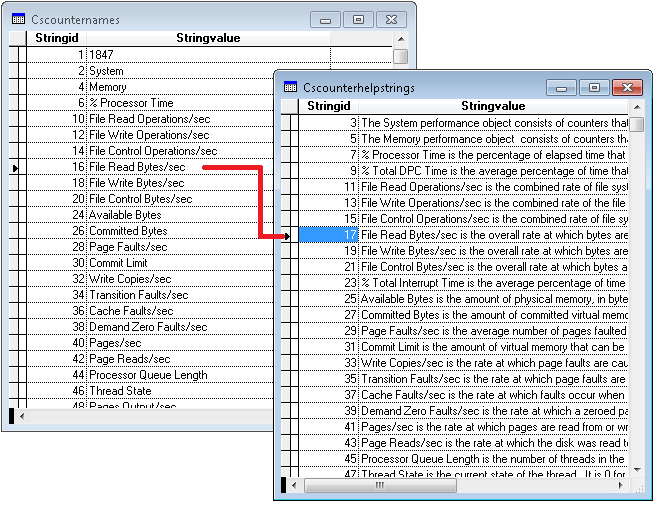

<link rel="stylesheet" type="text/css" href="../css/win32api.css">  
<link rel="stylesheet" href="https://cdnjs.cloudflare.com/ajax/libs/font-awesome/4.7.0/css/font-awesome.min.css">

# Enumerating Performance Counters

## Before you begin:
The counter is the mechanism by which performance data is collected.   

The registry stores the names of all the counters, each of which is related to a specific area of system functionality.   

Examples include a processor usage, memory usage, or the number of bytes received over a network connection.  

  
  
***  


## Code:
```foxpro  
#DEFINE HKEY_PERFORMANCE_DATA 0x80000004
#DEFINE HKEY_PERFORMANCE_TEXT 0x80000050
#DEFINE HKEY_PERFORMANCE_NLSTEXT 0x80000060

DO declare

DO EnumCounters WITH "Help", "csCounterHelpStrings"
	
DO EnumCounters WITH "Counter", "csCounterNames"

* end of main

FUNCTION EnumCounters(cValueName As String, cCursorName As String)

	LOCAL cBuffer, nBufSize, hKey
	nBufSize=0
	hKey=HKEY_PERFORMANCE_NLSTEXT

	= RegQueryValueEx(m.hKey, cValueName,;
		0, 0, NULL, @nBufSize)

	cBuffer = REPLICATE(CHR(0), nBufSize)

	= RegQueryValueEx(m.hKey, cValueName,;
		0, 0, @cBuffer, @nBufSize)

	nCount = ALINES(arrCounters, cBuffer, CHR(0))

	CREATE CURSOR csTempCounter (stringId I, stringValue C(250))

	FOR nIndex=1 TO 2 * INT(nCount/2) STEP 2
		INSERT INTO csTempCounter (stringId, stringValue);
		VALUES ( VAL(arrCounters[nIndex]), arrCounters[nIndex+1])
	NEXT
	
	SELECT stringId, MAX(stringValue) As stringValue;
	FROM csTempCounter;
	WHERE NOT EMPTY(stringId);
	GROUP BY 1;
	ORDER BY 1;
	INTO CURSOR (m.cCursorName) NOFILTER READWRITE
	
	BROWSE NORMAL NOWAIT
	
	USE IN csTempCounter

* end of main

PROCEDURE declare
	DECLARE INTEGER RegQueryValueEx IN advapi32;
		INTEGER hKey, STRING lpValueName,;
		INTEGER lpReserved, INTEGER @lpType,;
		STRING @lpData, INTEGER @lpcbData  
```  
***  


## Listed functions:
[RegQueryValueEx](../libraries/advapi32/RegQueryValueEx.md)  

## Comment:
To retrieve the names or help text, call the RegQueryValueEx function.   
  
Set the hKey parameter to either of three HKEY_PERFORMANCE keys. Set the lpValueName parameter to either "Counter" or "Help" to retrieve the names or help text, respectively.  
  
Read MSDN article <a href="http://msdn.microsoft.com/en-us/library/aa373181(v=VS.85).aspx">Retrieving Counter Names and Help Text</a>.  
  
***  

