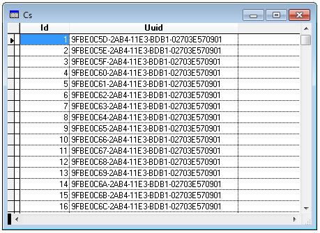

# Generating sequential UUID values

## Before you begin:
The code below generates one thousand of sequentials UUIDs.  
  

See also:

* [Generating random UUID values](sample_024.md)  
* [How to generate GUID values](sample_456.md)  
  
***  


## Code:
```foxpro  
#DEFINE RPC_S_OK 0
DO declare

CREATE CURSOR cs (id I AUTOINC, uuid C(36))

LOCAL cUUID, nIndex, cBuffer
cUUID = REPLICATE(CHR(0), 16)

FOR nIndex = 1 TO 1000
	IF UuidCreateSequential(@cUUID) = RPC_S_OK
		cBuffer = StringFromUUID(m.cUUID)
		INSERT INTO cs (uuid) VALUES (cBuffer)
	ENDIF
NEXT

SELECT cs

* Note that the indexing does not break
* the order created by AUTOINC.
* Which means the generated UUIDs are truly sequential
INDEX ON uuid TAG uuid
GO TOP

BROWSE NORMAL NOWAIT
* end of main

FUNCTION StringFromUUID(cUUID As String) As String
	LOCAL hBuffer, nBufsize, cResult
	cResult = ""
	hBuffer = 0

	IF UuidToString(@cUUID, @hBuffer) = RPC_S_OK
		nBufsize = 36
		cResult = REPLICATE(CHR(0), nBufsize)
		MemToStr(@cResult, hBuffer, nBufsize)
		RpcStringFree(@hBuffer)
	ENDIF
RETURN UPPER(STRTRAN(m.cResult, CHR(0), ""))

PROCEDURE declare
	DECLARE INTEGER RpcStringFree IN Rpcrt4;
		LONG @StringUuid
		
	DECLARE RtlMoveMemory IN kernel32 As MemToStr;
		STRING @, INTEGER, INTEGER
		
	DECLARE INTEGER UuidCreateSequential IN Rpcrt4;
		STRING @Uuid
		
	DECLARE INTEGER UuidToString IN Rpcrt4;
		STRING @Uuid,;
		LONG @StringUuid  
```  
***  


## Listed functions:
[RpcStringFree](../libraries/rpcrt4/RpcStringFree.md)  
[UuidCreateSequential](../libraries/rpcrt4/UuidCreateSequential.md)  
[UuidToString](../libraries/rpcrt4/UuidToString.md)  

## Comment:
Is there any difference between a GUID and a UUID?  
http://stackoverflow.com/questions/246930/is-there-any-difference-between-a-guid-and-a-uuid  
  
***  

