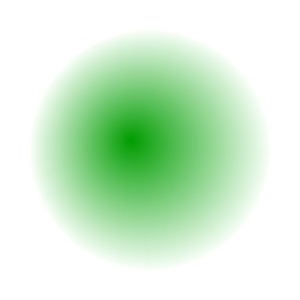

<link rel="stylesheet" type="text/css" href="../css/win32api.css">  
<link rel="stylesheet" href="https://cdnjs.cloudflare.com/ajax/libs/font-awesome/4.7.0/css/font-awesome.min.css">

# GDI+: creating a gradient

## Before you begin:
  
The code is based on <a href="?example=450">custom GDI+ class</a>. Download the class module first and save it in **gdiplus.prg** file.[custom GDI+ class](sample_450.md)  
  
***  


## Code:
```foxpro  
SET PROCEDURE TO gdiplus ADDITIVE
DO declare

PRIVATE gdiplus as gdiplusinit
gdiplus = CREATEOBJECT("gdiplusinit")

LOCAL oBitmap as gdibitmap
cFilename = "gradientsample.png"
nImgWidth = 300
nImgHeight = 300

oBitmap = CREATEOBJECT("gdibitmap",;
	nImgWidth, nImgHeight)

WITH oBitmap
	.graphics.FillRectangle(;
			ARGB(255,255,255, 255),;
			0,;
			0,;
			.imgwidth,;
			.imgheight)
ENDWITH

nPointCount = 128
nRadius = 120
cPoints = GeneratesCirclePoints(;
	nImgWidth/2,;
	nImgHeight/2,;
	nRadius,;
	nPointCount)

hBrush = 0
GdipCreatePathGradientI(;
	@cPoints, nPointCount, 4, @hBrush)

IF hBrush <> 0
	nColor1 = ARGB(0,156,0, 255)
	nColor2 = ARGB(230,255,230, 64)
	
	GdipSetPathGradientCenterColor(hBrush, nColor1)
	
	cColors = num2dword(nColor2)
	nColorCount = 1
	GdipSetPathGradientSurroundColorsWithCount(;
		hBrush, @cColors, @nColorCount)
	
	cPoints = num2dword(130) +;
		num2dword(140)

	GdipSetPathGradientCenterPointI(;
		hBrush, @cPoints)
	
	GdipFillRectangle(;
		oBitmap.graphics.graphics, hBrush,;
		0, 0, nImgWidth, nImgHeight)
			
	GdipDeleteBrush(hBrush)
ENDIF

oBitmap.SaveToFile(cFilename)
ShellExecute(0, "open", cFilename, "", "", 3)

oBitmap=NULL
gdiplus=NULL
* end of main

PROCEDURE GeneratesCirclePoints(;
	nAxisX, nAxisY, nRadius, nPointCount)
* generates a series of points forming a circle
	LOCAL nStep, nAngle, cResult
	nStep = (2 * PI()) / nPointCount
	
	cResult = ""
	FOR nAngle = 0 TO (2 * PI()) STEP nStep
		cResult = cResult +;
			num2dword(nAxisX + nRadius * COS(nAngle)) +;
			num2dword(nAxisY + nRadius * SIN(nAngle))
	NEXT
RETURN cResult

PROCEDURE declare
	DECLARE INTEGER ShellExecute IN shell32;
		INTEGER hWindow, STRING lpOperation,;
		STRING lpFile, STRING lpParameters,;
		STRING lpDirectory, INTEGER nShowCmd
		
	DECLARE INTEGER GdipCreatePathGradientI IN gdiplus;
		STRING @points, INTEGER pointcount,;
		INTEGER wrapMode, INTEGER @polyGradient
		
	DECLARE INTEGER GdipSetPathGradientCenterColor IN gdiplus;
		INTEGER brush, INTEGER colors
		
	DECLARE INTEGER GdipSetPathGradientSurroundColorsWithCount;
	IN gdiplus;
		INTEGER brush, STRING @argbColor, INTEGER @colorcount

	DECLARE INTEGER GdipSetPathGradientCenterPointI IN gdiplus;
		INTEGER brush, STRING @points

	DECLARE INTEGER GdipGetPathGradientCenterPointI IN gdiplus;
		INTEGER brush, STRING @points

FUNCTION num2dword(lnValue)
#DEFINE m0 0x0000100
#DEFINE m1 0x0010000
#DEFINE m2 0x1000000
	IF lnValue < 0
		lnValue = 0x100000000 + lnValue
	ENDIF
	LOCAL b0, b1, b2, b3
	b3 = Int(lnValue/m2)
	b2 = Int((lnValue - b3*m2)/m1)
	b1 = Int((lnValue - b3*m2 - b2*m1)/m0)
	b0 = Mod(lnValue, m0)
RETURN Chr(b0)+Chr(b1)+Chr(b2)+Chr(b3)  
```  
***  


## Listed functions:
[GdipCreatePathGradientI](../libraries/gdiplus/GdipCreatePathGradientI.md)  
[GdipSetPathGradientCenterColor](../libraries/gdiplus/GdipSetPathGradientCenterColor.md)  
[GdipSetPathGradientCenterPointI](../libraries/gdiplus/GdipSetPathGradientCenterPointI.md)  
[ShellExecute](../libraries/shell32/ShellExecute.md)  
